# Aprendizado de Máquina - 2023.1


## Repositório

[GitHub - AM](https://github.com/liviaalmada/ml20230)

---
## Aula 01 - 14.03.2023

### Ciência de dados

- É a transformação de dados usando matemática e estatística em insights, decisões e produtos valiosos.  
- Exemplos de tomada de decisões a partir da analise dos dados:  
  - Estratégias de logística
  - Melhoria no transito urbano
  - Controle de estoque de produtos.  
  - Alocação de tarefas e colaboradores.  

### Motivações

- Barateamento e popularização dos dispositivos móveis e dos mais diversos tipos de sensores para coleta de dados.  
- Aumento do poder de processamento e armazenamento dos computadores.  
- Otimização de recursos.  

### Passos importantes no aprendizado de máquina

1. Definir problema.
1. Análise exploratória de dados.
   - Uso de estatística descritiva e visualização.
1. Preparar os dados.
1. Avaliar Algoritmos.
1. Melhorar os resultados.
1. Apresentar os resultados.

### Materiais extras

- [Data Science Academy - Introdução à Ciência de Dados](https://www.datascienceacademy.com.br/cursosgratuitos?msg=not-logged-in)
- [Data Science Academy - Python Fundamentos para Análise de Dados](https://www.datascienceacademy.com.br/cursosgratuitos?msg=not-logged-in)

---

## Aula 02 - 20.03.2023

### Big Data

- Habilidade dos computadores de aprenderem a partir dos dados.

### Aprendizado de máquina

- Humanos derivam regras manualmente e constroem modelos de analisar grandes quantidades de dados.
- Algoritmos de auto aprendizagem que derivam do conhecimento dos dados para fazer previsões.
- O aprendizado de máquina é um campo de estudo que oferece aos computadores a capacidade de aprender sem serem explicitamente programdos.

### Tipos de aprendizado de máquina

|Supervised Learning|Unsupervised Learning|Reinforcement Learning|  
|-------------------|---------------------|----------------------|  
|Base de dados rotulada (categorias)|Sem rótulos|Processo de decisão|
|Feedback direto|Sem feedback|Sistema de recompensas|
|Previsão dos resultados/futuro|Encontrar a estrutura escondida nos dados|Aprender séries de aões|  

### Aprendizado supervisionado

- É a tarefa de aprender uma função que mapeia uma entrada em uma saída baseado em exemplos com entradas e saídas.
- 1° Etapa - treino
  - Dados de treino: Quais são os dados mais interessantes para treinar o meu algoritmo para o fim específico?  
```
Rótulos/dados de treino -> Algorítmo de aprendizado de máquina -> Modelo preditivo
```  
- 2° Etapa
```
Novos dados -> Modelo preditivo -> Predição
```

- É importante separar o nosso dataset em duas categorias: dados de treino e dados de teste.
  - Os dados de teste serão utilizados para validar a eficácia do nosso algoritmo.
  - Os dados de treino são utilizados na etapa de treino.

<div>
    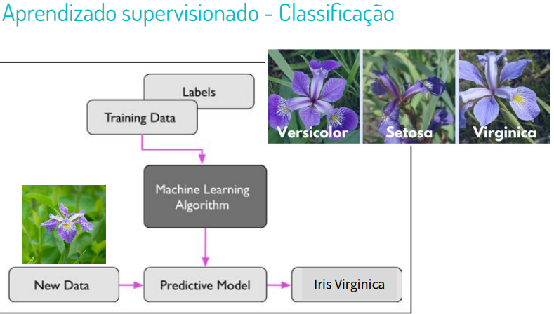
</div>
<div>
    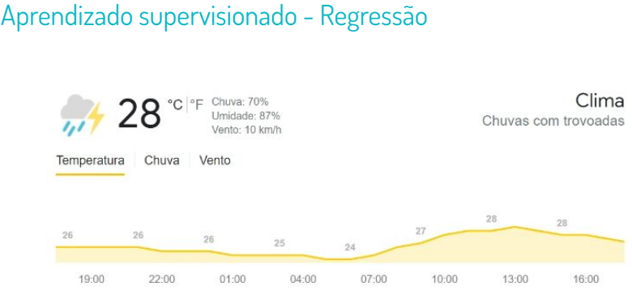
</div>
<div>
    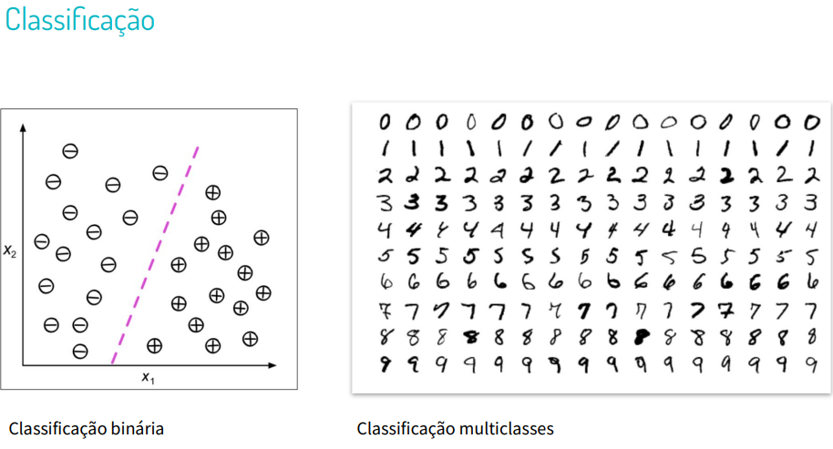
</div>
<div>
    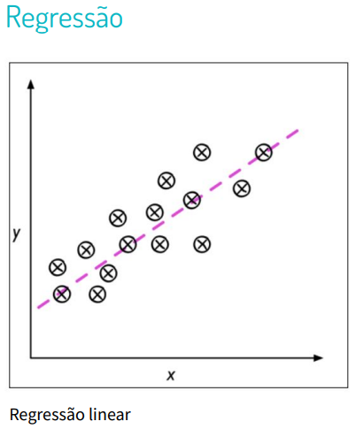
</div>

&nbsp;
### Aprendizado por reforço

- Interações com o ambiente
- Informação do estado atual.
- Maximizar um sinal de recompensa.
  - Medida da ação do agente.

<div>
    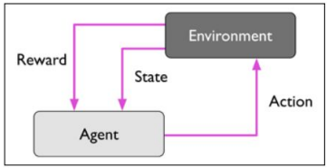
</div>


### Aprendizado não-supervisionado

- Objetivo: explorar a estrutura dos dados para extrair informações significativas.  
- Não há variável de sapida conhecida.
  - Dados não rotulados.  
- Não há função de recompensa.
- Estrutura dos dados pode ser desconhecida.

#### Clusterização

- Grupos baseados na similaridade dos atributos x1 e x2.
- Ex. de agrupamento de imagens por similiaridade:
  <div>
      
  </div>  

- Ex. de segmentação de imagens por agrupamento de pixels de acordo com a similaridade:
  <div>
    
  </div>

&nbsp;
#### Redução de dimensionalidade

- Limitações de dados de alta dimensionalidade: espaço de armazenamento e desempenho dos algoritmos.  

<div>
    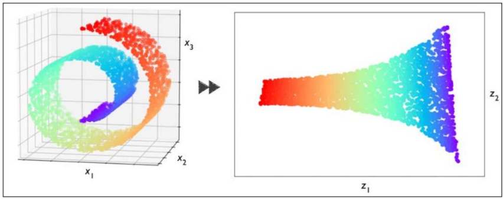
</div>

&nbsp;
### Terminologia e notação

<div>
    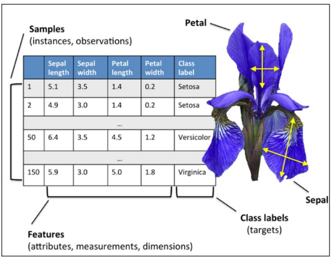
</div>

&nbsp;
### Representação dos dados (Ex. Iris Dataset)

<div>
    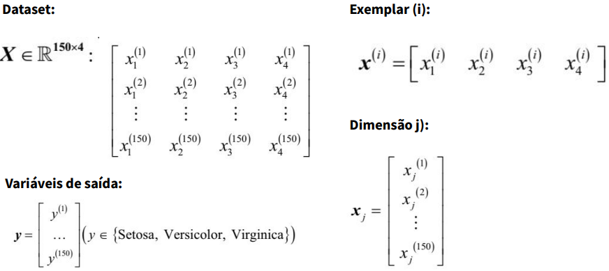
</div>

&nbsp;
### Criação de um modelo de aprendizado de máquina

<div>
    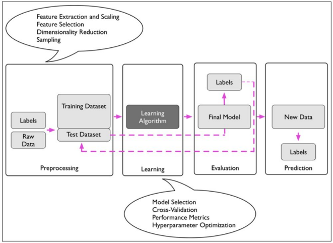
</div>

---
## Aula 03 - 27.03.2023

### Leitura complementar desta aula
- [K-Nearest Neighbors (KNN) Classification with scikit-learn](https://www.datacamp.com/tutorial/k-nearest-neighbor-classification-scikit-learn)
- veja: `A Beginner's Guide to The Machine Learning Workflow` (na pasta de pdf's).

### Classificação - Definição

- Dada uma coleção de registros (conjunto de treinamento)
  - Cada registro é caracterizado por uma tupla (x, y), em que x é o conjunto de atributos e y é o rótulo de classe.
  - x: atributo, variável independente, entrada
  - y: classe, resposta, variável dependente, saída  
- Tarefa:
  - Aprender um modelo que mapeie cada conjunto de atributos x em um dos rótulos de classe predefinidos.  

### Exemplos de classificação

|Task|Atributos set, x|Rótulos de classe, y|
|---------|----------------|--------------------|
|categorizando mensagens de email|atributos extraídos do cabeçalho e do conteúdo da mensagem de email|spam ou não spam|
|identificando células tumorais|atributos extraídos de exames e ressonância magnética|células malígnas ou benignas|
|Catolagação de galáxias|atributos extraídos das imagens de telescópio|elípticas, espirais ou de formato irregular|  

### Técnicas

- Classificadores básicos
  - Métodos baseados na árvore de decisão.
  - Métodos baseados em regras.
  - Vizinho mais próximos
  - Redes neurais
  - Aprendizagem profunda
  - Bayes Naïves e redes de crenças Bayesianas
  - Máquinas de vetores de suporte

- Classificadores Ensemble
  - Boosting, Bagging, Random Forest

### Classificadores baseados em instâncias

- Rote-learner  
  - Memoriza todos os dados de treinamento e executa a classificação somente se os atributos do registro corresponderem exatamente a um dos exemplos de treinamento;
- Vizinho mais próximo
  - Usa k pontos "mais próximos" para realizar a classificação.
  <div>
    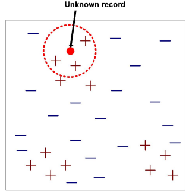
  </div>

  - Requer três coisas:
    - Conjunto de registros rotulados
    - Distância métrica para calcular a distância entre registros
    - O valor de k, o número de vizinhos mais próximos para recuperar.
  - Para classificar registros desconhecidos:  
    - Calcule a distância para outros registros de treinamento.
    - Identifique K vizinhos mais próximos.  
    - Use os rótulos de classe dos vizinhos mais próximos para determinar o rótulo de classe do registro desconhecido (por exemplo, ao obter o voto da maioria).

\+ Informações
- Hiper-parâmetro
  - Um parâmetro que não será dado como entrada, mas será utilizado internamente pelo modelo para a análise dos dados (O valor pode variar).  

### Definição do vizinho mais próximo  
- K-vizinho mais próximos de um registro x são pontos de dados que possuem as menores distâncias de k para k.  

### Nearest Neighbor (Vizinho próximo)  
- Diagrama de Voronoi  
  - É um tipo de decomposição de um dado espaço, por exemplo, um espaço métrico, determinado pela distância para uma determinada família de objetos (subconjuntos) no espaço.  
  - Estes objetos são normalmente chamados de sítios ou geradores (apesar de nomes como "sementes" estarem também em uso). Cada sítio está associado a célula de Voronoi correspondente, isto é, um conjunto de todos os pontos no dado espaço o qual a distância para o dado sítio não é maior que sua distância para os outros objetos.

<div>
  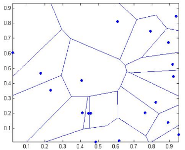
</div>  

### Classificador Nearest Neighbor  

1. Calcule a distância entre dois pontos:  
   - Distância euclidiana:  
    <div>
      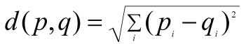
    </div>  
2. Determine a lista de vizinhos mais próximos.
    - Pegue o voto da maioria dos rótulos de classe entre os k vizinhos mais próximos.  
    - Pesar o voto de acordo com a distância fator de peso, `w = 1/d^2`  
- Escolha do valor de k:
  - Se k é muito pequeno, sensível a pontos de ruído.  
  - Se k é muito grande, a vizinhaça pode incluir pontos de outras classes.  
- Problemas de escalonamento de atributos.  
  - Atributos podem ter que ser escalonados para evitar que medidas de distância sejam dominadas por um dos atributos.  
  - Exemplo:  
    - altura de uma pesso pode variar de 1,5m a 1,8m.  
    - peso de uma pessoa pode variar de 90lb a 300lb.  
    - Renda de uma pessoa pode variar de US \$ 10 mil a US $ 1 milhão.  
- A seleção da medida de similaridade correta é crítica:  

<div>
    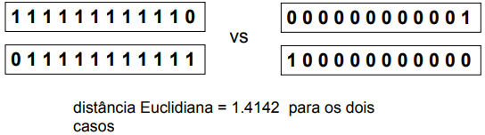
</div>  
&nbsp;

### Relembrando algumas distâncias

- Manhatan:
<div>
    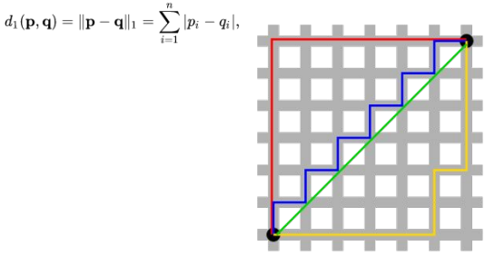
</div>  
<div>
    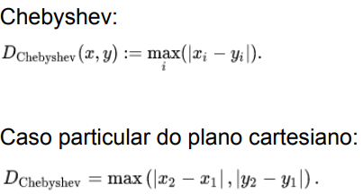
</div>  
&nbsp;

### Classificador Nearest Neighbor  

- Os classificadores k-NN são métodos de aprendizado **_lazy_**, pois não constroem modelos explicitamente.  
- A classificação de registros desconhecidos é relativamente cara (porquê?).  
- Pode produzir limites arbitrários de decisão.  
- Fácil de lidar com interações variáveis já que as decisões são baseadas em informações locais.  
- A seleção da medida de proximidade correta é essencial.  
- Atributos supérfulos ou redundantes podem criar problemas.  
- Atributos ausentes são difíceis de manipular.  

### Melhorando a eficiência do KNN  
- Evitar ter que calcular a distância de todos os objetos no conjunto de treinamento.  
- Métodos de acesso multidimensional (k-d trees).  
- Pesquisa de similiaridade aproximada rápida.  
- Hashing Sensível à Localidade (LSH).  
- Determine um conjunto menor de objetos que forneçam o mesmo desempenho.  
- Remover objetos para melhorar a eficiência.   

### Avaliação dos modelos  

- Propósito:  
  - Estimar o desempenho do classificador em dados não vistos anteriormente (conjunto de testes).  
- Holdout  
  - Reserve k% para treinamento e (100-k)% para teste.  
  - Sub-amostragem aleatória: holdout repetido.  
- Cross validation  
  - Dados de partição em k sub-conjuntos disjuntos.  
  - h-fold: treinar em partições k-1, testar no outro.  
  - Deixar-sair: k = n.  

### Cross-validation 

<div>
    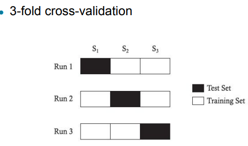
</div>  
&nbsp;

### Matriz de  Confusão
<div>
    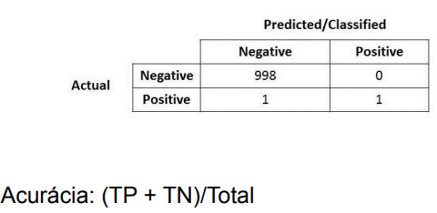
</div>  
&nbsp;

### Precision (Precisão) e Recall (Revocação)

- Daqueles que classifiquei como classe X, quantos efetivamente eram da classe X?  
- Quando realmente é da classe X, o quão frequente você classifica como X?
<div>
    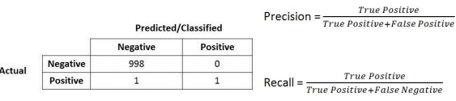
</div>  
<div>
    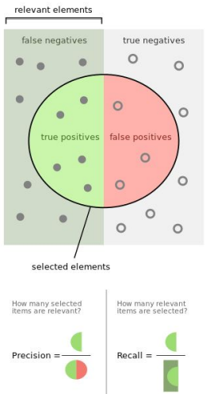
</div>  

### F1-measure

- Média harmônica da precisão e do recall.  
  - Combina precisão e recall de modo a trazer um número único que indique a qualidade geral do seu modelo.
<div>
    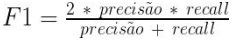
</div>  
&nbsp;


## Aula 04 - 04.04.2023

## Classificação e Árvore de decisão  

### Árvore de decisão
- Temos
  - Nó raiz
  - Nós internos
  - Nós folhas
---