# Aprendizado de Máquina - 2023.1


## Repositório

[GitHub - AM](https://github.com/liviaalmada/ml20230)

---
## Aula 01 - 14.03.2023

### Ciência de dados

- É a transformação de dados usando matemática e estatística em insights, decisões e produtos valiosos.  
- Exemplos de tomada de decisões a partir da analise dos dados:  
  - Estratégias de logística
  - Melhoria no transito urbano
  - Controle de estoque de produtos.  
  - Alocação de tarefas e colaboradores.  

### Motivações

- Barateamento e popularização dos dispositivos móveis e dos mais diversos tipos de sensores para coleta de dados.  
- Aumento do poder de processamento e armazenamento dos computadores.  
- Otimização de recursos.  

### Passos importantes no aprendizado de máquina

1. Definir problema.
1. Análise exploratória de dados.
   - Uso de estatística descritiva e visualização.
1. Preparar os dados.
1. Avaliar Algoritmos.
1. Melhorar os resultados.
1. Apresentar os resultados.

### Materiais extras

- [Data Science Academy - Introdução à Ciência de Dados](https://www.datascienceacademy.com.br/cursosgratuitos?msg=not-logged-in)
- [Data Science Academy - Python Fundamentos para Análise de Dados](https://www.datascienceacademy.com.br/cursosgratuitos?msg=not-logged-in)

---

## Aula 02 - 20.03.2023

### Big Data

- Habilidade dos computadores de aprenderem a partir dos dados.

### Aprendizado de máquina

- Humanos derivam regras manualmente e constroem modelos de analisar grandes quantidades de dados.
- Algoritmos de auto aprendizagem que derivam do conhecimento dos dados para fazer previsões.
- O aprendizado de máquina é um campo de estudo que oferece aos computadores a capacidade de aprender sem serem explicitamente programdos.

### Tipos de aprendizado de máquina

|Supervised Learning|Unsupervised Learning|Reinforcement Learning|  
|-------------------|---------------------|----------------------|  
|Base de dados rotulada (categorias)|Sem rótulos|Processo de decisão|
|Feedback direto|Sem feedback|Sistema de recompensas|
|Previsão dos resultados/futuro|Encontrar a estrutura escondida nos dados|Aprender séries de aões|  

### Aprendizado supervisionado

- É a tarefa de aprender uma função que mapeia uma entrada em uma saída baseado em exemplos com entradas e saídas.
- 1° Etapa - treino
  - Dados de treino: Quais são os dados mais interessantes para treinar o meu algoritmo para o fim específico?  
```
Rótulos/dados de treino -> Algorítmo de aprendizado de máquina -> Modelo preditivo
```  
- 2° Etapa
```
Novos dados -> Modelo preditivo -> Predição
```

- É importante separar o nosso dataset em duas categorias: dados de treino e dados de teste.
  - Os dados de teste serão utilizados para validar a eficácia do nosso algoritmo.
  - Os dados de treino são utilizados na etapa de treino.

<div>
    
</div>
<div>
    
</div>
<div>
    
</div>
<div>
    
</div>

&nbsp;
### Aprendizado por reforço

- Interações com o ambiente
- Informação do estado atual.
- Maximizar um sinal de recompensa.
  - Medida da ação do agente.

<div>
    
</div>


### Aprendizado não-supervisionado

- Objetivo: explorar a estrutura dos dados para extrair informações significativas.  
- Não há variável de sapida conhecida.
  - Dados não rotulados.  
- Não há função de recompensa.
- Estrutura dos dados pode ser desconhecida.

#### Clusterização

- Grupos baseados na similaridade dos atributos x1 e x2.
- Ex. de agrupamento de imagens por similiaridade:
  <div>
      
  </div>  

- Ex. de segmentação de imagens por agrupamento de pixels de acordo com a similaridade:
  <div>
    
  </div>

&nbsp;
#### Redução de dimensionalidade

- Limitações de dados de alta dimensionalidade: espaço de armazenamento e desempenho dos algoritmos.  

<div>
    
</div>

&nbsp;
### Terminologia e notação

<div>
    
</div>

&nbsp;
### Representação dos dados (Ex. Iris Dataset)

<div>
    
</div>

&nbsp;
### Criação de um modelo de aprendizado de máquina

<div>
    
</div>

---
## Aula 03 - 27.03.2023


### Leitura complementar desta aula
- [K-Nearest Neighbors (KNN) Classification with scikit-learn](https://www.datacamp.com/tutorial/k-nearest-neighbor-classification-scikit-learn)
- veja: `A Beginner's Guide to The Machine Learning Workflow` (na pasta de pdf's).

### Classificação - Definição

- Dada uma coleção de registros (conjunto de treinamento)
  - Cada registro é caracterizado por uma tupla (x, y), em que x é o conjunto de atributos e y é o rótulo de classe.
  - x: atributo, variável independente, entrada
  - y: classe, resposta, variável dependente, saída  
- Tarefa:
  - Aprender um modelo que mapeie cada conjunto de atributos x em um dos rótulos de classe predefinidos.  

### Exemplos de classificação

|Task|Atributos set, x|Rótulos de classe, y|
|---------|----------------|--------------------|
|categorizando mensagens de email|atributos extraídos do cabeçalho e do conteúdo da mensagem de email|spam ou não spam|
|identificando células tumorais|atributos extraídos de exames e ressonância magnética|células malígnas ou benignas|
|Catolagação de galáxias|atributos extraídos das imagens de telescópio|elípticas, espirais ou de formato irregular|  

### Técnicas

- Classificadores básicos
  - Métodos baseados na árvore de decisão.
  - Métodos baseados em regras.
  - Vizinho mais próximos
  - Redes neurais
  - Aprendizagem profunda
  - Bayes Naïves e redes de crenças Bayesianas
  - Máquinas de vetores de suporte

- Classificadores Ensemble
  - Boosting, Bagging, Random Forest

### Classificadores baseados em instâncias

- Rote-learner  
  - Memoriza todos os dados de treinamento e executa a classificação somente se os atributos do registro corresponderem exatamente a um dos exemplos de treinamento;
- Vizinho mais próximo
  - Usa k pontos "mais próximos" para realizar a classificação.
  <div>
    
  </div>

  - Requer três coisas:
    - Conjunto de registros rotulados
    - Distância métrica para calcular a distância entre registros
    - O valor de k, o número de vizinhos mais próximos para recuperar.
  - Para classificar registros desconhecidos:  
    - Calcule a distância para outros registros de treinamento.
    - Identifique K vizinhos mais próximos.  
    - Use os rótulos de classe dos vizinhos mais próximos para determinar o rótulo de classe do registro desconhecido (por exemplo, ao obter o voto da maioria).

\+ Informações
- Hiper-parâmetro
  - Um parâmetro que não será dado como entrada, mas será utilizado internamente pelo modelo para a análise dos dados (O valor pode variar).  

### Definição do vizinho mais próximo  
- K-vizinho mais próximos de um registro x são pontos de dados que possuem as menores distâncias de k para k.  

### Nearest Neighbor (Vizinho próximo)  
- Diagrama de Voronoi  
  - É um tipo de decomposição de um dado espaço, por exemplo, um espaço métrico, determinado pela distância para uma determinada família de objetos (subconjuntos) no espaço.  
  - Estes objetos são normalmente chamados de sítios ou geradores (apesar de nomes como "sementes" estarem também em uso). Cada sítio está associado a célula de Voronoi correspondente, isto é, um conjunto de todos os pontos no dado espaço o qual a distância para o dado sítio não é maior que sua distância para os outros objetos.

<div>
  
</div>  

### Classificador Nearest Neighbor  

1. Calcule a distância entre dois pontos:  
   - Distância euclidiana:  
    <div>
      
    </div>  
2. Determine a lista de vizinhos mais próximos.
    - Pegue o voto da maioria dos rótulos de classe entre os k vizinhos mais próximos.  
    - Pesar o voto de acordo com a distância fator de peso, `w = 1/d^2`  
- Escolha do valor de k:
  - Se k é muito pequeno, sensível a pontos de ruído.  
  - Se k é muito grande, a vizinhaça pode incluir pontos de outras classes.  
- Problemas de escalonamento de atributos.  
  - Atributos podem ter que ser escalonados para evitar que medidas de distância sejam dominadas por um dos atributos.  
  - Exemplo:  
    - altura de uma pesso pode variar de 1,5m a 1,8m.  
    - peso de uma pessoa pode variar de 90lb a 300lb.  
    - Renda de uma pessoa pode variar de US \$ 10 mil a US $ 1 milhão.  
- A seleção da medida de similaridade correta é crítica:  

<div>
    
</div>  
&nbsp;

### Relembrando algumas distâncias

- Manhatan:
<div>
    
</div>  
<div>
    
</div>  
&nbsp;

### Classificador Nearest Neighbor  

- Os classificadores k-NN são métodos de aprendizado **_lazy_**, pois não constroem modelos explicitamente.  
- A classificação de registros desconhecidos é relativamente cara (porquê?).  
- Pode produzir limites arbitrários de decisão.  
- Fácil de lidar com interações variáveis já que as decisões são baseadas em informações locais.  
- A seleção da medida de proximidade correta é essencial.  
- Atributos supérfulos ou redundantes podem criar problemas.  
- Atributos ausentes são difíceis de manipular.  

### Melhorando a eficiência do KNN  
- Evitar ter que calcular a distância de todos os objetos no conjunto de treinamento.  
- Métodos de acesso multidimensional (k-d trees).  
- Pesquisa de similiaridade aproximada rápida.  
- Hashing Sensível à Localidade (LSH).  
- Determine um conjunto menor de objetos que forneçam o mesmo desempenho.  
- Remover objetos para melhorar a eficiência.   

### Avaliação dos modelos  

- Propósito:  
  - Estimar o desempenho do classificador em dados não vistos anteriormente (conjunto de testes).  
- Holdout  
  - Reserve k% para treinamento e (100-k)% para teste.  
  - Sub-amostragem aleatória: holdout repetido.  
- Cross validation  
  - Dados de partição em k sub-conjuntos disjuntos.  
  - h-fold: treinar em partições k-1, testar no outro.  
  - Deixar-sair: k = n.  

### Cross-validation 

<div>
    
</div>  
&nbsp;

### Matriz de  Confusão
<div>
    
</div>  
&nbsp;

### Precision (Precisão) e Recall (Revocação)

- Daqueles que classifiquei como classe X, quantos efetivamente eram da classe X?  
- Quando realmente é da classe X, o quão frequente você classifica como X?
<div>
    
</div>  
<div>
    
</div>  

### F1-measure

- Média harmônica da precisão e do recall.  
  - Combina precisão e recall de modo a trazer um número único que indique a qualidade geral do seu modelo.
<div>
    
</div>  
&nbsp;

## Aula 04 - 04.04.2023

## Classificação e Árvore de decisão  

### Abordagem geral de resolução de um problema de classificação

<div>
    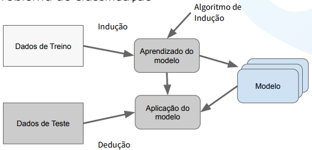
</div> 
&nbsp;

### Árvore de decisão
- Exemplo: classificação de espécie de flores.  
  <div>
      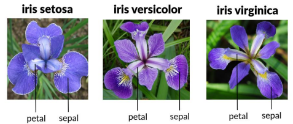
  </div> 

  <div>
      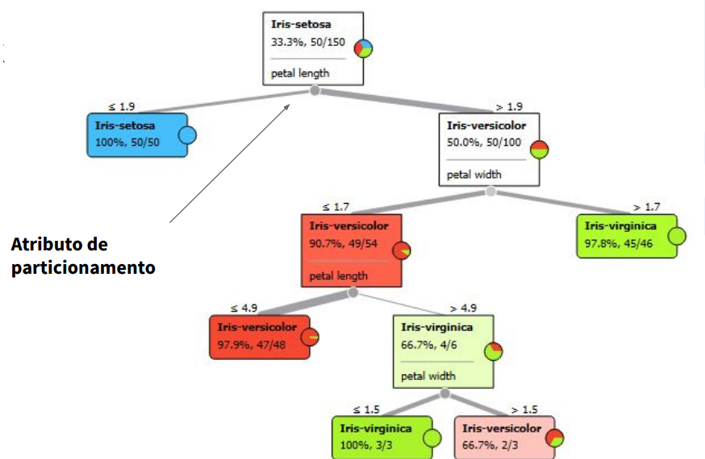
  </div> 

- Temos
  - Nó raiz
  - Nós internos
  - Nós folhas  
- Um mesmo conjunto de dados pode gerar diferentes árvores.  

  <div>
      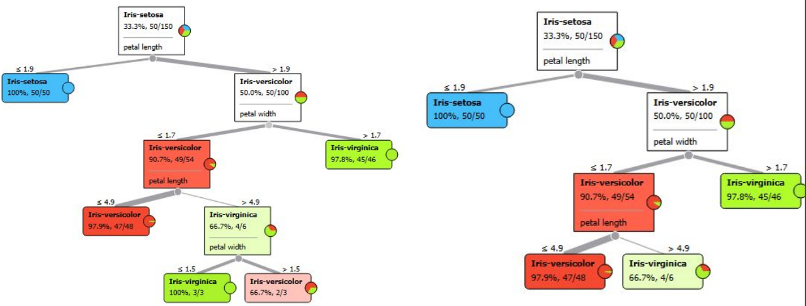
  </div>   
  &nbsp;

### Aplicando modelo aos dados de teste  

<div>
    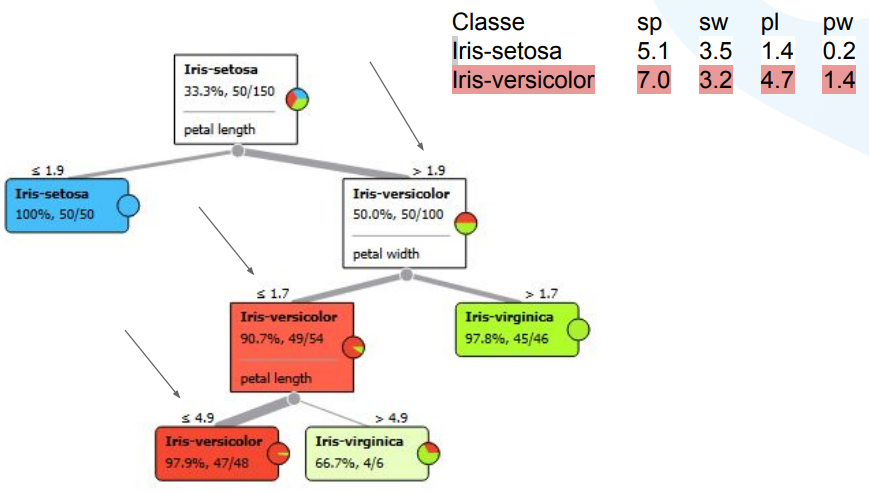
</div>   
&nbsp;
<div>
    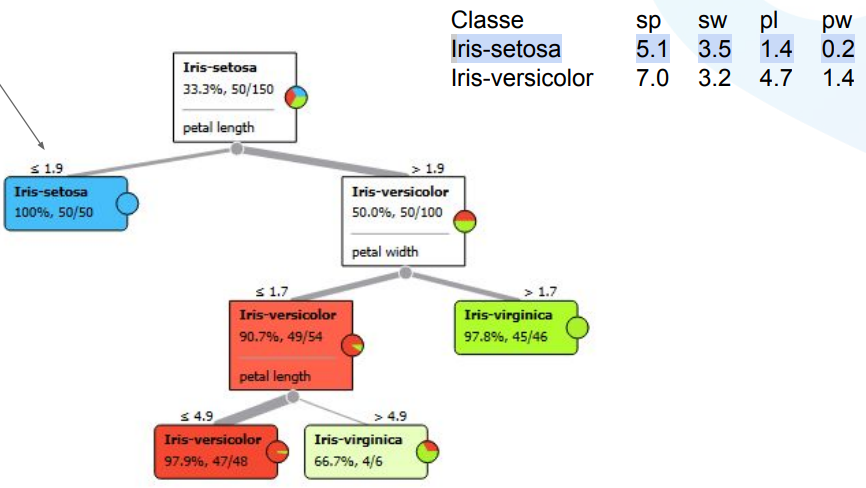
</div>   
&nbsp;

### Classificação com árvore de decisão  
 - Algoritmos:  
   - **Hunt's Algorithm** (o primeiro algoritmo).  
   - CART
   - ID3, C4.5
   - SLIQ, SPRINT  

### Algoritmo de Hunt - Estrutura Geral  

- Seja Dt o conjunto de registros de treino no nó Dt.  
  - Se Dt contém registros pertencentes a uma mesma classe yt, então o nó folha recebe a label yt.  
  - Se Dt contém registros que pertencem a uma ou mais classes, usamos um atributo para dividir os dados em subconjuntos menores (que gerarão novos nós).  
  - Aplicar o procedimento recursivamente a cada subconjunto obtido.  

<div>
    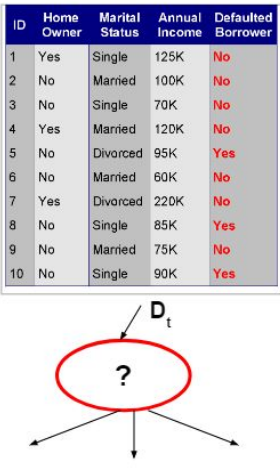
    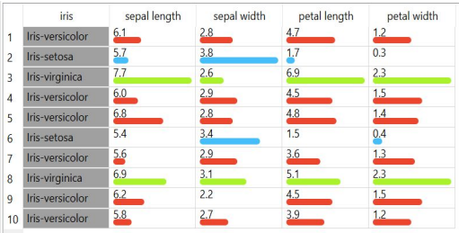
    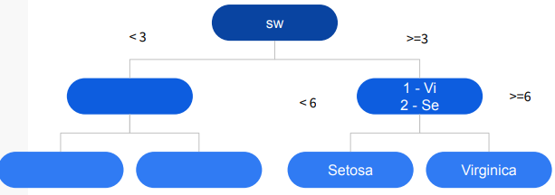
</div>   
&nbsp;

- Seja Dt o conjunto de registros de treino no nó Dt:  
  - Caso 01: Dt contém registros pertencentes a uma mesma classe yt. Então o nó folha recebe a label yt.  
  - Caso 02: Dt contém registros que pertencem a uma ou mais classes, usamos um atributo para dividir os dados em subconjuntos menores (que gerarão novos nós).  

### Questões para construção da árvore de decisão

- Como os registros de treinamento devem ser divididos?  
  - Método para especificar **condição de teste** dependendo dos tipos de atributo.  
  - Medida para avaliar a **qualidade de uma condição** de teste.  
- Quando o procedimento de divisão deve parar?  
  - Pare de dividir se todos os registros pertecerem à **mesma classe** ou tiverem valores de atributo idênticos.  
  - Parada **antecipada**.  

### Condições de teste
- Tipos de atributos
  - binário
  - nominal
  - ordinal
  - contínuo
- Número de splits
  - 2-way split
  - Multi-way split

<div>
    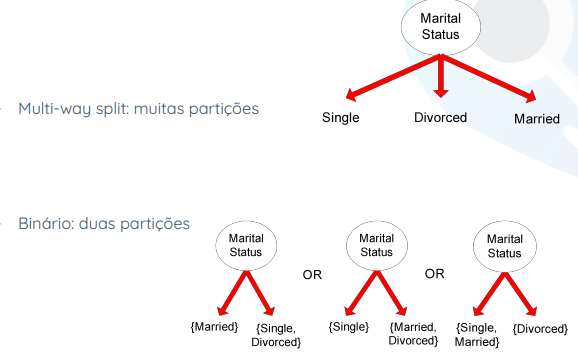
    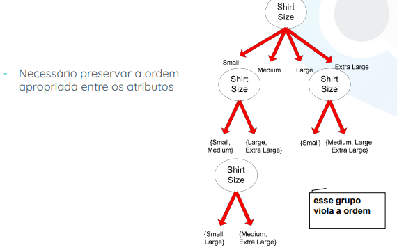
</div>   
&nbsp;

### Condições de teste - Atributos continuous  

<div>
  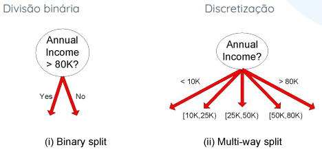
</div>
&nbsp;  

### Determinando a melhor divisão  

- Qual a melhor condição de teste?  
  <div>
    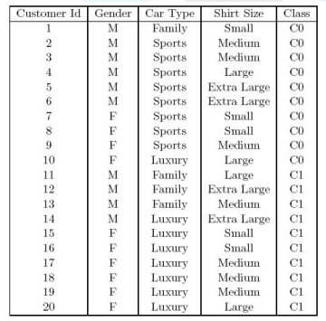
  </div>
  <div>
    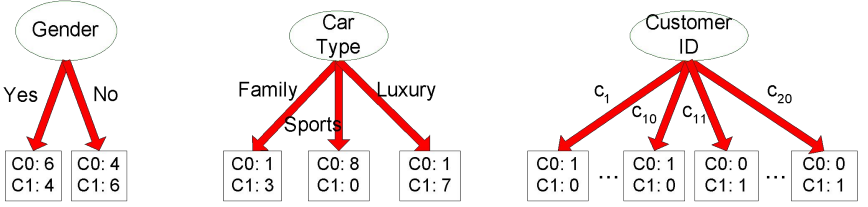
  </div>
  &nbsp;  

- **Algoritmo guloso**
  - Preferência a nós mais **puros**.  
- Necessita de uma medida de impureza.
  <div>
    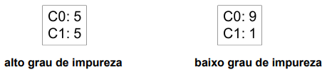
  </div>
  &nbsp;  

### Medidas para determinar a pureza de um nó
<div>
  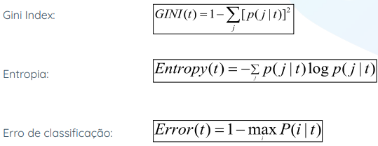
</div>
&nbsp;  

### Comparação para um problema de classificação binária  
<div>
  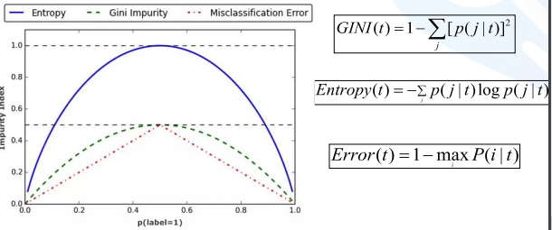
</div>
<div>
  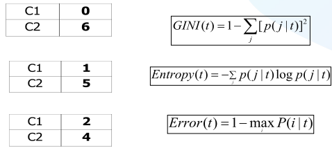
</div>
&nbsp;  

### Determinando a melhor divisão  

- Qual atributo escolher e qual o valor de particionamento?  
- Esses valores geram nós puros?  
- Ideia: comparar o grau de impureza do nó pai com o grau de impureza dos nós filhos.
1. Calcule a medida de impureza (P) antes de dividir.  
1. Calcular a medida de impureza (M) após a divisão.  
1. Calcule a medida de impureza de cada nó filho.  
1. M é a impureza ponderada dos filhos.  
1. Escolha a condição de teste de atributo que produz o maior ganho `Grain = P - M` ou equivalentemente, medida de impureza mais baixa após a divisão (M).  

### Medida de impureza: Gini Index  

- Índice de Gini para um determinado nó t:  
<div>
  
</div>

- (NOTA: p(j | t) é a frequência relativa da classe j no nó t).  
  - Máximo (1 - 1/nc) quando os registros são distribuídos igualmente enre todas as classes, implicando nas informações menos interessantes.  
  - Mínimo (0, 0) quando todos os registros pertencem a uma classe implicando nas informações mais importantes.
  - 2-class (p, 1 - p):
  <div>
    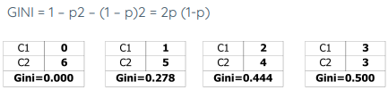
  </div>

- Quando um nó p é dividido em k partições (filhos)
  <div>
    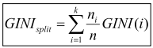
  </div>
- ni = número de registros no filho i, n = número de registros no nó pai p.  
- Escolha o atributo que minimiza o índice de Gini médio ponderado dos filhos.  
- O índice de Gini é usado em algoritmos de árvore de decisão, como CART, SLIQ, SPRINT.  

### Medida de impureza: Entropia

<div>
  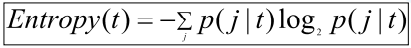
</div>

- Máximo (log nc) quando os registros são igualmente distribuídos entre todas as classes, implicando menos informações.  
- Mínimo (0, 0) quando todos os registros pertecem a uma classe, implicando na maioria das informações.  

### Ganho de informação  
<div>
  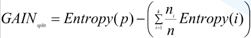
</div>

- Escolha a divisão que maximiza GANHO.  
- Usado nos algoritmos de árvore de decisão ID3 e C4.5

### Erro de classificação
<div>
  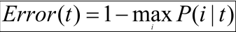
</div>

- Máximo (1 - 1/ nc) quando os registros são distribuídos igualmente entre todas as classes, implicando nas informações menos interessantes.  
- Mínimo (0) quando todos os registros pertencem a uma classe, implicando nas informações mais interessantes.

---

## Aula 05 - Regressão Linear - 17.04.2023

- Há datasets disponíveis no scikit learning para práticas (consultar documentação).

### Regressão

- Entrada: Variáveis descritoras e valor alvo contínuo.
  - Ex.: Predição do volume de chuva.
    - Variáveis descritores: Umidade (x1), Bioma (x2), Velocidade do ar (x3), Volume de chuva (último dia (x4), última semana (x5)).
    - Alvo: Volume de chuva (y).
    - Objetivo: Encontrar uma relação entre as variáveis descritores e o alvo.
      - Podemos encontrar uma equação linear do tipo: w0 + w1x1 + w2x2 + w3x3 + w4x4 + w5x5 = y
      - Devemos determinar os valores do conjunto dos coeficientes 'w'.
      - 'x' e 'y' são fornecidos para o treinamento do modelo.
      - Os valores dos coeficientes 'w' devem gerar a melhor reta no plano cartesiano dos nossos dados.
      <div>
        
      </div>   
      &nbsp;

### Regressão Linear Simples  

- Refere-se quando temos somente uma variável independente (X) para fazermos a preição.
- A linha de melhor ajuste é chamada de **linha de regressão**.  
- Linhas verticais da linha de regressão aos **valores de amostra** são os chamados **deslocamentos ou resíduos** - os erros de previsão.  

### Regressão Linear Múltipla  
- Refere-se quando temos somente uma variável independente (X) para fazermos a predição.  
- Hiperplano ajustado de um modelo de regressão linear com múltiplos atributos  

### Onde podemos usar regressão linear?

- Esse algoritmo pode ser utilizado em qualquer problema, onde as variáveis de entrada e saída são valores contínuos. Por exemplo:  
  - Prever as vendas de um determinado produto.  
  - Setor imobiliário (valor de um imóvel).  
  - Calcular a expectativa de vida de um país.  
  - Calcular a pressão sanguínia de um paciente.
- **Quando aplicar?**
  - Esse tipo de algoritmo é aplicado quando há uma boa correlação linear (positiva ou negativa) entre os dados (quando a associação entre os dados pode ser definida com uma reta).  

- A função que representa bem a regressão linear é dada por: `f(x) = w0 + w1 * x1`
  - `w0` representa o ponto inicial da reta.
  - `w1` representa a inclinação da reta.

### Modelo de regressão linear de mínimos quadrados ordinários  
- Função objetivo:

### Como minimizar a função objetivo
### Método do gradiente descendente  

- Gradiente é um vetor que indica o sentido e a direção na qual, por deslocamento a partir do ponto específico, obtém-se o maior incremento possível no valor de uma grandeza.  

### Método do gradiente descendente  

1. Usando gradiente descendente, podemos agora atualizar os pesos dando um passo na direção oposta do gradiente deltaJ(w) de nossa função de custo J(w).  
1. A mudançã de peso deltaW é definida como o gradiente negativo multiplicado pela taxa de aprendizagem n:  

--- 

## Aula 06 - Redes Neurais - 25.04.2023

### Neurônio Artificial
- A rede neural pode ajustar os pesos com base no erro do último resultado do teste.
- Os sinais de entrada modificados são somados em um único valor. Um deslocamento (_bias_) também é adicionado à soma.  
- A rede neural também ajusta o _bias_ (viés) durante a fase de aprendizado.  
- Após cada interação de aprendizado, pesos e viés são gradualemtne alterados.  
  - O objetivo é que o próximo resultado fique mais próximo da saída desejada.  
- O resultado do cálculo do neurônio é transformado em um sinal de saída.  
  - Feito alimentando o resultado para uma função de ativação.  
<div>
  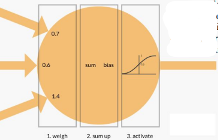
</div>  
&nbsp;

- Função de decisão Φ(z) (phi)
  - É preciso uma combinação linear de valores de entrada _x_ e um vetor de peso correspondente _w_.
  - _z_ é o resultado dessa combinação (soma ponderada). _z_ = w1*x1 + ... + wm\*xm.
  - Se a entrada líquida de uma determinada amostra for maior que um limite definido $\theta$, prevemos a classe 1. Caso contrário, a classe -1.  
- Por questão de simplicidade, definimos $w_{0} = -\theta$ e $x_{0} = 1$, e daí temos: $z = w_{0}x_{0} + w_{1}x_{1} + ... + w_{m}x_{m} = w^Tx$
- O limiar negativo, ou $w_{0} = - \theta$, é usualmente chamado de unidade de _bias_ (viés).  

### Perceptron  

<div>
  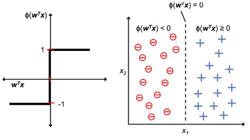
</div>  
&nbsp;

#### Regras de aprendizagem  
- O modelo Perceptron limiarizado de Rosenblatt imita como um único neurônio no cérebro funciona (dispara ou não dispara).  
1. Inicialize os pesos com o valor 0 ou próximos de 0 (de forma aleatória).  
1. Para cada valor de treino x(i):  
  - Compute o valor de saída ^y
  - Atualize os pesos.  
- $w_j := w_j + \Delta w_j$
- $\Delta w_j = \eta(y^{(i)} - \^y^{(i)})x_j^{(i)}$
  - $\eta$ é a taxa de aprendizado (geralmente, uma constante entre 0.0 e 1.0).
- Para predições corretas, **os pesos não se alteram**.  
  - $\Delta w_j = \eta(-1-(-1))x_j^{(i)} = 0$  
- Para predições incorretas, os pesos são **empurraods na direção da classe de destino positiva ou negatva**.  
  - $\Delta w_j = \eta(1 + 1)x_j^{(i)} = \eta(2)x_j^{(i)}$
  - $\Delta w_j = \eta(- 1 - 1)x_j^{(i)} = \eta(-2)x_j^{(i)}$


