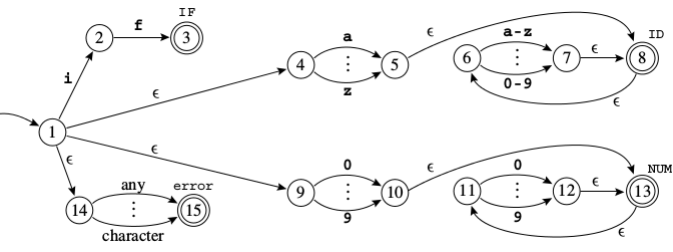

# Compiladores - 2023.1


## Aula 01 - Introdução - 14.04.2024

### Métodos de avaliação

- Um trabalho - front-end do compilador.
- Uma prova - front-end do compilador.
- Um trabalho - back-end do compilador.
- Uma prova - back-end do compilador.

As 3 maiores notas são computadas.

### Livros

- Modern Compiler in Java - 2.ed.
- Compiladores: Princípios, Técnicas e Ferramentas.

### Introdução

---
Programa fonte -> Compilador -> Programa alvo

---


## Aula 02 - Análise Léxica -  15.03.2023
---
### Introdução

- Compilador traduz de uma linguagem (fonte) para outra (de máquina).
- Esse processo demanda sua quebra em várias partes, o entendimento de sua estrutura e significado.
- O responsável por esse tipo de análise é o front-end.
- A análise léxica ocorre no front-end do compilador.

#### Front-end
- Análise Léxica:
  - Quebra a entrada em palavras conhecidas como símbolos (tokens).
- Análise Sintática:
  - Analisa a estrutura de frases do programa.
- Análise Semântica:
  - Calcula o significado do programa.

### Cadeias e Linguagens

- Alfabeto: conjunto finito e não vazio de símbolos.
  - Exemplo: Σ1 = {0,1}
- Cadeia: sequência de símbolos de um alfabeto (pode ser infinito).
   - 010010 é cadeia sobre o alfabeto Σ1 de tamaho 6
- O símbolo ε denota cadeia vazia de comprimento 0.
- Dado uma cadeia _w_ sobre um alfabeto:
  - _w_^0 = ε
  - _w_^_k_ = _w_^(_k_-1)_w_ para _k_ > 0 (concatenação _k_ vezaes)
- Dado um alfabeto Σ:
  - Σ^* é o conjunto de todas as cadeias finitas sobre Σ.
  - Σ^+ é o conjunto de todas as cadeias finitas sobre Σ menos a cadeia vazia.
    - Exemplo: Σ = {0, 1} - Temos:
      - Σ^+ = Σ^1 U Σ^2 U Σ^3 U ...
      - Σ^* = Σ^+ U { ε }
      - Σ^1 = {0, 1}
      - Σ^2 = {00, 01, 10, 11}
      - Σ^3 = {000, 001, 010, 011, 100, 101, 110, 111}
- Linguagem
    - Subconjunto de Σ^*
- Linguagem sobre Σ
  - Conjunto de cadeias em Σ.
  - Subconjunto de Σ^*.
- Dadas L1 e L2 linguagens sobre Σ:
  - L1 U L2 = {x | x ∈ L1 ou x ∈ L2}.
  - L1 . L2 = {xy | x ∈ L1 e y ∈ L2}.
  - L1^* = {x1, x2, ..., xk | k >= 0 e cada xi ∈ L1}.
- Linguagem livre de contexto:
  - Linguagens descritas por uma gramática livre de contexto.
  - Úteis para especificar linguagens de programação. 
  - Vamos estudar com mais detalhes a seguir.
- Linguagens regulares:
  - Caso particular de linguagens livres de contexto.
  - Linguagens que podem ser descritas através de expressões regulares reconhecidas por autômatos finitos.

### Analisador Léxico
- Recebe uma sequência de caracteres e produz uma sequência de palavras chaves, pontuação e nomes.
- Descarta comentários e espaços em branco.

### Símbolos Léxicos

<div>
  
</div>

### Não símbolos

<div>
  
</div>

### Exemplo

```
float match0(char *s) { /* find a zero */
        if (!strncmp(s, "0.0", 3))
    return .0;
}
```

Retorno do analisador léxico:

```
FLOAT ID(match0) LPAREN CHAR STAR ID(s) RPAREN LBRACE IF LPAREN BANG ID(strncmp) LPAREN ID(s) COMMA STRING(0.0) COMMA NUM(3) RPAREN RPAREN RETURN REAL(0.0) SEMI RBRACE EOF
```

---
## Aula 03 - Análise Léxica -  21.03.2023

### Analisador léxico

- Alguns símbolos têm um valor semântico associados a eles.
  - IDs e NUMs.
- Como são descritas as regras lexicográficas?
- Um identificador é uma sequência de letras e dígitos.
  - O primeiro caractere deve ser uma letra.
  - O underscore "_" conta como uma letra.  
  - Letras maiúsculas e minúsculas são diferentes.
  - Se o fluxo de entrada resultar em um símbolo até um dado caractere, o próximo caractere é lido visando encontrar a maior string de caracteres possível que constitua um símbolo.  
  - Espaços, tabs, novas linhas e comentários são ignorados exceto quando eles servem de separadores de símbolos.  
  - Um espaço em branco é usado para separar identificadores adjacentes, palavras chaves e constantes.
- Como os tokens são especificados?

### Expressões Regulares

- Uma linguagem é um conjunto de strings.
- Uma string é uma sequência de símbolos.
- Estes símbolos estão definidos em um alfabeto finito.  
  - Ex.: Linguagem C ou Pascal, linguagem dos primos, etc.
- Queremos poder dizer se uma string está ou não em uma linguagem.  
- **Símbolos**:  Para cada símbolo _a_ no alfabeto da linguagem, a expressão regular _a_ representa a linguagem contendo somente a string _a_.  
- **Alternação**: Dadas duas expressões regulares M e N, o operador de alternação (|) gera uma nova expressão M|N. Uma string está na linguagem de M|N se ela está na linguagem de M ou na linguagem de N.
  - Ex.: A linguagem de _a_|_b_ contém as duas strings _a_ e _b_.
- **Concatenação**: Dadas duas expressões M e N, o operador de concatenação (.) gera uma nova expressão M . N. Uma string está na linguagem de M . N se ela é a concatenação de quaisquer duas strings α e β tal que α está na linguagem de M e β está na linguagem de N.
  - Ex.: (a|b) . a contém as strings aa e ba.  
- **Epsilon**: A expressão regular  ε representa a linguagem cuja única string é a vazia.
  - Ex.: (a . b)|ε representa a linguagem {" ", "ab"}
- **Repetição**: Dada uma expressão regular M, seu Kleene closure é M*. Uma string está em M* se ela é a concatenação de zero ou mais strings todas em M.  
  - Ex.: ((a|b) . a)* representa {" ", "aa", "ba", "aaaa", "baaa", "aaba", "baba", "aaaaa", ...}
- Exemplos:  
  - (0|1)* . 0
    - Números binários múltiplos de 2.
  - b*(abb*)*(a|ε)
    - Strings de a's e b's sem a's consecutivos.
  - (a|b)*aa(a|b)\*
    - Strings de a's e b's com a's consecutivos.

<div>
  
</div>

- Como seriam as expressões regulares para os seguintes tokens?  
  - IF
    - if
  - ID
    - [a-z][a-z0-9]
  - NUM
    - [0-9]+

- Quais símbolos representam as seguintes expressões regulares?  
  - ([0-9]+"."[0-9]*)|([0-9]\*"."[0-9]+)
    - R -> REAL.
  - ("- -"[a-z]*"\n")|(""|"\n"|"\t")+
    - Nenhum token, somente comentário, brancos, nova, linha e tab.

### Analisador Léxico

- Ambiguidade:
  - if8 é um ID ou dois tokens IF e NUM(8)?
  - if 89 começa com um ID ou uma palavra-reservada?
- Duas regras:
  - Maior casamento: o próximo símbolo sempre é a substring mais longa possível de ser casada.  
  - Prioridade: Para uma dada substring mais longa, a primeira regra a ser casada produzirá o token.
- A especificação deve ser completa, sempre reconhece uma substring da entrada.
  - Mas quando estiver errada? Use uma regra com o "."
  - Em que lugar da sua especificação deve estar esta regra?
- Esta regra deve ser a última! (por quê?)

---
## Aula 04 - Análise Léxica -  22.03.2023

### Autômatos Finitos

- Expressões regulares são convenientes para especificar os símbolos.
- Precisamos de um formalismo que possa ser convertido em um programa de computador.
- Este formalismo são os autômatos finitos.  
- Um autômato finito possui:  
  - Um conjunto finito de estados.
  - Arestas levando de um estado a outro, anotada com um símbolo.
  - Um estado inicial.
  - Um ou mais estados finais.
  - Normalmente os estados são numerados ou nomeados para facilitar a manipulação e discussão.

<div>
  
</div>

### Autômato Finito Determinístico

- DFAs não podem apresentar duas arestas que deixam o mesmo estado, anotadas com o mesmo símbolo.  
- Saindo do estado inicial o autômato segue extamente uma aresta para cada caractere da entrada.  
- O DFA aceita a string se, após percorrer todos os caracteres, ele estiver em um estado final.  
- Se em algum momento não houver uma aresta a ser pecorrida para um determinado caractere ou ele terminar em um estado não-final, a string é rejeitada.  
- A linguagem reconhecida pelo autômato é o conjuto de todas as strings que ele aceita.
- Consigo combinar os autômatos definidos para cada símbolo de maneira a ter um único autômato que possa ser usado como analisador léxico?
  - Sim.
  - Veremos um exemplo ad-hoc e mais adiante mecanismos formais para esta tarefa.

### Autômato Finitos

<div>
  
</div>

&nbsp;
### Autômato Combinado

- Estados finais nomeados com o respectivo símbolo.  
- Alguns estados apresentam caracterísitcas de mais de um autômato anterior.   
  - Ex.: 2.
- Como ocorre a quebra de ambiguidade entre ID e IF?

<div>
  
</div>

&nbsp;
### Maior Substring

- A tabela anterior é usada para aceitar ou recusar uma string.  
- Porém, precisamos garantir que a maior string seja reconhecida.  
- Necessitamos de duas informações.  
  - Último estado final.
  - Posição da entrada no último estado final.

&nbsp;
<div>
  
</div>

### Autômato finito Não-Dterminístico

- Pode ter mais de uma aresta saindo do mesmo estado com o mesmo símbolo.  
- Pode ter aresta anotadas com o símbolo ε.  
  - Essa aresta pode ser precorrida sem consumir nenhum caractere caractere de entrada.

<div>
  
</div>

<div>
  
</div>

- Este autômato reconhece a mesma linguagem do autômato acima.


- Não são apropriados para transformar em programas de computador.  
  - "Adivinha" qual caminho deve ser seguido não é uma tarefa faacilmente executada pelo hardware dos computadores.  
- NFAs se tornam úteis porque é fácil converter expressões regulares (ER) para NFA.

---
## Aula 05 - Análise Léxica -  28.03.2023

### Convertendo ER's para NFA's
- De maniera geral, toda ER terá um NFA com uma cauda (aresta de entrada) e uma cabeça (estado final).
- Podemos definir essa conversão de maneira indutiva pois:
  - Uma ER é primitiva (único símbolo ou vazio) ou é uma combinação de outras ERs.
  - O mesmo vale para NFAs.  

<div>
  
</div>

- Exemplo: ERs para IF, ID, NUM e ERROR

<div>
  
</div>

### NFA vs DFA

- DFAs são facilmente simuláveis por programas de computador.  
- NFAs são mais complexos, pois o programa teria que "adivinhar" o melhor caminho em alguns momentos.  
- Outra alternativa seria tentar todas as possibilidaeds.

<div>
  
</div>

### ε-Closure

- Edge(s,c): todos os estados alcançáveis a partir de s, consumindo c.  
- Closure(S): todos os estados alcançáveis a partir do conjunto S, sem consumir caractere de entrada.  
- Closure(S) é o menor conjunto T, tal que:  

<div>
  
</div>
&nbsp;

### Algoritmo

<div>
  
</div>

<div>
  
</div>
&nbsp;

### Convertendo NFA em DFA

- Manipular esses conjuntos de estados é muito caro durante a simulação.  
- Solução:
  - Calcular todos eles antecipadamente.  
- Isso converte um NFA em um DFA!
  - Cada conjunto de estados no NFA se torna um estado no DFA. 

#### Algoritmo

<div>
  
</div>

- O estado _d_ é final se qualquer um dos estados de `states[d]` for final.
- Pode haver vários estados finais em `states[d]`.  
  - `d` será anotado com o token que ocorrer primeiro na especificação léxica (ERs) => Regra de prioridade.
- Ao final
  - Descartar `states[]` e usar `trans[]` para análise léxica.

<div>
  
</div>

- Esse é o menor autômato possível para essa linguagem?  
  - Não.
  - Existem estados que são equivalentes.  
- Quais estados são equivalentes no autômato acima?
- Como encontrar estados equivalentes?  
  - `trans[s1,c] = trans[s2,c]` para todo `c`. -> Isso não é suficiente!
  - _S1_ e _S2_ são equivalentes quando o autômato aceita σ começando em _S1_ sse ele também aceita σ começando em _S2_.

---

## Aula 06 - Análise Sintática -  05.04.2023

### Analisador Sintático (Parser)

- Recebe uma sequência de tokens do analisador léxico e determina se a string pode ser gerada através da gramática da linguagem fonte.  
- É esperado que ele reporte os erros de uma maneira inteligível.  
- Deve se recuperar de erros comuns, continuando a processar a entrada.

&nbsp;
### Gramáticas livre de contexto

- ERs são boas para definir a estrutura léxica de maneira declarativa.  
- Entretanto, não são "poderosas" o suficiente para definir declarativamente a estrutura sintática de linguagens de programação.
- Exemplo de ER usando abreviações:  
  - digits = [0-9]^+
  - sum = (digits "+")^* digits
  - definem somas da forma 28+301+9  
- Como isso é implementado?  
  - O analisador léxico substitui as abreviações antes de traduzir para um autômato finito.  
  - sum = ([0-9]^+ "+")^*[0-9]^+
- É possível usar a mesma ideia para definr uma linguagem para expressões que tenham parênteses balanceados?  
  - (1+(245+2))
- Tentativa
  - digits = [0-9]^+
  - sum = expr "+" expr
  - expr = "(" sum ")" | digits
- O analisador léxico substituiria _sum_ em _expr_:
  - expr = "(" expr "+" expr ")" | digits
- Depois substituiria _expr_ no próprio _expr_:  
  - expr = "(""(""(" expr "+" expr ")" | digits")" "+" expr")" | digits
- Note que assim, ainda teríamos _expr's_ do lado direito.
- As abreviações não acrescentam o poder de expressar recursão às ERs.
- E é isso que precisamos para expressar a recursão mútua entre _sum_ e _expr_.  
- E também para expressar a sintaxe de linguagens de programação.  
```
expr = ab(c|d)e => aux = c|d
                   expr = a b aux e
```  

- Descreva uma linguagem através de um conjunto de produções da forma:  
```
symbol -> symbol symbol symbol symbol ... symbol
```
- onde existem zero ou mais símbolos do lado direito.  
- Símbolos:
  - Terminais: uma string do alfabeto da linguagem.
  - Não-terminais: aparecem do lado esquerdo de alguma produção.  
  - Nenhum token aparece do lado esquerdo de uma produção.  
  - Existe um não-terminal definido como _start symbol_.

- Considere:
1. A -> 0A1
2. A -> B
3. B -> #

- Gerar cadeias da linguagem
1. Escrever variável inicial.
1. Encontre uma variável escrita e uma regra para essa variável. Substitua essa variável pelo lado direito da regra.  
1. Repita o passo 2 até não restar variáveis

- A sequência de substituição é chamada de derivação.  
- Ex.:
  - 000#111
  - A -> 0A1

- Linguagem: O conjunto de todas as cadeias que podem ser geradas dessa maneira.

&nbsp;
### Hierarquia de Chomsky

<div>
  
</div>
<div>
  
</div>
&nbsp;

### Gramáticas livre de contexto

- Considere a seguinte grmática:  

```
1. S -> S;S             6. E -> E + E
2. S -> id := E         7. E -> (S,E)
3. S -> print(L)        8. L -> E
4. E -> id              9. L -> L, E
5. E -> numm
```
`id := num;   id := id + (id := num + num, id)`

<div>
  
</div>
&nbsp;

### Derivações
- _left-most_: o não terminal mais a esquerda é sempre o expandido;
- _right-most_: o não terminal mais a direita é sempre o mais expandido.

### Parse Trees
- Constrói-se uma arvore conectado-se cada símbolo em uma derivação ao qual ele foi derivado.  
- Duas derivações diferentes podem levar a uma mesma _parse tree_.
<div>
  
</div>  
&nbsp;

### Gramáticas Ambíguas
- Podem derivar uma sentença com duas _parse trees_ diferentes.  
  - `id := id + id  id`
<div>
  
</div>
&nbsp;  

#### É Ambígua?

```
1. E −→ id      5.E −→ E + E
2. E −→ num     6.E −→ E - E
3. E −→ E * E    7.E −→ (E)
4. E −→ E/E
```
- Construa _parse Trees_ para as seguintes expressões:
  - 1-2-3
  - 1+2*3
<div>
  
</div>
<div>
  
</div>
&nbsp;  

- Os compiladores usam as _parse trees_ para extrair o significado das expressões.  
- A ambiguidade se torna um problema.  
- Podemos, grealmente, mudar a gramática de maneira a retirar a ambuiguidade.
- Alterando o exemplo anterior:  
  - Queremos colocar uma precedência maior para * em relação ao + e ao -.  
  - Também queremos que cada operador seja associado à esquerda:  
    - (1-2)-3 e não 1-(2-3)
- Conseguimos introduzir novos não-terminais.  
```
1. E −→ E + T     4.T −→ T * F      7.F −→ id
2. E −→ E - T     5.T −→ T/F        8.F −→ num
3. E −→ T         6.T −→ F          9.F −→ (E)
```  
- Geralmente podemos transformar uma gramática para retirar a ambiguidade.  
- Algumas linguagens não possuem gramáticas não ambíguas.  
- Mas elas não seriam apropriadas como linguagens de programação.  

### Fim de Arquivo
```
0. S −→ E $
1. E −→ E + T     4.T −→ T * F      7.F −→ id
2. E −→ E - T     5.T −→ T/F        8.F −→ num
3. E −→ T         6.T −→ F          9.F −→ (E)
```  
- Criar um novo não terminal como símbolo inicial.  
&nbsp;  

### Parsing
- CFG (_context free grammar_) geram as linguagens.  
- Parsers são reconhecedores das linguagens.  
- Para qualquer CFG é possível obter um parser que roda em O(n^3).
  - Algoritmos de Early e CYK (Cocke-Younger-Kasami).  
- O(n^3) é muito lento para programas grandes.  
- Existem classes de gramáticas para as quais podemos construir parsers que rodam em tempo linear.  
  - LL: left-to-right, left-most derivation.  
  - LR: left-to-right, right-most derivation.  
&nbsp;

### Análise Descendente (Predictive Parsing)  
- Também chamados de _recursive-descent_ ou _top-down_.  
- É um algoritmo simples, capaz de fazer o _parsing_ de algumas gramáticas (gramáticas LL).  
- Cada produção se torna uma clásula em uma função recursiva.  
- Temos uma função para cada não-terminal.  
```
E −→ +EE
E −→ *EE
E −→ a|b
```  
- Expressões pré-fixas.  
- Considere a cadeia +b*ab.  
- Como é sua derivação mais à esquerda?  
- Análise descedente produz uma derivação à esquerda.  
- Precisa determinar a produção a ser usada para expandir o não-terminal corrente.  
- Vejamos um exemplo de implementação.   
```
S −→ if E then S else S
S −→ begin S L
S −→ print E
L −→ end
L −→ ; S L
E −→ num = num
```
<div>
  
</div>  
&nbsp;

```
0. S −→ E $
1. E −→ E + T     4.T −→ T * F      7.F −→ id
2. E −→ E - T     5.T −→ T/F        8.F −→ num
3. E −→ T         6.T −→ F          9.F −→ (E)
```   
- Vamos aplicar a mesma técnica para essa outra gramática...  
- Como decidir entre E+T e T na função que implementa o não-terminal E?
  - Tanto E como T podem derivar cadeias começando com id ou "(".  
  - E se você puder olhar o número k > 1 para fente da entrada?  
- Essas cadeias podem ter tamanho arbitrário.  
- O problema permanece.
<div>
  
</div>  
&nbsp;  

### Conjuntos FIRST e FOLLOW  
- Dada uma string y de terminais e não terminais.  
  - FIRST(y) é o conjunto de todos os terminais que podem iniciar uma string de terminais derivadas de y.  
  - FOLLOW(X) é o conjutno de terminais que podem imediatamente seguir X.  
  - t ∈ FOLLOW(X) se existe alguma derivação contendo Xt.  
  - Cuidado com derivações da forma XYZt, onde Y e Z podem ser vazios.
- Exemplo usando a gramática anterior:  
  - y = T*F  
    - FIRST(y) = {id, num, (}   
&nbsp;   

### Algoritmo para calcular os conjuntos FIRST e FOLLOW  
<div>
  
</div>  
&nbsp;  

### Análise Descendente (Predictive Parsing)

- Se uma gramática tem produções da forma:  
  - X -> y1
  - X -> y2
    - Caso os conjuntos FIRST(y1) e FIRST(y2) tenham intersecção, então a gramática não pode ser analisada com um predictive parser.  
- Por quê?  
  - A função recursiva não vai saber que caso executar;

### Resumindo
- Nullable(X) é verdadeiro se X pode derivar a string vazia.
- FIRST(y) é o conjunto de terminais que podem iniciar strings derivadas de y.
-  FOLLOW(X) é o conjunto de terminais que podem imediatamente
seguir X.
- t ∈ FOLLOW(X) se existe alguma derivação contendo Xt.
- Cuidado com derivações da forma XYZt, onde Y e Z podem ser vazios


---