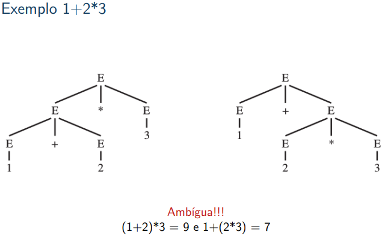
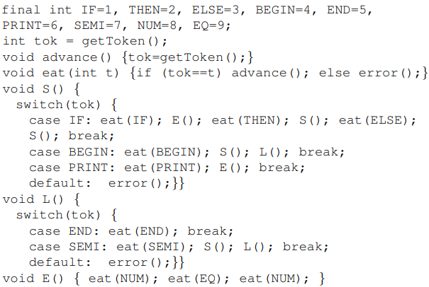
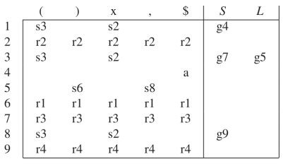
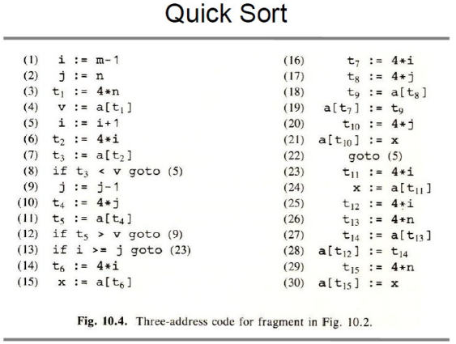

# Compiladores - 2023.1


## Aula 01 - Introdução - 14.04.2024

### Métodos de avaliação

- Um trabalho - front-end do compilador.
- Uma prova - front-end do compilador.
- Um trabalho - back-end do compilador.
- Uma prova - back-end do compilador.

As 3 maiores notas são computadas.

### Livros

- Modern Compiler in Java - 2.ed.
- Compiladores: Princípios, Técnicas e Ferramentas.

### Introdução

---
Programa fonte -> Compilador -> Programa alvo

---


## Aula 02 - Análise Léxica -  15.03.2023
---
### Introdução

- Compilador traduz de uma linguagem (fonte) para outra (de máquina).
- Esse processo demanda sua quebra em várias partes, o entendimento de sua estrutura e significado.
- O responsável por esse tipo de análise é o front-end.
- A análise léxica ocorre no front-end do compilador.

#### Front-end
- Análise Léxica:
  - Quebra a entrada em palavras conhecidas como símbolos (tokens).
- Análise Sintática:
  - Analisa a estrutura de frases do programa.
- Análise Semântica:
  - Calcula o significado do programa.

### Cadeias e Linguagens

- Alfabeto: conjunto finito e não vazio de símbolos.
  - Exemplo: Σ1 = {0,1}
- Cadeia: sequência de símbolos de um alfabeto (pode ser infinito).
   - 010010 é cadeia sobre o alfabeto Σ1 de tamaho 6
- O símbolo ε denota cadeia vazia de comprimento 0.
- Dado uma cadeia _w_ sobre um alfabeto:
  - _w_^0 = ε
  - _w_^_k_ = _w_^(_k_-1)_w_ para _k_ > 0 (concatenação _k_ vezaes)
- Dado um alfabeto Σ:
  - Σ^* é o conjunto de todas as cadeias finitas sobre Σ.
  - Σ^+ é o conjunto de todas as cadeias finitas sobre Σ menos a cadeia vazia.
    - Exemplo: Σ = {0, 1} - Temos:
      - Σ^+ = Σ^1 U Σ^2 U Σ^3 U ...
      - Σ^* = Σ^+ U { ε }
      - Σ^1 = {0, 1}
      - Σ^2 = {00, 01, 10, 11}
      - Σ^3 = {000, 001, 010, 011, 100, 101, 110, 111}
- Linguagem
    - Subconjunto de Σ^*
- Linguagem sobre Σ
  - Conjunto de cadeias em Σ.
  - Subconjunto de Σ^*.
- Dadas L1 e L2 linguagens sobre Σ:
  - L1 U L2 = {x | x ∈ L1 ou x ∈ L2}.
  - L1 . L2 = {xy | x ∈ L1 e y ∈ L2}.
  - L1^* = {x1, x2, ..., xk | k >= 0 e cada xi ∈ L1}.
- Linguagem livre de contexto:
  - Linguagens descritas por uma gramática livre de contexto.
  - Úteis para especificar linguagens de programação. 
  - Vamos estudar com mais detalhes a seguir.
- Linguagens regulares:
  - Caso particular de linguagens livres de contexto.
  - Linguagens que podem ser descritas através de expressões regulares reconhecidas por autômatos finitos.

### Analisador Léxico
- Recebe uma sequência de caracteres e produz uma sequência de palavras chaves, pontuação e nomes.
- Descarta comentários e espaços em branco.

### Símbolos Léxicos

<div>
  
</div>

### Não símbolos

<div>
  
</div>

### Exemplo

```
float match0(char *s) { /* find a zero */
        if (!strncmp(s, "0.0", 3))
    return .0;
}
```

Retorno do analisador léxico:

```
FLOAT ID(match0) LPAREN CHAR STAR ID(s) RPAREN LBRACE IF LPAREN BANG ID(strncmp) LPAREN ID(s) COMMA STRING(0.0) COMMA NUM(3) RPAREN RPAREN RETURN REAL(0.0) SEMI RBRACE EOF
```

---
## Aula 03 - Análise Léxica -  21.03.2023

### Analisador léxico

- Alguns símbolos têm um valor semântico associados a eles.
  - IDs e NUMs.
- Como são descritas as regras lexicográficas?
- Um identificador é uma sequência de letras e dígitos.
  - O primeiro caractere deve ser uma letra.
  - O underscore "_" conta como uma letra.  
  - Letras maiúsculas e minúsculas são diferentes.
  - Se o fluxo de entrada resultar em um símbolo até um dado caractere, o próximo caractere é lido visando encontrar a maior string de caracteres possível que constitua um símbolo.  
  - Espaços, tabs, novas linhas e comentários são ignorados exceto quando eles servem de separadores de símbolos.  
  - Um espaço em branco é usado para separar identificadores adjacentes, palavras chaves e constantes.
- Como os tokens são especificados?

### Expressões Regulares

- Uma linguagem é um conjunto de strings.
- Uma string é uma sequência de símbolos.
- Estes símbolos estão definidos em um alfabeto finito.  
  - Ex.: Linguagem C ou Pascal, linguagem dos primos, etc.
- Queremos poder dizer se uma string está ou não em uma linguagem.  
- **Símbolos**:  Para cada símbolo _a_ no alfabeto da linguagem, a expressão regular _a_ representa a linguagem contendo somente a string _a_.  
- **Alternação**: Dadas duas expressões regulares M e N, o operador de alternação (|) gera uma nova expressão M|N. Uma string está na linguagem de M|N se ela está na linguagem de M ou na linguagem de N.
  - Ex.: A linguagem de _a_|_b_ contém as duas strings _a_ e _b_.
- **Concatenação**: Dadas duas expressões M e N, o operador de concatenação (.) gera uma nova expressão M . N. Uma string está na linguagem de M . N se ela é a concatenação de quaisquer duas strings α e β tal que α está na linguagem de M e β está na linguagem de N.
  - Ex.: (a|b) . a contém as strings aa e ba.  
- **Epsilon**: A expressão regular  ε representa a linguagem cuja única string é a vazia.
  - Ex.: (a . b)|ε representa a linguagem {" ", "ab"}
- **Repetição**: Dada uma expressão regular M, seu Kleene closure é M*. Uma string está em M* se ela é a concatenação de zero ou mais strings todas em M.  
  - Ex.: ((a|b) . a)* representa {" ", "aa", "ba", "aaaa", "baaa", "aaba", "baba", "aaaaa", ...}
- Exemplos:  
  - (0|1)* . 0
    - Números binários múltiplos de 2.
  - b*(abb*)*(a|ε)
    - Strings de a's e b's sem a's consecutivos.
  - (a|b)*aa(a|b)\*
    - Strings de a's e b's com a's consecutivos.

<div>
  
</div>

- Como seriam as expressões regulares para os seguintes tokens?  
  - IF
    - if
  - ID
    - [a-z][a-z0-9]
  - NUM
    - [0-9]+

- Quais símbolos representam as seguintes expressões regulares?  
  - ([0-9]+"."[0-9]*)|([0-9]\*"."[0-9]+)
    - R -> REAL.
  - ("- -"[a-z]*"\n")|(""|"\n"|"\t")+
    - Nenhum token, somente comentário, brancos, nova, linha e tab.

### Analisador Léxico

- Ambiguidade:
  - if8 é um ID ou dois tokens IF e NUM(8)?
  - if 89 começa com um ID ou uma palavra-reservada?
- Duas regras:
  - Maior casamento: o próximo símbolo sempre é a substring mais longa possível de ser casada.  
  - Prioridade: Para uma dada substring mais longa, a primeira regra a ser casada produzirá o token.
- A especificação deve ser completa, sempre reconhece uma substring da entrada.
  - Mas quando estiver errada? Use uma regra com o "."
  - Em que lugar da sua especificação deve estar esta regra?
- Esta regra deve ser a última! (por quê?)

---
## Aula 04 - Análise Léxica -  22.03.2023

### Autômatos Finitos

- Expressões regulares são convenientes para especificar os símbolos.
- Precisamos de um formalismo que possa ser convertido em um programa de computador.
- Este formalismo são os autômatos finitos.  
- Um autômato finito possui:  
  - Um conjunto finito de estados.
  - Arestas levando de um estado a outro, anotada com um símbolo.
  - Um estado inicial.
  - Um ou mais estados finais.
  - Normalmente os estados são numerados ou nomeados para facilitar a manipulação e discussão.

<div>
  
</div>

### Autômato Finito Determinístico

- DFAs não podem apresentar duas arestas que deixam o mesmo estado, anotadas com o mesmo símbolo.  
- Saindo do estado inicial o autômato segue extamente uma aresta para cada caractere da entrada.  
- O DFA aceita a string se, após percorrer todos os caracteres, ele estiver em um estado final.  
- Se em algum momento não houver uma aresta a ser pecorrida para um determinado caractere ou ele terminar em um estado não-final, a string é rejeitada.  
- A linguagem reconhecida pelo autômato é o conjuto de todas as strings que ele aceita.
- Consigo combinar os autômatos definidos para cada símbolo de maneira a ter um único autômato que possa ser usado como analisador léxico?
  - Sim.
  - Veremos um exemplo ad-hoc e mais adiante mecanismos formais para esta tarefa.

### Autômato Finitos

<div>
  
</div>

&nbsp;
### Autômato Combinado

- Estados finais nomeados com o respectivo símbolo.  
- Alguns estados apresentam caracterísitcas de mais de um autômato anterior.   
  - Ex.: 2.
- Como ocorre a quebra de ambiguidade entre ID e IF?

<div>
  
</div>

&nbsp;
### Maior Substring

- A tabela anterior é usada para aceitar ou recusar uma string.  
- Porém, precisamos garantir que a maior string seja reconhecida.  
- Necessitamos de duas informações.  
  - Último estado final.
  - Posição da entrada no último estado final.

&nbsp;
<div>
  
</div>

### Autômato finito Não-Dterminístico

- Pode ter mais de uma aresta saindo do mesmo estado com o mesmo símbolo.  
- Pode ter aresta anotadas com o símbolo ε.  
  - Essa aresta pode ser precorrida sem consumir nenhum caractere caractere de entrada.

<div>
  
</div>

<div>
  
</div>

- Este autômato reconhece a mesma linguagem do autômato acima.


- Não são apropriados para transformar em programas de computador.  
  - "Adivinha" qual caminho deve ser seguido não é uma tarefa faacilmente executada pelo hardware dos computadores.  
- NFAs se tornam úteis porque é fácil converter expressões regulares (ER) para NFA.

---
## Aula 05 - Análise Léxica -  28.03.2023

### Convertendo ER's para NFA's
- De maniera geral, toda ER terá um NFA com uma cauda (aresta de entrada) e uma cabeça (estado final).
- Podemos definir essa conversão de maneira indutiva pois:
  - Uma ER é primitiva (único símbolo ou vazio) ou é uma combinação de outras ERs.
  - O mesmo vale para NFAs.  

<div>
  
</div>

- Exemplo: ERs para IF, ID, NUM e ERROR

<div>
  
</div>

### NFA vs DFA

- DFAs são facilmente simuláveis por programas de computador.  
- NFAs são mais complexos, pois o programa teria que "adivinhar" o melhor caminho em alguns momentos.  
- Outra alternativa seria tentar todas as possibilidaeds.

<div>
  
</div>

### ε-Closure

- Edge(s,c): todos os estados alcançáveis a partir de s, consumindo c.  
- Closure(S): todos os estados alcançáveis a partir do conjunto S, sem consumir caractere de entrada.  
- Closure(S) é o menor conjunto T, tal que:  

<div>
  
</div>
&nbsp;

### Algoritmo

<div>
  
</div>

<div>
  
</div>
&nbsp;

### Convertendo NFA em DFA

- Manipular esses conjuntos de estados é muito caro durante a simulação.  
- Solução:
  - Calcular todos eles antecipadamente.  
- Isso converte um NFA em um DFA!
  - Cada conjunto de estados no NFA se torna um estado no DFA. 

#### Algoritmo

<div>
  
</div>

- O estado _d_ é final se qualquer um dos estados de `states[d]` for final.
- Pode haver vários estados finais em `states[d]`.  
  - `d` será anotado com o token que ocorrer primeiro na especificação léxica (ERs) => Regra de prioridade.
- Ao final
  - Descartar `states[]` e usar `trans[]` para análise léxica.

<div>
  
</div>

- Esse é o menor autômato possível para essa linguagem?  
  - Não.
  - Existem estados que são equivalentes.  
- Quais estados são equivalentes no autômato acima?
- Como encontrar estados equivalentes?  
  - `trans[s1,c] = trans[s2,c]` para todo `c`. -> Isso não é suficiente!
  - _S1_ e _S2_ são equivalentes quando o autômato aceita σ começando em _S1_ sse ele também aceita σ começando em _S2_.

---

## Aula 06 - Análise Sintática -  05.04.2023

### Analisador Sintático (Parser)

- Recebe uma sequência de tokens do analisador léxico e determina se a string pode ser gerada através da gramática da linguagem fonte.  
- É esperado que ele reporte os erros de uma maneira inteligível.  
- Deve se recuperar de erros comuns, continuando a processar a entrada.

&nbsp;
### Gramáticas livre de contexto

- ERs são boas para definir a estrutura léxica de maneira declarativa.  
- Entretanto, não são "poderosas" o suficiente para definir declarativamente a estrutura sintática de linguagens de programação.
- Exemplo de ER usando abreviações:  
  - digits = [0-9]^+
  - sum = (digits "+")^* digits
  - definem somas da forma 28+301+9  
- Como isso é implementado?  
  - O analisador léxico substitui as abreviações antes de traduzir para um autômato finito.  
  - sum = ([0-9]^+ "+")^*[0-9]^+
- É possível usar a mesma ideia para definr uma linguagem para expressões que tenham parênteses balanceados?  
  - (1+(245+2))
- Tentativa
  - digits = [0-9]^+
  - sum = expr "+" expr
  - expr = "(" sum ")" | digits
- O analisador léxico substituiria _sum_ em _expr_:
  - expr = "(" expr "+" expr ")" | digits
- Depois substituiria _expr_ no próprio _expr_:  
  - expr = "(""(""(" expr "+" expr ")" | digits")" "+" expr")" | digits
- Note que assim, ainda teríamos _expr's_ do lado direito.
- As abreviações não acrescentam o poder de expressar recursão às ERs.
- E é isso que precisamos para expressar a recursão mútua entre _sum_ e _expr_.  
- E também para expressar a sintaxe de linguagens de programação.  
```
expr = ab(c|d)e => aux = c|d
                   expr = a b aux e
```  

- Descreva uma linguagem através de um conjunto de produções da forma:  
```
symbol -> symbol symbol symbol symbol ... symbol
```
- onde existem zero ou mais símbolos do lado direito.  
- Símbolos:
  - Terminais: uma string do alfabeto da linguagem.
  - Não-terminais: aparecem do lado esquerdo de alguma produção.  
  - Nenhum token aparece do lado esquerdo de uma produção.  
  - Existe um não-terminal definido como _start symbol_.

- Considere:
1. A -> 0A1
2. A -> B
3. B -> #

- Gerar cadeias da linguagem
1. Escrever variável inicial.
1. Encontre uma variável escrita e uma regra para essa variável. Substitua essa variável pelo lado direito da regra.  
1. Repita o passo 2 até não restar variáveis

- A sequência de substituição é chamada de derivação.  
- Ex.:
  - 000#111
  - A -> 0A1

- Linguagem: O conjunto de todas as cadeias que podem ser geradas dessa maneira.

&nbsp;
### Hierarquia de Chomsky

<div>
  
</div>
<div>
  
</div>
&nbsp;

### Gramáticas livre de contexto

- Considere a seguinte gramática:  

```
1. S -> S;S             6. E -> E + E
2. S -> id := E         7. E -> (S,E)
3. S -> print(L)        8. L -> E
4. E -> id              9. L -> L, E
5. E -> numm
```
`id := num;   id := id + (id := num + num, id)`

<div>
  
</div>
&nbsp;

### Derivações
- _left-most_: o não terminal mais a esquerda é sempre o expandido;
- _right-most_: o não terminal mais a direita é sempre o mais expandido.

### Parse Trees
- Constrói-se uma arvore conectado-se cada símbolo em uma derivação ao qual ele foi derivado.  
- Duas derivações diferentes podem levar a uma mesma _parse tree_.
<div>
  
</div>  
&nbsp;

### Gramáticas Ambíguas
- Podem derivar uma sentença com duas _parse trees_ diferentes.  
  - `id := id + id + id`
<div>
  
</div>
&nbsp;  

#### É Ambígua?

```
1. E −→ id      5.E −→ E + E
2. E −→ num     6.E −→ E - E
3. E −→ E * E    7.E −→ (E)
4. E −→ E/E
```
- Construa _parse Trees_ para as seguintes expressões:
  - 1-2-3
  - 1+2*3
<div>
  
</div>
<div>
  
</div>
&nbsp;  

- Os compiladores usam as _parse trees_ para extrair o significado das expressões.  
- A ambiguidade se torna um problema.  
- Podemos, geralmente, mudar a gramática de maneira a retirar a ambuiguidade.
- Alterando o exemplo anterior:  
  - Queremos colocar uma precedência maior para * em relação ao + e ao -.  
  - Também queremos que cada operador seja associado à esquerda:  
    - (1-2)-3 e não 1-(2-3)
- Conseguimos introduzir novos não-terminais.  
```
1. E −→ E + T     4.T −→ T * F      7.F −→ id
2. E −→ E - T     5.T −→ T/F        8.F −→ num
3. E −→ T         6.T −→ F          9.F −→ (E)
```  
- Geralmente podemos transformar uma gramática para retirar a ambiguidade.  
- Algumas linguagens não possuem gramáticas não ambíguas.  
- Mas elas não seriam apropriadas como linguagens de programação.  

### Fim de Arquivo
```
0. S −→ E $
1. E −→ E + T     4.T −→ T * F      7.F −→ id
2. E −→ E - T     5.T −→ T/F        8.F −→ num
3. E −→ T         6.T −→ F          9.F −→ (E)
```  
- Criar um novo não terminal como símbolo inicial.  
&nbsp;  

### Parsing
- CFG (_context free grammar_) geram as linguagens.  
- Parsers são reconhecedores das linguagens.  
- Para qualquer CFG é possível obter um parser que roda em O(n^3).
  - Algoritmos de Early e CYK (Cocke-Younger-Kasami).  
- O(n^3) é muito lento para programas grandes.  
- Existem classes de gramáticas para as quais podemos construir parsers que rodam em tempo linear.  
  - LL: left-to-right, left-most derivation.  
  - LR: left-to-right, right-most derivation.  
&nbsp;

### Análise Descendente (Predictive Parsing)  
- Também chamados de _recursive-descent_ ou _top-down_.  
- É um algoritmo simples, capaz de fazer o _parsing_ de algumas gramáticas (gramáticas LL).  
- Cada produção se torna uma clásula em uma função recursiva.  
- Temos uma função para cada não-terminal.  
```
E −→ +EE
E −→ *EE
E −→ a|b
```  
- Expressões pré-fixas.  
- Considere a cadeia +b*ab.  
- Como é sua derivação mais à esquerda?  
- Análise descedente produz uma derivação à esquerda.  
- Precisa determinar a produção a ser usada para expandir o não-terminal corrente.  
- Vejamos um exemplo de implementação.   
```
S −→ if E then S else S
S −→ begin S L
S −→ print E
L −→ end
L −→ ; S L
E −→ num = num
```
<div>
  
</div>  
&nbsp;

```
0. S −→ E $
1. E −→ E + T     4.T −→ T * F      7.F −→ id
2. E −→ E - T     5.T −→ T/F        8.F −→ num
3. E −→ T         6.T −→ F          9.F −→ (E)
```   
- Vamos aplicar a mesma técnica para essa outra gramática...  
- Como decidir entre E+T e T na função que implementa o não-terminal E?
  - Tanto E como T podem derivar cadeias começando com id ou "(".  
  - E se você puder olhar o número k > 1 para fente da entrada?  
- Essas cadeias podem ter tamanho arbitrário.  
- O problema permanece.
<div>
  
</div>  
&nbsp;  

### Conjuntos FIRST e FOLLOW  
- Dada uma string y de terminais e não terminais.  
  - FIRST(y) é o conjunto de todos os terminais que podem iniciar uma string de terminais derivadas de y.  
  - FOLLOW(X) é o conjutno de terminais que podem imediatamente seguir X.  
  - t ∈ FOLLOW(X) se existe alguma derivação contendo Xt.  
  - Cuidado com derivações da forma XYZt, onde Y e Z podem ser vazios.
- Exemplo usando a gramática anterior:  
  - y = T*F  
    - FIRST(y) = {id, num, (}   
&nbsp;   

### Algoritmo para calcular os conjuntos FIRST e FOLLOW  
<div>
  
</div>  
&nbsp;  

### Análise Descendente (Predictive Parsing)

- Se uma gramática tem produções da forma:  
  - X -> y1
  - X -> y2
    - Caso os conjuntos FIRST(y1) e FIRST(y2) tenham intersecção, então a gramática não pode ser analisada com um predictive parser.  
- Por quê?  
  - A função recursiva não vai saber que caso executar;

### Resumindo
- Nullable(X) é verdadeiro se X pode derivar a string vazia.
- FIRST(y) é o conjunto de terminais que podem iniciar strings derivadas de y.
-  FOLLOW(X) é o conjunto de terminais que podem imediatamente
seguir X.
- t ∈ FOLLOW(X) se existe alguma derivação contendo Xt.
- Cuidado com derivações da forma XYZt, onde Y e Z podem ser vazios

---  

## Aula 07 - Análise Sintática -  19.04.2023

### Construindo um Predictive Parser  

- Cada função relativa a um não-terminal precisa conter uma cláusula para cada produção.  
- Precisa saber escolher, baseado no próximo token, qual a produção apropriada.  
- Isto é feito através da tabela do predictive parsing.  
- Dada uma produção X -> γ.  
- Para cada T ∈ FIRST(γ).  
  - Coloque a produção X -> γ na linha X, coluna T.  
- Se γ é nullable.
  - Coloque a produção na linha X, coluna T para cada T ∈ FOLLOW[X].  

#### Exemplo

<div>
  
</div>  
&nbsp;    

- Não é possível fazer um parser predictive para essa gramática porque ela é ambígua.  
  - Note que algumas células da tabela do predictive parser têm mais de uma entrada!  
  - Isso sempre acontece com gramáticas ambíguas (Mas pode acontece também em gramáticas não ambíguas).  
<div>
  
</div>  
&nbsp;  

- Linguagens cujas tabelas não possuam entradas duplicadas são denominadas de LL(1).  
  - _left to right parsing, leftmost derivation, 1-symbol lookahead_.  
- A defnição de conjuntos FIRST pode ser generalizada para os primeiros K tokens de uma string.  
  - Gera uma tabela onde as linhas são os não-terminais e as colunas são todas as sequências possíveis de k terminais.  
- Isso raramente é feito devido ao tamanho explosivo das tabelas geradas (deve ter um símbolo para cada combinação, não-terminal-lookahead).  
- Gramáticas analisáveis com tabelas LL(K) são chamadas LL(K).  
- Nenhuma gramática ambígua é LL(K) para nenhum k!  

### Recursão à Esquerda  
```
0. S −→ E $
1. E −→ E + T    4.T −→ T * F     7.F −→ id
2. E −→ E - T    5.T −→ T/F       8.F −→ num
3. E −→ T        6.T −→ F         9.F −→ (E)
```  
- Consigo gerar um parser LL(1) para essa gramática?  
- Problema:  
  - A função que implementa E precisa chamar a si mesma caso escolha E+T.  
  - Porém, é a primeira ação dela, antes de avançar na cadeia de entrada.  
  - Laço infinito!  
  - Acontece devido à recursão à esquerda.  
- Como Resolver? (Fatoração - recursão à direita).  
```
E −→ E+T      E −→ TE’
E −→ E-T      E’ −→ +TE’
T −→ T*F      E’ −→
```  
- Generalizando:  
  - Tendo X -> Xγ e X -> α, onde α não começa com X.  
- Derivamos strings da forma αγ^*  
  - α seguindo de zero ou mais γ.  
- Podemos reescrever:   
<div>
  
</div>  
&nbsp; 

### Eliminando Recursão à Esquerda  

```
0. S −→ E $       5.T −→ FT’        9. F −→ id
1. E −→ TE’       6.T’ −→ *FT’      10.F −→ num
2. E −→ +TE’      7.T’ −→ /FT’      11.F −→ (E)
3. E’ −→ -TE’     8.T’ −→
4. E’ −→
```  
<div>
  
</div>  
<div>
  
</div>  
&nbsp; 

### Fatoração à esquerda
- Um outro problema para predictive parsing ocorre em sutuação do tipo:  
```
S -> if E then S else S
S -> if E then S
```  
- Regras do mesmo não terminal começam com os mesmos símbolos.  
- Criar um novo não-terminal para os finais permitidos:
```
S -> if E then S X
X -> 
X -> else S
```

### Recuperação de erros

- Uma entrada em branco na tabela indica um caractere não esperado.  
- Parar o processo no primeiro erro encontrado não é desejável.  
- Duas alternativas:  
  - Inserir símbolo:
    - Assume que encontrou o que esperava.  
  - Deletar símbolo(s):
    - Pula tokens até que um elemento do FOLLOW seja atingido.  

```
void T() {switch (tok) {
  case ID:
  case NUM:
  case LPAREN: F(); Tprime(); break;
  default: print("expected id, num, or left-paren");
}}
```
```
int Tprime_follow [] = {PLUS, RPAREN, EOF};  

void Tprime() {switch (tok) {
  case PLUS: break;
  case TIMES: eat(TIMES); F(); Tprime(); break;  
  case RPAREN: break;
  case EOF: break;
  default: print("expected +, *, right-paren, or end-of-file");
  skipto(Tprime_follow);
}}
```   

### LR Parsing
- O ponto fraco da técnica LL(k) é precisar prever que produção usar.  
  - Com base nos primeiros k tokens do lado direito da produção.  
- LR(k) posterga a decisão até ter visto todo o lado direito de uma produção, mais os k próximos tokens da entrada.  
  - _Left-to-right parse, rightmost-derivation, k-token lookhead_  
- O parser tem uma pilha e a entrada.  
- Os primeiros k tokens da entrada forma o lookahead.  
- Dois tipos de ações:  
  - SHIFT: move o primeiro token para o topo da pilha.  
  - REDUCE:
    - escolhe uma produção X -> A B C;
    - desempilha C, B e A.
    - empilha X.
<div>
  
</div>  
&nbsp; 

#### Exemplo
<div>
  
</div>  
&nbsp; 

### LR Parsing Engine
- Como o parser sabe quando fazer um SHIFT ou um REDUCE?  
- Usando um DFA aplicado a pilha!  
- As arestas são nomeadas com os símbolos que podem aparecer na pilha.  

#### Exemplo
<div>
  
</div>  
&nbsp; 

### Tabela de transição
- 4 tipos de ações:  
  - sn: SHIT para o estado n;  
  - gn: vá para o estado n;
  - rk: REDUCE pela regra k;  
  - a: Accept;  
  - : Error (entrada em branco).
- As arestas do DFA são as ações SHIFT e goto.  
- No exemplo anterior, cada número indica o estado destino.  

### Algoritmo  
- Olhe para o estado no topo da pilha e para o símbolo de entrada para determinar a ação.  
- Se a ação for SHIFT(n):
  - A entrada avança um símbolo e é feito um _push_ de n na pilha.  
- Se a ação for REDUCE(k):
  - Desempilhe r símbolos da pilha (pop), onde r é o número de símbolos no lado direito da regra k.  
  - Seja X o símbolo do lado esquerdo da regra k;  
    - No estado (atual) do topo da pilha, procure X para obter um "goto n".  
    - Adicione X ao topo da pilha.  
- Accept: para o parsing e reporta sucesso.  
- Error: para o parsing e reporta falha.

### Tabela de transição  

- O exemplo anterior mostrou o uso de 1 símbolo de lookhead.  
- Para k, a tabela terá colunas para todas as sequências de k tokens.  
- k > 1 praticamente não é usado para compilação.  
- Maioria das linguagens de programação podem ser descritas por gramáticas LR(1).  

### Geração de Parsers LR(0)  

- LR(0) são as gramáticas que podem ser analisadas olhando somente a pilha.  

```
0. S' -> S$;      3. L -> S
1. S -> (L)       4. L -> L,S
2. S -> x
```  

### Estados  

<div>
  
</div>  
&nbsp;  

- Ação de Goto:
  - Imagine um SHIFT de "x" ou "(" no estado 1 seguido de redução pela produção de S correspondente.  
  - Todos os símbolos do lado direito da produção serão desempilhados e o parser vai executar um goto para S no estado 1.  
  - Isso se representa movendo-se o ponto para após o S e colocando este item em um novo estado (4):  
  ```
  S' -> S.$
  ```  

#### Exemplo:
<div>
  
</div>  
<div>
  
</div>  
&nbsp;  

### Algoritmos
<div>
  
</div>  
<div>
  
</div>  
&nbsp;  

## Aula 08 - Análise Sintática -  25.04.2023

### SLR

### SLR Parser  
```
0. S -> E$          2. E -> T
1. E -> T + E       3. T -> x
```
<div>
  
</div>  
&nbsp;

- Colocar reduções somente onde indicado pelo conjunto FOLLOW.  
- Ex.: FOLLOW(E) = {$}
<div>
  
</div>  
&nbsp;  

### LR(1)
- Mais poderoso do que SLR.  
- Maioria das linguagens de programação são LR(1).  
  - Exceção notável: C++
- Algoritmo similiar ao LR(0)
- Item: (A -> α.β, x)  

### Exemplo
```
0. S -> S$;       3. E -> V
1. S -> V = E     4. V -> x
2. S -> E         5. V -> *E
```
<div>
  
</div>  
<div>
  
</div>  
<div>
  
</div>  
&nbsp;  

### LALR(1)
- O tamanho das tabelas LR(1) pode ser muito grande.  
- É possível reduzir o tamanho unindo estados do DFA.  
  - Junte os estados que possuam os itens idênticos, ecxeto pelo lookahead.
- Vejamos o exemplo anterior.
<div>
  
</div>  
&nbsp;  

- Pode gerar uma tabela com conflitos, onde LR(1) não possuía.  
  - Na prática, o efeito de redução no uso de memória é bastante desejável.  
- A maioria das linguagens de programação é LALR(1).  
- É o tipo mais usado em geradores automáticos de parses.  

### Hierarquia das gramáticas
<div>
  
</div>  
&nbsp;  

### Ambiguidade  
```
S -> if E then S else S
S -> if E then S
S -> other
```  
- Como seria a parser tree para:
```
if a then if b then s1 else s2
```
1. `if a then {if b then s1 else s2}`
1. `if a then {if b then s1} else s2`
- Teríamos um conflito SHIFT-REDUCE:
```
S -> if E then S.             else
S -> if E then S .else S      (any)
```

### Eliminando  
- Pode-se usar a gramática ambígua, decidindo os conflitos sempre por SHIFT em casos desse tipo.  
- Somente aconselhável em casos bem conhecidos.  

### Diretivas de precedência  
- Nenhuma gramática ambígua é LR(k), para nenhum k.  
- Podemos usá-las se encontramos uma maneira de resolver os conflitos.  
- Relembrando um exemplo anterior... (Ver slide)
- Podem ajudar.  
- Não devem ser abusivamente utilizadas.  
- Se não conseue explicar ou bolar um uso de precedência que resolva o seu problema, reescreva a gramática.
<div>
  
</div>  
&nbsp;  

--- 

## Aula 09 - Análise Semântica - 26.04.2023

### Introdução
- O parser define uma estrutura sintática ilustrada por uma àrvore sintática, entretanto não há definição de significado.  
  - Qual o tipo da variável "x"?
  - A variável "x" foi redeclarada?
  - Existem identificadores que não foram declarados?  
  - Declarados, mas não usados?
  - A expressão "x*y+d" é consistente no tipo?
  - Quantos argumentos tem a função gamb()?
  - Os tipos dos argumentos da função gamb() são consistentes?  

### Tipos de dados
- Dois propósitos principais:  
  - Fornecer um contexto implícito:  
    - Pascal
      - a+b: real ou integer?
      - New p: alocação no heap de tamanho correto.
    - C++/Java
      - New m.type(): chamada automática de construtor.  
  - Limitar o conjunto de operações semanticamente válidas.  
    - Registros não podem ser somados a caracteres, etc.
    - Tipos de parâmetros de funções.  
    - Não conseguem prevenir qualquer tipo de erro. 
    - Pegam um número de erros suficientes para ser de grande valor prático.  

### Sistema de tipos
- Podemos dizer que consiste de:  
  - Um mecanismo para definição de tipos e sua associação a certas construções da linguagem.  
  - Um conjunto de regras para:  
    - Equivalência.  
    - Compatibilidade.  
    - Inferência.  
  - Equivalência
    - Determinar quando os tipos de dois valores são os mesmos.  
  - Compatibilidade  
    - Determinar quando um valor de um dado tipo pode ser usado em um certo contexto.  
  - Inferência  
    - Determinar o tipo de uma expressão a partir dos tipos de seus componentes ou (as vezes) do contexto em volta.  
  - Verificação de tipos
    - Assegura que o programa obedece as regras de compatibilidade da linguagem.  
  - Linguagem fortemente tipada (_strongly typed_)  
    - São linguagem onde os objetos/variáveis tem um tipo bem definido e que precisa ser informado no momento de sua declaração. Nela todas as variáveis têm um tipo específico e seus tipos são importantes para a linguagem.  
  - Linguagem estaticamente tipada (_statically typed_)  
    - É fortemente tipada.  
    - Verificação de tipos feita em tempo de compilação.  
      - Poucas linguagens satisfazem, se encarado estritamente.  
      - Na prática, o termo é aplicado quando a maior parte da verificação é feita esticamente.  
   - Ada:
     - Fortemente tipada e em sua maioria estaticamente tipada.  
   - Pascal:
     - Maior parte estaticamente tipada.  
     - Não é fortemente tipada: _untagged variant records_.  
   - C:
     - Não é fortemente tipada.  
       - Unions.  
       - Subrotinas com número variável de parâmetros.  
       - Interoperabilidade entre arrays e ponteiros.  
     - Implementação de C não costumam checar qualquer coisa em tempo de execução.
  - Assembly:  
    - Não tem sistema de tipos.  
    - Operações de qualquer tipo podem ser aplicadas a valores em locais arbitrários (memória ou registradores).  
  - Verificação Dinâmica  
    - Operações verificam em tempo de execução se os tipos de sues operadores são aceitáveis.  
    - Ex.: LIST, Smalltalk, Schem.  
    - Maior parte das verificações feita em tempo de execução.  
    - Operações verificam em tempo de execução se os tipos de seus operandos são aceitáveis.  
      - LISP, Smalltalk, Schem, Python, Perl...  
    - Podem ser mais flexíveis e sotisficados por terem informação de tempo de execução.  
    - Só asseguram que uma dada execução do programa está correta.  
    - É repetida para todas as execuções.  

### Analisador Semântico  
- Checa os tipos de cada expressão.  
- Relaciona declarações de variáveis com seus usos.  
- É caracterizado pela manipulação de tabelas de símbolos.  
  - Mapeiam identificadores e seus tipos e localização.  
- Declarações geram inclusões nas tabelas de símbolos.  
- Uso geram consultas nas tabelas.  
- Escopo
  - Determina a visibilidade.  
  - Ex.: variáveis locais de um método são visíveis apenas dentro do método.  
- Tabelas são também chamadas de ambientes.   
- Ambientes são conjuntos de "amarrações" do tipo:  
  - {g -> string, a -> int}  

<div>
  
</div>  
&nbsp;  

### Como implementar a tabela de símbolos?  

- Existem duas escolhas para se implementar a tabela de símbolos:  
  - Usando um estilo funcional: mantemos o estado σ1 enquanto criamos os estados o σ2 e o σ3.  
    - Assim, quando precisamos de o σ1 novamente ele estará pronto para ser usado.  
  - Usando o estilo imperativo: no estilo imperativo, modificamos σ1 até ele se tornar σ2.  
  - Essa atualização destrutiva "destrói" σ1; enquanto σ2 existe, não podemos consultar a tabela σ1.  
  - Mas quando terminamos com σ2, podemos "desfazer" até termos novamente σ1.  

### Implementação eficiente da tabela de símbolo (Imperativa)  
- Como um programa grande pode conter milhares de identificadores distintos, a tabela de símbolos deve permitir uma busca eficiente.  
- A implementação do ambiente usando o estilo imperativo, normalmente, usa tabelas _hash_, que são muito eficientes.  
- A operação σ' = σ + {σ -> τ} é implementada inserindo τ na tabela _hash_ com a chave σ.  
- Uma simples tabela _hash_ com encadeamento externo funciona bem e permite fácil remoção.  
- Vamos precisar deletar {σ -> τ} para recuperar σ no fim do escopo de σ.  

### Implementação eficiente da tabela de símbolos (Funcional)

- No estilo funcional, queremos computar σ' = σ + {σ -> τ} de modo que continuamos com σ disponível.  
- Desse modo, em vez de "alterar" a tabela adicionando uma amarração, criamos uma nova tabela computando a "soma" de uma tabela existente e uma nova amarração.  
- Por exemplo, quando fazemos a adição 7 + 8 não alteramos o valor de 7 pela adição de 8; nós criamos um novo valor, 15 e o 7 continua disponível para outras computações.  
- Entretanto, atualizações não destrutivas não são eficientes para tabelas _hash_.  
- Uma forma de implementar tal estilo eficientemente é usando árvores de busca binária.  
- Considere, por exemplo, uma árvore de busca que representa o mapeamento.  
`m1 = {bat -> 1m camel -> 2, dog -> 3}`  
- Podemos adicionar a amarração `mouse -> 4`, criando o mapeamento `m2` sem destruir o mapeamento `m1`.  
<div>
  
</div>

___

## Back-end do Compilador
## Aula 10 - Representação Intermediária (RI) - 09.05.2023  
- Queremos compiladores para N linguagens, direcionadas para M arquiteturas de máquinas diferentes.  
- RI nos possibilita elaborar N front-ends e M back-ends (N+M), ao invés de N*M.  

### Representação Intermediária (RI)  

- Facilmente construída a partir da análise sintática.  
- Conveniente para a tradução para a linguagem de máquina.  
- Facilmente alterada (re-escrita) durante as trasnformações (otimizações) de código.  

### Escolha de uma RI

- Reuso: adequação à linguagem e à arquitetura alvo, custos.  
- Projeto: nível, estrutura, expressividade.  
- "_Intermediate-language design is largely an art, not a science_", Steven Muchnick.  
- Pode-se adotar mais que uma RI.  

### Características de uma RI  

- Alto nível: acesso a arrays, chamada de procedimentos.  
- Nível Médio: composta por descrições de operações simples: busca/armazenamento de valores, movimentação, saltos, etc.  

### Tipos de RI  

- Representação gráfica:
  - Árvores ou DAGs.
  - Manipulação pode ser feita através de gramáticas.  
  - Pode ser tanto de alto-nível como de nível médio.  

### Representação em Árvore  
- Tipos de operações (nós): const, binop, mem, call, etc.  
<div>
  
</div>
&nbsp;  

### Representação Linear

- Se assemelha a um pseudo-código para alguma máquina abstrata.  
  - Java: Bytecode (interpretado ou traduzido).  
  - Código de três endereços.  

### Código de três endereços  
- Forma geral: `x := y op z`
- Representação linearizada de uma árvore sintática ou DAG.
<div>
  
</div>
&nbsp;  

### Representação Linear

- Tipos de sentenças:  
  - Atribuição: `x := y op z` ou `z := y` ou `z := op y`.  
  - Saltos: `goto L`
  - Desvios condicionais `if x relop y goto L`.  
  - Chamadas a procedimentos: `param x and call p,n`.  
  - Retorno: `return y`.
  - Arrays: `x =: y[i]` ou `x[i] := y`.  

### Exemplo - Produto Interno
<div>
  
</div>
&nbsp;  

### Representação
- Quádruplas: (op, arg1, arg2, result)
  - (1) -> (*, b, t1, t2)
- Triplas:
  - (0) -> (-, c, )
  - (1) -> (*, b, (0))
  - (2) -> (-, c,)
<div>
  
</div>
&nbsp;  

- Triplas indiretas:
  - (7) -> (-, c, )
  - (8) -> (*, b, (7))
  - (9) -> (-, c, )
- Lista de sentenças:  
  - (0) -> (7)
  - (1) -> (8)
  - (2) -> (9)
  - Array de pointers da a ordem das triplas no programa.  

### Geração de código de 3 endereços  
- A partir da árvore sintática.  
- Emissão a partir de ações na grmática com atributos.  
<div>
  
</div>
&nbsp;  

### Representação Híbrida  
- Combina-se elementos tanto das representações inteermediárias gráficas como das lineares.  
- Usa RI linear para blocos de código sequencial e uma representação gráfica (grafo CFG) para representar o fluxo de controle entre esses blocos.

#### Exemplo - CFG com código de três endereços
<div>
  
</div>
&nbsp;  

### Caso Real - Gnu Compiler Collection  

- Várias linguagens: pascal, fortran, C, C++
- Várias arquiteturas alvo: MIPS, SPARC, Intel, Motorola, PowerPC, etc.  
- Utiliza mais de uma representação intermediária.  
  - Árvore sintática: construída por ações na gramática.  
  - RTL: traduções de trechos da árvore.  

### Caso Real - Xingó

- Representação linear (XIR).  
- Utiliza operações que se aproxima das disponíveis na linguagem C.  
- Possibilita a geração de código fonte a partir da RI.

<div>
  
</div>
&nbsp;  

### Compilador do Livro do Appel
- O parser produz _abstract syntax trees_ (AST).  
- Estas árvores refletem a estrtura sintática do programa.  
- São a interface entre o parser e as próximas fases da compilação.  
- Já abstraem detalhes irrelevantes para as fases seguintes. Ex.: Pontuação.  
- As AST precisam ainda ser transformadas em uma RI mais apropriada para geração de código.

### Tradução para RI  
- A RI deveria ter componentes descrevendo operações simples.  
  - Ex.: MOVE, um simples acesso, um JUMP, etc.  
- A ideia é quebrar pedaços complicados da AST em um conjunto de operações de máquina.  
- Cada operação ainda pode gerar mais de uma instrução assembly no final.  
- Neste compilador, a RI contém somente corpo das funções.  
- Código para o prólogo e o epílogo das funções é adicionado posteriormente.  
- A tradução é feita percorrendo a AST e analisando caso a caso.
<div>
  
</div>
&nbsp;  

---

## Aula 11 - Blocos Básicos e Grafos de Fluxo de Controle - 10.05.2023 

### Introdução  
- Representação gráfica do código de 3 endereços.  
  - É útil para entender os algoritmos de otimização.  
- Nós: computação.  
- Arestas: fluxo de controle.  
- Muito usado em coletas de informações sobre o programa.  

### Blocos básicos   

- Sequência de instruções consecutivas.  
- Fluxo de Controle:  
  - Entra no início.  
  - Sai pelo final.
  - Não existem saltos para dentro ou do meio para fora da sequência.  
- t1 = a * a
- t2 = a * b
- t3 = b * 3
- t4 = t2 - t3  

### Algoritmo para quebrar em BBs  
- Entrada: sequência de código 3 endereços.  
- Defina os líderes (iniciam os BBs):  
  - Primeira sentença é um líder.  
  - Todo alvo de um `goto`, condicional ou incondicional é um lider.  
  - Toda sentença que sucede imediatamente um `goto` condicional ou incondicional, é um líder.  
<div>
  
</div>
<div>
  
</div>
<div>
  
</div>
&nbsp;  

### Laços  
- O que é um laço?
- Como encontrá-los?  
- Na figura: B3, B4.  
- Um laço é um conjunto de nós tais que:  
  - Todos os nós são fortemente conectados.  
  - Têm uma única entrada.  
- Um laço que não contém outros laços é um _inner loop_.