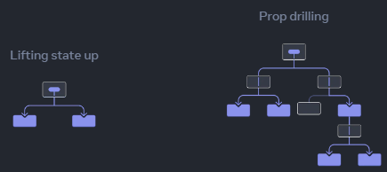
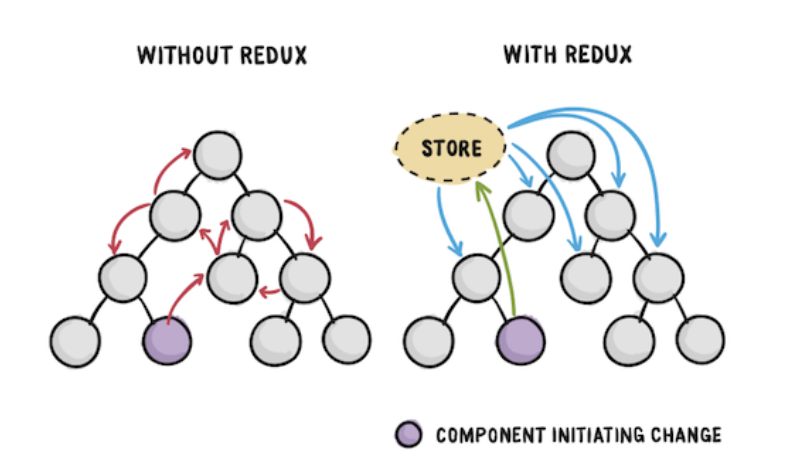

# Dev Web - Jefferson de Carvalho Silva (jeffersoncarvalho@ufc.br)


## Aula 01 - 13.03.2023

---
## O que eu tenho que instalar? 

- NodeJS
- npm/npx

## Repositório

[GitHub - Jefferson Carvalho](https://github.com/jeffersoncarvalho/ufc_2023_1)
## SPA (Sigle Page Application)

Um SPA (aplicativo de página única) é uma implementação de aplicativo da Web que carrega apenas um único documento da Web e, em seguida, atualiza o conteúdo do corpo desse documento único por meio de APIs JavaScript, como XMLHttpRequest e Fetch, quando um conteúdo diferente deve ser exibido.

---  

## Aula 02 - 15.03.2023
---
Nessa aula foi apresentada as diferentes sintaxes de montagem de um componente (classe, função "normal", _arrow function_ e _arrow function_ simplificada) ou uma função. Além disso, foi explicada a forma de passar propriedades do componente pai para o componente filho.
- Exemplo:
```JS
// V0:
function HelloWorld() {
    return <h2>Algum Nome</h2>;
}

// V1:
const HelloWorld = () => {
    return <h2>Algum Nome</h2>;
};

// V2:
const HelloWorld = () => 
    <div>
        <h2>Algum nome</h2>
    </div>

// V3:
import React from 'react';

class HelloWorld extends React.Component {
    render() {
        return (
            <div>
                <h2>Algum nome com classe</h2>
            </div>
        );
    }
}

export default HelloWorld;
```  

- Utilizando `jsx`, podemos simular um comportamento de tipagem para as propriedades dos componentes da seguinte forma (exemplo):
  ```JS
  import PropTypes from 'prop-types';

  const Item = ({marca, ano_lanc}) => {
    return (
        <>
            <li>{marca} - {ano_lanc}</li>
        </>
    )

    Item.PropTypes = {
        marca: PropTypes.string.isRequired,
        ano_lanc: PropTypes.number,
    }  

    // Para atribuir valores default:
    Item.defaultProps = {
        marca: 'Faltou a marca',
        ano_lanc: 0,
    }
  }
  ```

- Passando evento por props:

```JS
const Evento = () => {
    const evento01 = () => console.log("Primeiro evento");
    const evento02 = () => console.log("Segundo evento");

    return (
        <div>
            <MyButton event={evento01} text="Primeiro evento"/>
            <MyButton event={evento02} text="Segundo evento"/>
        </div>
    );
}

export default Evento;
```
```JS
const Mybutton = ({event, text}) => {
    return <button onClick={event}>{text}</button>
}

export default MyButton;
```

- Hierarquia de props: Passar as propriedades do componente pai para o filho.  
  - Isso pode se tornar inviável em aplicações maiores.
  - Para isso, podemos optar por utilizar outros recursos como o `useContext` e o `Redux`.

---
## Aula 03 - 22.03.2023

### Exportando mais de um componente em um mesmo arquivo

- Exemplo de código:
    ```JavaScript
    const Header = () => {
        return (
            <div>
                <h1>Cabeçalho</h1>
            </div>
        );
    }

    const Body = () => {
        return (
            <div>
                <h1>Corpo</h1>
            </div>
        );
    }

    const Footer = () => {
        return (
            <div>
                <h1>Rodapé</h1>
            </div>
        );
    }

    export {Header, Body, Footer};
    ```
- Importação em outro arquivo (duas formas):
    ```JavaScript
    import { Header, Body, Footer } from './components/04Multiplo';
    
    import * as Site from './components/04Multiplo';
    ```

### Utilizando children

- Siga o exemplo abaixo para `props.children`:
    ```JavaScript
    <div className='App'>
      <Supermercado nome='DuPovu'>
        <Legume nome='Batata' />
        <Bebidas nome='Café' />
      </Supermercado>
    </div>
    ```

    ```JavaScript
    const Supermercado = (props) => {
        return (
            <div>
                <h1>Supermercado {props.nome}</h1>
                {props.children}
            </div>
        );
    }
    ```  
- Note que `children` é uma palavra reservada do escopo das propriedades dos componentes.

### Utilizando Children

- `Children` é uma forma de manipulação e transformação do JSX que é recebido pela propriedade `children`.
- Ex.:
  ```JS

  import { Children} from 'react';
  const Supermercado = ({children, nome}) => {
    return (
        <div style={{display: 'flex', alignItems: 'center', flexDirection:'column'}}>
            <h1>Supermercado {nome}</h1>
            {Children.map(
                children,
                (child) => {
                    return (
                        <div style={{backgroundColor: 'red', color: '#fff'}}>
                            {child}
                        </div>
                    );
                }
            )}
        </div>
        );
    }
  ```  
- Para mais informações, consulte a [documentação de Children](https://react.dev/reference/react/Children).
- A partir deste recurso, podemos utilizar `cloneElement()` (consultar [documentação](https://react.dev/reference/react/cloneElement)).
- O `cloneElement()` é utilizado quando precisamos modificar as propriedades internas do nosso elemento filho.  
  - Cria um clone e discarta o filho original.
  - Modificamos e retornamos o clone em seu lugar de origem.
---
## Aula 04 - 29.03.2023

### Contexto

- Usualmente, passamos as informações para os componentes filhos via props.  
- Passagem por props é uma ótima maneira de canalizar dados explicitamente por meio de sua árvore de interface do usuário para os componentes que os utilizam
- Mas isso pode tornar nosso código muito verboso e incoveniente se você tiver que passar as informações para diferentes componentes filhos.  
- O ancestral comum mais próximo pode estar muito longe dos componentes que precisam de dados, e elevar o estado tão alto pode levar a uma situação chamada “Prop drilling”.  

<div>
  
</div>  

- O contexto permite que um componente pai (mesmo que distante) forneça dados para toda a árvore abaixo dele.  
- Para utilizar contexto, devemos seguir os seguintes passos:  
  1. Criar um contexto.
  1. Usar esse contexto nos componentes que precisam dos dados.  
  1. Fornecer esse contexto do componente que especifica os dados.  

### Criando um contexto

```JavaScript
import { createContext } from 'react';

const MinhaCor = createContext();

export default MinhaCor;
```

### Usando o contexto

```JavaScript
import MinhaCor from './MeuContexto';

const FuncaoB = () => {
    return (
        <MinhaCor.Consumer>
            {
                (cor) => {
                    return (
                        <div>
                            <h1 style={{backgroundColor: cor}}>Função B</h1>
                        </div>
                    );
                }
            }
        </MinhaCor.Consumer>
    );
}

export default FuncaoB;
```

#### Usando o contexto com useContext()  (mais usado)

```JavaScript
import MinhaCor from './MeuContexto';
import { useContext } from 'react';

const FuncaoD = () => {
    const cor = useContext(MinhaCor);
    return (
        <div>
            <h1 style={{backgroundColor: cor}}>Função D</h1>
        </div>
    );
}

export default FuncaoD;
```

### Fornecendo o contexto do componente pai

```JavaScript
import FuncaoB from './FuncaoB';
import MinhaCor from './MeuContexto';

const FuncaoA = () => {
    const cor = 'cyan';

    return (
        <MinhaCor.Provider value={cor}>
            <div>
                <h1 style={{backgroundColor: cor}}>Funcação A</h1>
                <FuncaoB />
            </div>
        </MinhaCor.Provider>
    );
}

export default FuncaoA;
```

### useContext()

- É um React Hook que permite que você leia e assine o contexto de seu componente.
- Chame `useContext` no nível superior do seu componente para ler e assinar o contexto.
- `SomeContext`: O contexto que você criou anteriormente com createContext. O contexto em si não contém as informações, apenas representa o tipo de informação que você pode fornecer ou ler dos componentes.

---

## Aula 05 - 05.03.2023

<div align="center">
    
</div>

### Local Storage VS Session Storage
- No navegador, temos dois locais onde podemos guardar dados do tipo string a partir de uma chave criada (também do tipo string). São eles:
- O que diferencia **Local Storage** de **Session Storage** é o tempo em que os dados ficam armazenados.
- Exemplo - Utilizando sessionStorage:

```JavaScript
const aluno = {
            matricula:"00111",
            nome:"Jefferson",
            curso:"Sistemas de Informação"
        }

sessionStorage.setItem(aluno.matricula, JSON.stringify(aluno))
```
- Nomenclatura: `sessionStorage.setItem(key: string, data: string)`  
- **Session Storage**  
  - Armazena os dados durante a sessão do usuário no navegador (enquanto a aba ou a janela estiver ativa).
  - Quando a sessão é encerrada, os dados são atumaticamente apagados.  
- **Local Storage**
  - Permite armazenar dados no navegador de forma permanente, mesmo depois que o usuário fecha o navegador.  
  - Os dados que estarão armazenados no Local Storage estarão disponíveis mesmo depois que o usuário fechar o navegador.  

### Use State (Hook)
- `useState` é um React Hook (declarado no nível do topo do componente) que permite adicionar uma variável de estado ao seu componente.  

#### Parâmetros
- `initialState`: O valor inicial desejado para o estado.  
  - Pode ser um valor de qualquer tipo.
  - Uma função pode ser passada como estado inicial, nesse caso, ele será tratada como uma função inicializadora (deve ser puro, não deve ter argumentos e deve retornar um valor de qualquer tipo).
  - A função inicializadora é chamada ao inicializar o componente. O valor de retorno é armazenado como estado inicial.

#### Retorno
- Um array com exatamente dois valores:
  - O estado atual.
  - A função _set_ que permite atualizar o estado para um valor diferente e acionar uma nova renderezação (Você pode passar o próximo estado diretamente ou uma função que o calcula a partir do estado anterior:).

### Use Effect (Hook)
- `useEffect` é um React Hook que permite sincronizar um componente com um sistema externo.
  - Deve ser chamado no topo do componente (depois das declarações de estado e antes das funções auxiliares ou return do componente).  

#### Parâmetros  
- `setup`: A função com a lógica do seu efeito.
- `dependencies` (opcional): Lista de todos os valores relativos referenciados dentro do código de configuração.
  - Esses valores incluem props, state e todas as variáveis e funções declaradas diretamente dentro do corpo do componente.  

#### Retorno
- `useEffect` retorna `undefined`.
---
## Aula 06 - 17.04.2023

### O que é o Axios?  

- É um cliente HTTP baseado em promessas para o `node.js` e para o navegador.  
- É isomórfico (pode rodar no navegador e no node.js com a mesma base de código).
  - No lado do servidor usa código nativo node.js (módulo http).
  - No lado do cliente (navegador) usa XMLHttpRequest.

### Features

- Faz XMLHttpRequests do navegador
- Faz requisições http do node.js
- Suporta a API de Promessas
- Intercepta requisições e respostas
- Transforma os dados de requisições e de respostas
- Cancela requisições
- Automaticamente transforma dados para JSON
- Suporta proteções contra XSRF no lado do cliente  

### O que é o Redux

- É uma biblioteca feita para gerenciar estados em uma aplicação.  
- Tira a responsabilidade de um componente ter um estado que poderá ser usado por vários outros componentes dentro de sua aplicação.  
  - Passa isso para um objeto global, que pode ser acessado por qualquer componente, a qualquer momento.

<div>
    
</div>

### Ferramentas do Redux

1. Store
   - Objeto onde será guardado todos os estados que serão utilizados globalmente na aplicação.
1. Actions
   - São ações que serão enviadas do seu componente para acionar os Reducers.
1. MiddleWares
   - Fazem toda a lógica necessária com o dado que será aterado no estado que, ccomo vimos mais acima, fica dentro do store.  
   - Em outras palavras, podemos dizer que MiddleWares são setters, que vão fazer todo o tratamento do dado, aplicar a regra do negócio, etc.  
1. Reducers
   - Depois que o MiddleWare tratar os dados, ele despacha esse dado para o reducer informar ao Store que o state foi alterado e assim, todos os outros componentes que precisarem usar esse novo estado são notificados.

- Acesse [Kenzie](https://kenzie.com.br/blog/o-que-e-redux/) para mais informações.  

--- 