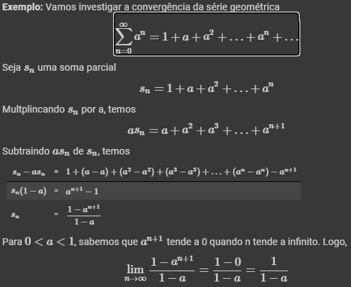
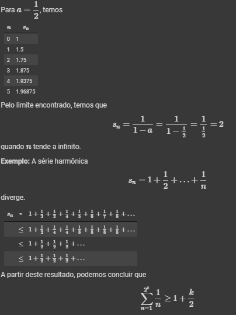
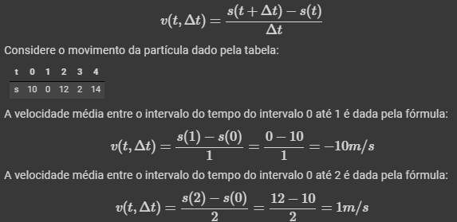
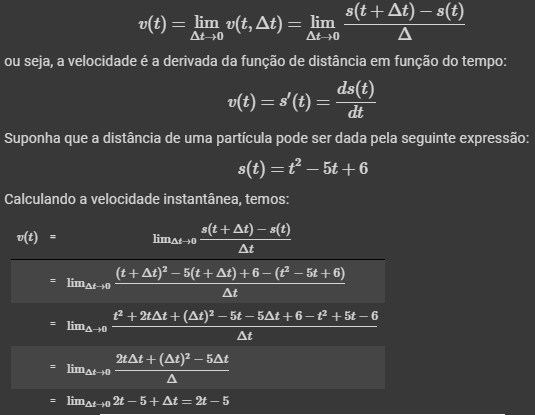
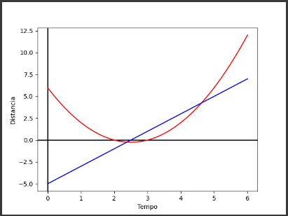
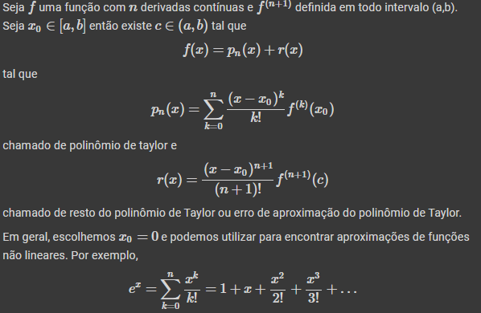
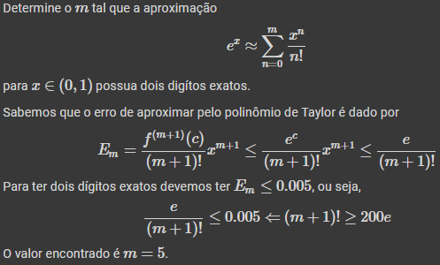
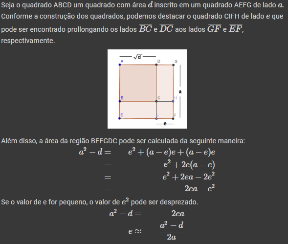
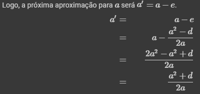
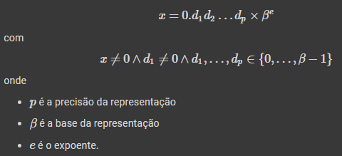

# Matemática Computacional - 2023.1

<div>
    
</div>

## Por que fazer Matemática Computacional?  

- Desenvolvimento de modelos matemáticos e métodos numéricos para obtenção de soluções para problemas complexos.

## Aula 01 - Ferramentas básicas - 23.03.2023

- A seguir temos algumas ferramentas básicas que podem ser necessárias para essa disciplina.

### Sequência

- É uma coleção possivelmente infinita de números alinhados em alguma ordem (X1, X2, X3, ...).

- Uma sequência {Xn}n → ∞ tem um limite A se existe um N >= 0 tal que para todo n >= , para ε >= 0:  
|Xn - A| <= ε

- Podemos ecpressar o fato acima na notação de limite:  
lim n→∞ xn = A

- Uma sequência é **convergente** se ela tem um limite quando _n_ tende a infinito, e **divergente** caso contrário.

- Uma sequência {Xn} é **limitada** se existe algum número M >= 0 tal que |Xn| < M para todo 1, 2, ... e ilimitada se tal número não existir.
- Exemplos:
  - Xn = 1/n é limitada, uma vez que |Xn| < 1.
  - Xn = n é ilimitada.

- Uma sequência {Xn} é crescente se Cn < Xn+1, para todo n. E decrescente se Xn > Xn+1 para todo n.  

### Série Infinita

- Dado uma sequência {Xn} a expressão somatório de Xn de n = 1 até o infinito = X1 + X2 + ..., é chamada de série infinita.   
- Se uma série infinita é convergente com um limite s. Dizemos que essa série converge para a soma s.

<div>
    
</div>
<div>
    
</div>

### Derivada e taxa de variação

#### Velocidade média

- Seja s(t) uma função que determina a distância de uma partícuça. A velocidade média da partícula no intervalo de tempo de t até delta t pode ser calculado pela seguinte fórmula:

<div>
    
</div>  

&nbsp;
### Velocidade Instantânea

- A velocidade instantânea de uma partícula no momento _t_ pode ser cakculada calculando o limite da velocidade média quando delta tende a zero.

<div>
    
</div>  
<div>
    
</div>  

- Note que a velocidade instantânea começa com o valor -5. Quando chega no ponto 5/2 torna-se zero.  

### Teorema do valor médio

- Seja _f_ uma função contínua no intervalo fechado [a, b] e diferenciável no intervalo aberto (a, b). Então existe um ponto ξ ∈ [a, b] tal que: `f'(ξ) = (f(b) - f(a))/(b - a)`.
- Essa equação estabelece que a inclinação da reta tangente ao ponto ξ é igual a inclinação média da curva no intervalo [a, b].
- Podemos reescrever o teorema do valor médio da seguinte maneira: `f(x1) - f(x2) = f'(ξ)(x1 - x2)`.
- Com essa equação, podemos substituir a diferença dos valores da função pela diferença entre dos valores dos argumentos da função.  

### Teorema do Valor Intermediário

- Seja _f_ uma função contínua no intervalo [a, b]. Seja _W_ um valor tal que `f(a) <= W <= f(b)` ou `f(b) <= W <= f(a)`. Então existe um ponto _c_ ∈ [a, b] tal que `f(c) = W`.  
- Consequência: Se você encontrar um intervalo [a, b] tal que `f(a) < 0 < f(b)` ou `f(b) < 0 < f(a)`. Então existe um ponto c ∈ [a, b] tal que `f(c) = 0`.
  - Este teorema pode ser usado para encontrar o zero de uma função.  

### Teorema de Taylor  

- É um resultado matemático que nos ajuda a entender melhor o comportamento de uma função em torno de um ponto específico.  
  - Diz que, se uma função é suficientemente suave em um intervalo ao redor desse ponto, podemos aproximar a função por um polinômio.  
  - Por que um polinômio? -> polinômios são expressões matemáticas mais simples e fáceis de trabalhar.  
- Exemplo: Imagine que você queira aproximar a função cos(x) em torno do ponto x = 0. 
  - O teorema de Taylor nos permite escrever uma expressão para essa função que é um polinômio de grau cada vez mais alto, e quanto mais termos adicionamos, melhor será a nossa aproximação. 
  - Assim, podemos usar essa expressão para fazer cálculos mais facilmente e entender melhor o comportamento da função.
- Esse teorema é importante, pois nos permite aproximar uma função por meio de uma série de polinômios.  
  - Esses polinômios são os chamados polinômios de Taylor -> usados para encontrar uma boa aproximação da função em torno de um ponto específico.  
- Para uma função `f(x)` que é contínua e diferenciável `n` vezes em um intervalo fechado [a, b], existe um polinômio de grau `n`, chamado de polinômio de Taylor.
  - Esse polinômio pode ser escrito como uma soma de termos da forma `(x-a)^k/k!`.
  - Onde `k` é um número inteiro não negativo, tal que:  
  ```
  f(x) = f(a) + f'(a)(x-a) + f''(a)(x-a)^2/2! + ... + f^n(a)(x-a)^n/n! + R_n(x)
  ```
  - `R_n(x)` é o chamado termo de resto, que mede o erro na aproximação da função `f(x)` pelo polinômio de Taylor.

---  
- A seguir temos uma segunda versão dessa explicação (extraido do material da disciplina):  

<div>
    
</div>
<div>
    
</div>
&nbsp;

### Métodos interativos 

- Hierão desenvolveu um algoritmo para o cálculo da raiz quadrada que pode ser interpretado geometricamente da seguinte maneira:
  - Imagine que você queira calcular _√d_. Geometricamente, você quer encontrar o lado quadrado tal que a área do quadrado é _d_, ou seja, _l_ * _l_ = _d_ (_l_ = _√d_).
  - Podemos começar com uma aproximação inicial considerando _l_ = _a_:  

    <div>
        
    </div>
    <div>
        
    </div>

---

## Aula 02 - Erros - 24.03.2023

- O processo de resolução computacional de um problema pode ser estrturado em várias fases:
  - Levantamento dos dados.
  - Construção de um modelo matemático.  
  - Escolha de um método numérico adequado.  
  - Implementação computacional do modelo.  
  - Análise dos resultados obtidos.

### Problema: Calculando a altura de um prédio

- Supondo que estamos em cima de um prédio com uma bola de metal e um cronômetro. Vamos usar isso para medir a altura do edifício.
  - Para isso, podemos usar como auxílio a seguinte equação:  
  `s = s0 + v0t + (1/2)gt^2`  
- A bolinha foi solta do topo do edifício e o cronômetro marcou que ela levou 2s para atingir o solo. Logo, `s = (1/2)*9.8 * 4 = 19,6`.  
- Essa resposta é confiável? Quais são os possíveis erros da modelagem?  
  - Erros de modelagem
    - Resistência do ar
    - Velocidade do vento
    - Forma do objeto.  
  - Erros de resolução  
    - Precisão dos dados
    - Representação dos dados
    - Operações numéricas realizadas.  
    - Erros de truncamento.

### Erro de precisão  

- A maioria das linguagens de programação utiliza uma quantidade fixa de bytes para a representação númerica para números reais -> Impossibilita a representação exata de todos os números reais.  
- Esses erros de precisão podem se acumularem dependendo do número de operações realizadas.  
- Durante a etapa de escolha do método numérico adequado, temos que considerar os possíveis erros que podem ser acumulados durante a resolução do problema.  
- A seguir, vamos ver como podemos representar um número de uma maneira simplificada.  

### Notação científica  

- Permite representar números muito grandes ou muito pequeno de uma maneira simplificada.  
- Um número N na notação científica tem a forma geral `N = m * 10^e`, onde:  
  - `m` é um valor entre 1 e 10
  - `e` é o expoente.

### Ponto Flutuante Normalizada

- A notação em ponto flutuante na forma normalizada é parecida como a notação científica com as seguintes diferenças:  
  - A parte inteira é sempre zero
  - O primeiro dígito após a vírgula é sempre diferente de zero.  
- Um número _x_ pode ser expresso da seguinte maneira:  

<div>
    
</div>

---