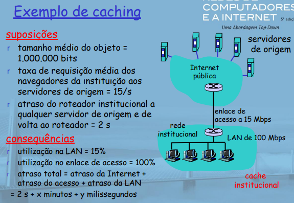
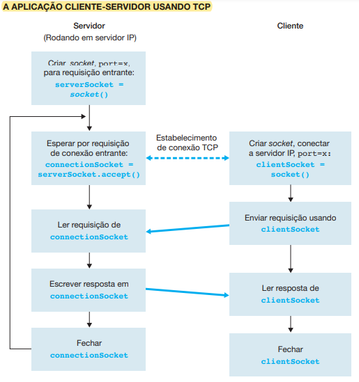

# Redes de Computadores - 2023.1

## Aula 01 - 16.03.2023

### Bibliografia

- KUROSE J. ROSS K. W. Redes de Computadores e internet uma abordagem top-down (IDEAL).
- ANDREW S. TANENBAUM. Redes de Computadores 4° edição, editora Campus (PARA UM MAIOR APROFUNDAMENTO). 

### Avaliações

- 3 avaliações escritas.
- Trabalho final substituí a última avaliação (AP3).
- Segunda chamada e avaliação final cobrem todo o assunto da matéria.

### Sistemas

- Frquência e arquivos - SIPPA.
- Resultados e avaliações - SIGAA.

---
### Capítulo 01

### O que é a Internet?
- Aspectos principais da internet:
  - Componentes de software e hardware báscios que a formam.
- Podemos descrever a Internet em termos de uma infraestrutura de redes que fornece serviços para aplicações distribuídas.

1. Borda da rede
1. Núcleo da rede
1. Atraso, perdas e vazão nas redes comutadas por pacotes.
1. Camadas de protocolo, modelos de serviço
1. Segurança da rede
1. História.

- Alguns conceitos da internet

  <div>
    
  </div>

#### Visão básica
- A internet é uma rede de conhecimento que interconecta centenas de milhões de dispositivos de computação ao redor do mundo.
  - Hospedeiros (Hosts) = sistemas finais.
     - Rodando aplicações de rede.
  - Sistemas finais são conectados entre si por **enlaces (links) de comunicação** e **comutadores (switches) de pacotes**.
  - Quando um sistema final possui dados para enviar a outro sistema final, o sistema emissor segmenta esses dados e adicona bytes de cabeçalho a cada segmento.
  - Os **pacotes** são enviados através da rede ao sistema final de destino, onde são remontados para os dados originais.

- Enlaces de comunicação
  - Fibra, cobre, satélite, rádio.
  - Taxa de transmissão.

- Roteadores -> Encaminham pacotes (pedaços de dados).

- Alguns conceitos:
  - Largura de banda -> Faixa de frequência medida em Hz.
  - Dados -> Medido em Bits ou Byts.
  - Transmissão de dados -> bps (bits por segundo) ou Bps (bytes por segundo).
  - Velocidade -> (distância/tempo) -> M/s ou KM/h.

- Um comutador de pacotes encaminha o pacote que está chegando em um de seus enlaces de comunicação de entrada para um de seus enlaces de comunicação de saída (os mais predominantes são roteadores e comutadores de chamada de enlace).
  - Comutadores de chamada de enlace são geralmente utilizados em redes de acesso.
  - Roteadores são principalmente utilizados no núcleo da rede.
- **rota**/**caminho**: sequência de enlaces de comunicação e comutadores de pacotes que um pacotes percorre.
- Sistemas finais (Hosts) acessam a internet por meio de **Provedores de Serviços de Internet (ISPs)**
  - Cada ISP é uma rede de comutadores de pacotes e enlaces de comunicação.
  - Um ISP de nível mais alto consiste em roteadores de alta velocidade interconectados com enlaces de fibra ótica de alta velocidade.

#### Visão dos elementos básicos
- Sistemas finais, comutadores de pacotes e outras peças da internet executam protocolos.
- **Protocolos**: controle de envio e recepção de mensagens.  
  - Ex.: TCP, IP, HTTP, Skype, Ethernet.
- **Internet: "rede de redes"**
  - Vagamente hierárquica.
  - Internet pública _versus_ intranet privada.  
- Padrões da Internet
  - RFC: Request For Comments
  - IETF: Internet Engineering Task Force.  
- O protocolo IP especifica o formato dos pacotes que são enviados e recebidos entre roteadores e sistemas finais.
  - Os principais protocolos da internet são conhecidos como **TCP/IP**.
- Dada a importância de protocolos para a internet, é adequado que todos concordem sobre o que cada um deles faz.
  - Aqui entram em ação **Padrões de Internet** que são desenvolvidos pela IETF.
  - Os documentos padronizados da IETF são denominados **RFCs** (**Request For Comments** - pedido de comentários).

#### Uma visão de serviço

- **Infraestrutura de comunicação**
  - Possibilita aplicações distribuídas:
    - Web, VolP, e-mail, jogos, e-commerce, compartilhamento de arquivos.
- **Serviços de comunicação fornecidos às aplicações**
  - Entrega de dados confiável da origem ao destino.  
  - Entrga de dados pelo "melhor esforço" (não confiável).
- Os sistemas finais ligados à internet oferecem uma **Interface de Programa de Aplicação** (API).

### O que é um protocolo?

- Protocolos humanos:
  - Que horas são?
  - tenho uma pergunta
  - introduções

- Protocolos de rede:
  - máquinas em vez de humanos.
  - toda atividade de comunicação na internet controlada por protocolos.

<div>
  
</div>

- Um protocolo define o formato e a ordem das mensagens trocadas entre duas ou mais entidades comunicantes, bem como as ações realizadas na transmissão e/ou no recebimento de uma mensagem ou outro evento.
- Um protocolo de rede é semelhante a um protocolo humano; a única diferêncça é que as entidades que trocam mensagens e realizam ações são componentes de hardware ou software de algum dispositivo.

### Visão mais de perto da estrutura de rede:  

- Borda da rede 
  - Aplicações e hospedeiros.  
- Redes de acesso, meios físicos: enlaces de comunicação com e sem fio.
- Núcleo da rede.
  - Roteadoes interconectados.
  - Rede de redes.

### A borda da rede
- Sistemas finais (hospedeiros)
  - São hospedeiros porque executam programas de aplicação.
  - Ex.: Web, e-mail.
  - na "borda da rede".

- Modelo cliente/servidor
  - Hospedeiro cliente solicita e recebe serviços de servidor sempre ativo.
  - Ex.: navegador/servidor Web, cliente/servidor de e-mail.

- modelo peer-peer:  
  - Usa mínimo (ou nenhum) de servidores dedicados.
  - Ex.: Skype

### Redes de acesso e meios físicos

- Como conectar sistemas finais ao roteador da borda?
  - Rede de acesso residencial.
    - Os dois tipos de acesso residencial banda larga predominantes são a **linha digital de assinante (DSL)** ou a cabo.
    - Normalmente, uma residência obtém acesso DSL à Internet da mesma empresa que fornece acesso telefônico local com fio.
    - A linha telefônica conduz, simultaneamente, dados e sianis telefônicos tradicionais, que são codificados em frequências diferentes:
      - Um canal _downstream_ de alta velocidade, com banda de 50KHz a 1MHZ.
      - Um canal _upstream_ de velocidade média, com uma banda de 4 KHz a 50 KHz.
      - Um canal de telefone bidirecional comum, com uma banda de 0 a 4 KHz. 
  - Redes de acesso institucional (escola, empresa)  
    - Uma rede local (LAN) costuma ser usada para conectar sistemas finais ao roteador da periferia (isso também ocorre nas residencias, com mais frequêcnia atualmente).
    - A **Ethernet** é uma tecnologia LAN que é utilizada predominantemente.  
    - Em uma LAN sem fio, os usuários transmitem/recebem pacotes para/de um ponto de acesso que está conectado à rede da empresa (quase sempre incluindo Ethernet com fio) que, por sua vez, é conectada à Internet com fio.
    - Um usuário de LAN sem fio deve estar no espaço de alguns metros do ponto de acesso.  
    - O acesso à LAN sem fio é baseado na tecnologia IEEE 802.11m ou seja, Wi-Fi, está presente em todo lugar.
  - Redes de acesso móvel
    - Dispositivos com acesso móvel empregam a mesma infraestrutura sem fios usada para a telefonia celular para enviar/receber pacotes por uma estação-base que é controlada pela operadora de rede celular.  
    - Diferente do Wi-Fi, um usuário só precisa estar dentro de algumas dezenas de quilômetros da estação-base.

- Lembre-se:
  - Taxa de transmissão (bits por segundo) da rede de acesso?
  - Compartilhado ou dedicado? 

---
## Aula 02 - 17.03.2023

### Modem discado

<div>
  
</div>

- Usa infrasestrutura de telefonia existente.
  - Casa conectada ao **escritório central**.
- Até 56 kbps de acesso direto ao roteador (geralmente menos).
- Não pode navegar e telefonar ao mesmo tempo: não está "sempre ligado".

### Digital Subscriber Line (DSL)

<div>
  
</div>

- Também usa infraestrutura de telefone existente.
- Até 1 Mbps upstram (hoje, normalmente < 256 kbps).
- Até 8 Mbps downstram (hoje, normalmente < 1 Mbps>).
- Linha física dedicada à central telefônica.

### Acesso residencial: modems a cabo

- Não usa infraestrutura de telefone.
  - Usa infraestrutura de TV a cabo.
- **HFC: Hybrid Fiber Coax**
  - assimétrico: até 30 Mbps downstream, 2 Mbps upstream.
- **Rede** de cabo e fibra conecta casas ao roteador ISP.
  - Casas **compartilham acesso** ao roteador.
  - Diferente de DSL, que tem **acesso dedicado**.

### Fibra nas residências

<div>
  
</div>

- Enlace ótico da central à residência.
- Duas tecnologias óticas concorrentes:  
  - Passive Optical Network (PON).
  - Active Optical Network (PAN).
- Velocidades de internet muito mais altas;
- Fibra também transporta serviços de tv e telefone.

### Acesso à Internet por Ethernet

<div>
  
</div>

- Normalmente usado em empresas, universidade, etc.
- Ethernet a 10 Mbs, 100 Mbps, 1 Gbps, 10 Gbps.
- Hoje, os sistemas finais normalmente se conectam ao comutador Ethernet.

### Redes de acesso sem fio

<div>
  
</div>

- Rede de acesso sem fio compartilhado conecta sistema final ao roteador.
  - Via estação base, também conhecida como "ponto de acesso".
- **LANs sem fio:**
  - 802.11b/g (wifi): 11 ou 54 Mbps
- **Acesso sem fio de área mais remota**
  - Fornecido pelo operador de telecomunicação.  
  - ~1 Mbps por sistema celular (EVDO, HSDPA)
  - Próximo (?): WiMAX (101s Mbps) por área remota. 

### Redes residenciais

- **Componentes típicos da rede residencial:**
- modem DSL ou a cabo.
- roteador/firewall/nat
- Ethernet
- Ponto de acesso sem fio

<div>
  
</div>

### Meios físicos

- **bit**: propaga entre pares de transmissor/receptor.
- **enlace físico**: o que fica entre o transmissor e receptor.
- **Meio guiado**:
  - Sinais se propagam em meio sólido: cobre, fibra, coaxial.  
- **Meio não guiado**:
  - Sinais se propagam livrimente, Ex.: rádio.
- **Par Trançado (TP)**
  - Dois fios de cobre isolados (é o tradicional cabo Ethernet).  
    - Categoria 3: fios de telefone tradicionais, Ethernet a 10 Mbps.
    - Categoria 5: Ethernet a 100 Mbps.
- Exemplos de meios físicos são: Par de fios de cobre trançado, cabo coaxial, cabo de fibra ótica multimodo, espectro de rádio terrestre e espectro de rádio por satélite.
### Meio físico: cabo coaxial, fibra

- **Cabo coaxial**:
  - Dois condutores de cobre concêntricos
  - Bidirecional
  - Banda base:
    - Único canal no cabo.
    - Ethernet legado.
  - Banda larga:
    - Múltiplos canais no cabo
    - HFC
  - Como o par trançado, o cabo coaxial é constituído de dois condutores de cobre, porém concêntricos e não paralelos.
- **Cabo de fibra ótica**:
  - Fibra de vidro conduzindo pulsos de luz. Cada pulso é um bit.
  - Operação em alta velocidade:
    - Transmissão em alta velocidade ponto a ponto (Ex.: 10-100 Gps).
  - A fibra ótica é um meio delgado e flexível que conduz pulsos de luz, cada um deles representando um bit.

### Meio físico: rádio

- Sinal transportado no espectro eletromagnético.
- Nenhum "fio" físico.
- Bidirecional.
- Efeitos no ambiente de propagação:
  - Reflexão
  - Obstrução por objetos
  - Interferência
- Os canais de rádio terrestres carregam sinais dentro do espectro eletromagnético.
  - São um meio atraente porque sua instalação não requer cabos físicos, podem atravessar paredes, dão conectividade ao usuário móvel e, potencialmente, conseguem transmitir um sinal a longas distâncias.
  - Podem ser classificados, a nível de operação, em:
    - Distâncias muito curtas.
    - Pequeno alcance.
    - Longo alcance.
- **Rasdo link types:**
  - micro-ondas terrestre
    - Ex.: até canais de 45 Mbps
  - LAN (Ex.: Wifi)
    - 11 Mbps, 54 Mbps
  - àrea ampla (Ex.: celular)
    - celular 36: ~1 Mbps
  - satélite
    - Um satélite de comunicação liga dois ou mais transmissores-receptores de micro-ondas baseados na Terra, denominados estações terrestres.
    - Canal de Kbps a 45 Mbps (ou múltiplos canais menores)
    - Atraso fim a fim de 270 msec.
    - Geoestacionário VS baixa altitude.

### O núcleo da rede

- Malha de roteadores interconectados.
- A questão fundamental:
  - Como os dados são transferidos?

### Núcleo da rede: comutação de circuitos

- **Recursos fim a fim reservados para "chamada"**
- Largura de banda do enlace, capacidade de comutação.
- Recursos dedicados: sem compartilhamento.  
- Desempenho tipo circuito (garantido).
- Exige preparação de chamada.
- Recursos de rede (Ex.: largura de banda) divididos em "pedaços".
  - Pedaços alocados a chamadas.
  - Pedaço de recurso **ocioso** se não usado por chamada particular (sem compartilhamento).
- Dividindo largura de banda do enlace em "pedaços".  
  - Divisão de frequência
  - Divisão de tempo

<div>
  
</div>

<div>
  
</div>

Resolução:

- 1536/24 = 64 Mbps = 64.000.000 bps
- 640.000/64.000.000 = 0,01 segundos = 10 ms
- 500 ms + 10 ms = **510 ms**

### Núcleo da rede: comutação de pacotes

- **Cada fluxo de dados fim a fim dividido em pacotes**
- Para enviar uma mensagem de um sistema final de origem para um destino, o originador fragmenta mensagens longas em porçoes de dados menores, denominados **pacotes**.  
- Entre origem e destino, cada um deles percorre enlaces de comunicação e **comutadores de pacotes** (há dois tipos principais de comutadores de pacotes: **roteadores** e **comutadores de camada de enlace**).
- Se um sistema final de origem ou um comutador de pacotes estiver enviando um pacote de L bits por um enlace com taxa de transmissão de R bits/s, então o tempo para transmitir o pacote é L/R segundos.
- Cada pacote usa largura de banda total do enlace.
- Recrusos usados quando necessário.
- **Disputa por recursos**:
  - Demanda de recurso agregado pode exceder quantidade disponível.
  - Congestionamento: fila de pacotes, espera por uso do enlace.
  - store and forward: pacotes se movem um salto de cada vez.  
    - Nó recebe pacote completo antes de encaminhar.
### Comutação de pacotes: multiplexação estatística

<div>
  
</div>

### Comutação de pacotes: store-and-forward

- O comutador de pacotes deve receber o pacote inteiro antes de poder começar a transmitir o primeiro bit para o enlace de saída.
- Supondo uma linha de transmissão de A até B passando por um comutador de pacotes, teríamos um atrase de 2L/R, pois o comutador iria receber o pacote inteiro antes de iniciar a transmissão.
  - Se o comutador reenviasse os bits assim que chegassem, então o atraso total seria L/R.

<div>
  
</div>

- Considerando um caso geral do envio de um pacote da origem ao destino por um caminho que consiste em N enlaces, cada um com taxa R (assim, há N - 1 roteadores entre a origem e o destino), teríamos que `d_fim_a_fim = N * L/R`.

### Comutação de pacotes VS comutação de circuitos

- A comutação de pacotes permite que mais usuários usem a rede.  

<div>
  
</div>
<div>
  
</div>

---
## Aula 03 - 23.03.2023

### Estrutura da Internet

- Aproximadamente hierárquica.  
- **no centro: ISPs de "níve l"** -> Cobertura nacional/internacional.  
  - Tratam uns aos outros como iguais.
  - Ex. - Sprint:
  <div>
    
  </div>
- **ISPs de nível 2: ISPs menores (geralmente regionais)**
  - Conectam a um ou a mais ISPs de nível 1, possívelmente outros ISPs de nível 2.
  <div>
    
  </div>
- **ISPs de nível 3 e ISPs locais**
  - rede do último salto ("acesso"), mais próximo dos sistemas finais.
  <div>
    
  </div>

### Como ocorrem a perda e o atraso?

- Pacotes se enfileiram em buffers de roteador.  
  - Taxa de chegada de pacotes ao enlace ultrapassa capacidade de saída do enlace.
  - Pacotes se enfileiram, esperam por sua vez.
  - Se não houver buffers livres para armazenar os pacotes, os mesmos serão descartados.

### Quatro fontes de atraso de pacotes

1. Processamento nodal
   - Verficar erros de bit.
   - Determinar enlace de saída.  
2. Enfileiramento
   - Tempo esperado por transmissão no enlace de saída.  
   - Depende do nível de congestionamento do roteador.
3. Atraso de transmissão
   - R = largura de banda do enlace (bps).
   - L = tamanho do pacote (bits)
   - Tempo para enviar bits no enlace = L/R.
4. Atraso de propagação
   - d = tamanho do enlace físico.  
   - s = vel. de propagação no meio (~2*108 m/s)
   - Atraso de propagação = d/s.

### Atraso nodal

<div>
  
</div>
&nbsp;

### Atraso de enfileiramento (revisado)

- R = Largura de banda do enlace (bps).  
- L = tamanho do pacote (bits)
- a = taxa média de chegado de pacote
- **Intensidade de tráfego = La/R**
  - La/R ~ 0: Pequeno atraso de enfileiramento médio.
  - La/R -> 1: Atrasos tornam-se grandes.
  - La/R > 1: Mais "trabalho" chegando do que pode ser atendido, atraso médio infinito!

<div>
  
</div>
&nbsp;

### Perda de pacote

- Fila (ou buffer) antes do enlace no buffer tem capacidade finita.  
- Pacote chegando à fila cheia -> descartado (ou perdido).  
- Último pacote pode ser retransmitido pelo nó anterior, pela origem ou de forma nenhuma.

### Vazão 

- **Vazão**: taxa (bits/unidade de tempo) em que os bits são transferidos entre o emissor/receptor.  
  - **Instantânea**: taxe em determinado ponto no tempo.  
  - **média**: taxa por período de tempo maior.
<div>
  
</div>

### Vazão: cenário da internet

- Na prática: Rc ou Rs normalmente é gargalo.
- Vazão fim a fim por conexão: mim(Rc,Rs,R/10)
- "R/10" porque há 10 conexões (aproximadamente) compatilhando enlace de gargalo do backbone a R bits/s

### "Camadas" de protocolo

- **Redes são complexas!**  
  - muitas "partes":
    - hospedeiros
    - roteadores
    - enlaces de vários meios físicos
    - aplicações
    - protocolos
    - hardware, software
- **Camada**: cada camada implementam um serviço.  
  - por meio de suas própias ações da camada interna.  
  - contando com serviços fornecidos pela camada abaixo.

#### Por que usar camadas?

- lidando com sistemas complexos:  
  - estrutura explicita permite identificação e relação entre partes complexas do sistema.
    - **modelo de referência** em camadas para discussão.  
  - modularização facilita manutenção e atualização do sistema.  
    - mudança de implementação do serviço da camada transparente ao restante do sistema.  
    - Ex.: mudanças no procedimento de porta não afeta o restante do sistema.  
- uso de camadas considerado prejudicial?  

### Pilha de protocolos da Internet  

- **aplicação**: suporte a aplicações de rede.  
  - FTP, SMTP, HTTP.  
- **transporte**: transferência de dados processo-processo.  
  - TCP, UDP.  
- **rede**: roteamento de datagramas da origem ao destino.  
  - IP, protocolos de roteamento.  
- **enlace**: transferência de dados entre elementos vizinhos da rede.  
  - PPP, Ethernet.  
- **física**: bits "nos fios".  

#### Modelo de referência ISO/OSI  
- **apresentação**: permite que as aplicações interpretem significado de dados. Ex.: criptografia, compactação, convenções específicas da máquina.  
- **session**: sincronização, verificação, recuperação de troca de dados.  
- Pilha da Internet não contém essas camadas.
  - estes serviços, se necessários, devem ser implementados na aplicação.
---
## Aula 04 - Camada de Aplicação - 30.03.2023

### Algumas aplicações de rede

- e-mail
- web
- mensagem instantânea
- Login remoto
- Compartilhamento de arquivos P2P
- Jogos em rede multiusuários
- Clipes de vídeo armazenaods em fluxo contínuo  
- Redes sociais
- Voice over IP
- Videoconferência em tempo real
- Computação em grade

### Criando uma aplicação de rede  

- **Escreva programas que**  
  - Executem em (diferentes sistemas finais).  
  - Se comuniquem pela rede.  
  - Ex.: software de servidor Web se comunica com software de navegador Web.  
- **Não é preciso escrever software e para dispositivos do núcleo da rede**  
  - Dispositivos do núcleo da rede não executam aplicações do usuário.  
  - As aplicações nos sistemas finais permitem rápido, desenvolvimento e propagação.

### Arquiteturas de aplicação  
1. Cliente-servidor
    - Incluindo centros de dados/cloud computing
1. Peer-to-peer (P2P)  
1. Híbrida de cliente-servidor e P2P  

### Arquitetura cliente-servidor  
- **Servidor**
  - Hospedeiro sempre ligado.
  - Endereço IP permanente.
  - Server farms por expansão.  
- **Clientes**
  - Comunicam-se com o servidor.  
  - Podem estar conectados intermitentemente.  
  - Podem ter endereços IP dinâmicos.  
  - Não se comunicam diretamente entre si.  

  <div>
    
  </div>

### Arquitetura P2P pura  

- Nenhum servidor sempre ligado.  
- Sistemas finais arbitrários se comunicam diretamente.  
- Pares são conectados intermitentemente e mudam endereços IP.  
- **Altamente escalável, mas difícil de administrar**  

  <div>
    
  </div>

### Híbrido de cliente-servidor e P2P  

- **Skype**  
  - Aplicação P2P voice-overIP.  
  - Servidor centralizado: achando endereço da parte remota.  
  - Conexão cliente-cliente: direta (não através de servidor).  
- **Mensagem Instantânea**  
  - Bate-papo entre dois usuários é P2P.  
  - Serviço centralizado: detecção/localização da presença do cliente.  
    - Usuário registra seu endereço IP com servidor central quando entra on-line.  
    - Usuário contacta servidor central para descobrir endereços IP dos parceiros.  

### Processos se comunicando  
- **processo**: Programa rodando dentro de um hospedeiro.
  - No mesmo hospedeiro, dois processos se comunicam usando a **comunicação entre processos** (definida pelo SO).  
  - Processos em hospediros diferentes se comunicam trocando **mensagens**.  
- **processo cliente**: Processo que inicia a comunicação.  
- **Processo servidor**: Processo que espera para ser contactado.  
- Nota: aplicações com arquiteturas P2P têm processos clientes & processos servidores.  

### Sockets  

- Processo envia/recebe mensagens de/para seu **socket**.  
- Socket semelhante à porta.  
  - Processo enviando empurra mensagem pela porta.  
  - Processo envinado conta com infraestrtura de transporte no outro lado da porta.
    - Essa estrutra leva a mensagem ao socket no processo receptor.
  
  <div>
    
  </div>  

### Endereçando processos  

- Para receber mensagens, processo deve ter **identificador**.  
- Dispositivo hospedeiro tem endereço IP exclusivo de 32 bits.  
- Pergunta: Basta o endereço IP do hospedeiro em que o processo é executado para identificar o preocesso?
  - Resposta: Não. Muitos processos podem estar rodando no mesmo hospedeiro.  
- **Identificador** inclui **endereço IP** e **números de porta** associados ao processo no hospedeiro.  
- Exemplos de número de porta:  
  - servidor HTTP: 80  
  - servidor de correio: 25

### Definição de protocolo da camada de aplicação  

- Tipos de mensagens trocadas.  
  - Ex.: requisição, resposta.  
- Sintaxe da mensagem:  
  - que campos nas mensagens & como os campos são delineados.  
- Semântica da mensagem.  
  - Significado da informação nos campos.  
- Regras de quando e como processos enviam & respondem a mensagens.  
-  **Protocolos de domínio público**
  - definidos em RFCs.
  - provê interoperabilidade.  
  - Ex.: HTTP, SMTP, BitTorrent.
- **Protocolos proprietários**  
  - Ex.: Sjype, ppstream.

### Que serviço de transporte uma aplicação precisa?  

- **Perda de dados**
  - Algumas aplicações podem tolerar alguma perda (Ex.: Áudio).
  - Outras aplicações exigem transferência de dados 100% confiável (Ex.: Transferência de arquivos).
- **Temporização**
  - Algumas aplicações exigem pouco atraso para serem "eficazes" (Ex.: Jogos interativos).
- **Vazão**
  - Algumas aplicações exigem um mínimo de vazão para serem "eficazes" (Ex.: multimídia).
  - Outras aplicações utilizam qualquer vazão que receberem (Ex.: Aplicações elásticas).
- **Segurança**
  - Criptografia, integridade de dados, etc.

### Requisitos de serviço de transporte das aplicações comuns  

  <div>
    
  </div>  
&nbsp;

### Serviços de protocolos de transporte da Internet  

- **serviço TCP**
  - Orientada a conexão  
    - Preparação exigida entre processos cliente e servidor.
  - Transporte confiável  
    - Entre processo emissor e receptor.
  - Controle de fluxo  
    - Emissor não sobrecarrega receptor.
  - Controle de congestionamento
    - Regula emissor quando a rede está sobrecarregada.
  - Não oferece  
    - Temporização, garantias mínimas de vazão, segurança.
- **serviço UDP**  
  - Transferência de dados não confiável entre processo emissor e receptor.  
  - Não oferece: preparação da conexão, confiabilidade, controle de fluxo, controle de congestionamento, temporização, garatia de vazão ou segurança.  

### Aplicações da Internet: aplicação protocolos de transporte

  <div>
    
  </div>  
&nbsp;

### Web e HTTP  

- **Primeiro, algum jargão**  
  - **página Web** consiste em **objetos**.  
  - Objetos pode ser arquivo HTML, imagem JPEG, applet Java, arquivo de áudio, ...  
  - Página Web consiste em arquivo HTML básico que inclui vários objetos referenciados.  
  - Cada objeto é endereçável por um **URL**.  
  - Exemplo de URL: `www.someschool.edu/someDept/pic.gif`  
    - `www.someschool.edu` -> nome do hospedeio.  
    - `/someDept/pic.gid` -> Nome do caminho.  

### Visão geral do HTTP  

- **HTTP: HyperText Transfer Protocol**  
  - Protocolo da camda de aplicação da Web.  
  - modelo cliente/servidor.  
    - **cliente**: navegador que requisita, recebe, "exibe" objetos web.  
    - **servidor**: servidor web envia objetos em resposta a requisições.  
  <div>
    
  </div> 

  - **Usa TCP**
    - Cliente inicia conexão TCP (cria socket) com serviddor, porta 80.  
    - Servidor aceita conexão TCP do cliente.  
    - Mensagens HTTP (do protocolo da camada de aplicação) trocadas entre navegador (cliente HTTP) e servidor Web (servidor HTTP).  
    - Conexão TCP fechada.  
  - **HTTP** é "sem estado".  
    - servidor não guarda informações sobre requisições passadas do cliente.  
  - Protocolos que mantêm "estado" são complexos!  
    - história passada (estado) deve ser mantida.  
    - se servidor/cliente falhar, suas visões do "estado" podem ser incoerentes, devem ser reconciliadas.  

### Conexões HTTP  

1. **HTTP não persistente**
  - No máximo um objeto é enviado por uma conexão TCP.
1. **HTTP persistente**  
  - Múltiplos objetos podem ser enviados por uma única conexão TCP entre cliente e servidor.  

### HTTP não persistente  

- Suponha que o usuário digite o URL `www.someSchool.edu/someDepartament/home.index` (contém texto e referência a 10 imagens JPEG).  

1. Cliente HTTP inicia conexão TCP com servidor HTTP (processo) em `www.someSchool.edu` na porta 80
1. Servidor HTTP no hospedeiro `www.someSchool.edu` espera conexão TCP na porta 80. "aceita" conexão, notificando cliente.  
1. Cliente HTTP envia **mensagem de requisição** HTTP (contendo URL) pelo socket de conexão TCP. Mensagem indica que cliente deseja o objeto `someDepartament/home.index`.  
1. Servidor HTTP recebe mensagem de requisição, forma **mensagem de resposta** contendo objeto requisitado e envia mensagem para seu socket.  
1. Servidor HTTP fecha conexão TCP.  
1. Cliente HTTP recebe mensagem de resposta contendo arquivo html, exibe html. Analisando arquivo html, acha 10 objetos JPEG referenciados.  
1. Etapas 1-5 repetidas para cada um dos 10 objetos JPEG.  

#### Tempo de resposta  
- **Definição de RTT**: tempo para um pequeno pacote trafegar do cliente ao servidor e retornar.  
- **Tempo de resposta**:
  - Um RTT para iniciar a conexão TCP.  
  - Um RTT para a requisição HTTP e primeiros bytes da resposta HTTP retornarem.  
  - Tempo de transmissão de arquivo.  
- **Total = 2RTT + tempo de transmissão**  

<div>
  
</div>  
&nbsp;

### HTTP Persistente  

- **Problemas do HTTP não persistente**  
  - Requer 2 RTTs por objeto.  
  - Overhead do SO para cada conexão TCP.  
  - Navegadores geralmente abrem conexões TCP paralelas para buscar objetos referenciados.  
- **HTTP persistente**
  - Servidor deixa a conexão aberta depois de enviar a resposta.  
  - Mensagens HTTP seguintes entre cliente/servidor enviadas pela conexão aberta.  
  - Cliente envia requisições assim que encontra um objeto referenciado.  
  - No mínimo um RTT para todos os objetos referenciados.

### Mensagem HTTP  
- Dois tipos de mensagens HTTP: **requisição** e **resposta**.  
- **Mensagem de requisição HTTP:**  
  - ASCII (formato de texto legível)  
  <div>
    
  </div>  
#### Formato geral
  <div>
    
  </div>  
&nbsp;

#### Upload da entrada do formulário  

- **método POST**
  - Página Web geralmente inclui entrada do formulário.  
  - Entrada é enviada ao servidor no corpo da entidade.
- **método do URL**  
  - Usa o método GET.
  - Entrada é enviada no campo de URL da linha de requisição.

### Tipos de método  

- **HTTP/1.0**
  1. GET
  1. POST
  1. HEAD
      - Pede ao servidor para deixar o objeto requisitado fora da resposta.
- **HTTP/1.1**
  1. GET; POST; HEAD
  1. PUT
      - Envia arquivo no corpo da entidade ao caminho especificado no campo de URL.  
  1. DELETE  
      - Exclui arquivo especificado no campo de URL;  

### Mensagem de resposta HTTP  

  <div>
    
  </div>  
&nbsp;

### Códigos de estado da resposta HTTP  

- Exemplos da primeira linha da mensagem de resposta:  
  - 100 Continue
    - Pedido incompleto recebido, pode eviar o resto do pedido.
  - 200 Ok
    - Requisição bem-sucedida, objeto requisitado mais adiante.
  - 301 Moved Permanently  
    - Objeto requisitado movido, novo local especificado mais adiante na mensagem (cabeçalho Location)
  - 400 Bad Request  
    - Mensagem de requisição não entendida pelo servidor.
  - 404 Not Found  
    - Documento requisitado não localizado neste servidor.
  - 505 HTTP Version Not Supported  
    - Solicitação usa versão HTTP não suportada.

### Estado usuário-servidor: cookies  

- Nuitos sites importantes usam cookies.  
- **Quatro componentes**  
  1. Linha de cabeçalho de cookie da mensagem de resposta HTTP.  
  1. Linha de cabeçalho de cookie na mensagem de requisição HTTP.  
  1. Arquivo de cookie na máquina do usuário, controlado pelo navegador do usuário.  
  1. Banco de dados de apoio no site web.  
- **Exemplo**  
  - Susana sempre acessa a Internet pelo PC.
  - Visita um site de comércio eletrônico pela primeira vez.  
  - Quando as primeiras requisições HTTP chegam ao site, este cria:  
    - ID exclusivo.
    - Entrada no banco de dados de apoio para o ID.  

<div>
  
</div>  

- **O que os cookies podem ter**
  - Autorização
  - Carrinhos de compras
  - Recomendações
  - Estado da sessão do usuário (e-mail da Web)
- **Como manter o "estado"**  
  - Extremidades do protocolo: mantêm estado no emissor/receptor por múltiplas transações.  
  - cookies: mensagens HTTP transportam estado.  
- **Cookies e privacidade**
  - cookies permitem que os sites descubram muito sobre você.  
  - você pode fornecer nome e e-mail aos sites.  

### Caches Web (Servidor Proxy)  

- **Objetivo:** satisfazer a requisição do cliente sem envolcer servidor de origem.  
  - Usuário prepara navegador: acesso à Web via cache.  
  - Navegador envia todos as requisições HTTP ao cache.  
    - Objeto no cache: cache retorna objeto.  
    - Ou cache requisita objeto do servidor de origem, depois retorna objeto ao    cliente.  
<div>
  
</div>
&nbsp;

### Mais sobre cache web  

- Cache atua como cliente e servidor.  
- Normalmente, cache é instalado por ISP (da universidade, empresa, residencial).  
- **Por que caching Web?**  
  - Reduz tempo de resposta à requisição do cliente.  
  - Reduz tráfego no enlace de acesso de uma instituição.  
  - Internet densa com caches:  
    - Permitem que provedores de conteúdo "fracos" renetan conteúdo efetivamente (mas o mesmo ocorre com compartilhamento de arquivos P2P).

<div>
  
</div>
<div>
  
</div>
<div>
  
</div>  

### GET condicional  

- **Objetivo:** não enviar objeto se o cache tiver versão atualizada.  
- Cache: especifica data da cópia em cache na requisição HTTP.
  ```
  If-modified-since:  
    <data>
  ```  
- Servidor: resposta não contém objeto se a cópia em cache estiver atualizado:  
  ```
  HTTP/1.0 304 Not
    Modified
  ```
<div>
  
</div>
&nbsp;

## Aula 05 - Camada de Aplicação - 31.03.2023

### FTP: o protocolo de transferência de arquivos

<div>
  
</div>

- Transfere arquivo de/para hospedeiro remoto.  
- Modelo cliente/servidor.
  - **cliente**: lado que inicia transferência (de/para remoto).  
  - **servidor**: hospedeiro remoto.  
- FTP: RFC 959
- servidor FTP: porta 21.

### FTP: Conexões separadas para controle e dados
- Cliente FTP contacta servidor FTP na porta 21 (TCP é o protocolo de transporte).  
- Cliente autorizado por conexão de controle.  
- Cliente navega por diretório remoto enviando comandos por conexão de controle.  
- Quando servidor recebe comando de transferência de arquivo, abre 2° conexão TCP (para arquivo) com cliente.  
- Após transferir um arquivo, servidor fecha conexão de dados.

<div>
  
</div>

- Servidor abre outra conexão de dados TCP para transferir outro arquivo.  
- Conexão de controle: **"fora da banda"**
- Servidor FTP mantém "estado": diretório atual. autenticação anterior.   

### Comandos e respostas FTP

- **Exemplos de comandos**
  - Enviado como texto ASCII pelo canal de controle.
  - `USER nome-usuário`
  - `PASS senha`
  - `LIST` retorna lista de arquivos no diretório atual.  
  - `RETR nome-arquivo` recupera (apanha) arquivo.  
  - `STOR nome-arquivo` armazena (coloca) arquivo no hospedeiro remoto.
- **Exemplos de códigos de retorno**  
  - Código e frases de estado (como no HTTP).
  - `331 Username Ok, password required`
  - `125 data connection already open;`
  - `425 Can't open data connection`
  - `452 Error writing file`  

### Correio eletrônico  

&nbsp;
<div>
  
</div>

- **Três componentes principais:**
  - Agentes de usuário.
  - Servidores de correio.
  - Simple Mail Transfer Protocol: SMTP  
- **Agente do usuário**
  - Também chamado "leitor de correio"
  - redigir, editar, ler mensagens de correio eletrônico.  
  - Ex.: Eudora, Outlook, elm, Mozila Thunderbird.  
  - Mensagens entrando e saindo armazenadas no servidor.  

### Correio eletrônico: Servidores de correio
- **Caixa de correio** contém mensagens que chegam para o usuário.  
- **Fila de mensagens** com mensagens de correio a serem enviadas.  
- **Protocolo SMTP** entre servidores de correio para enviar mensagens de e-mail.  
  - Cliente: servidor de envio de correio.  
  - "Servidor": servidor de recepção de correio.  

### Correio eletrônico: SMTP [RFC 2821]  
- Usa TCP para transferir de modo confiável a mensagem de e-mail do cliente ao servidor, porta 25.  
- Transferência direta: servidor de envio ao servidor de recepção.  
- Três fases da transferência.  
  - Handshaking (saudação).
  - Transferência de mensagens.  
  - Fechamento.  
- Interação comando/resposta.  
  - **comandos**: texto ASCII.
  - **resposta**: código e frase de estado.  
- Mensagens devem estar em ASCII de 7 bits.  

### Cenário: Alice envia mensagem a Bob

&nbsp;
<div>
  
</div>

1. Alice usa AU para redigir mensagem "para" `bob@algumaescola.edu`.
1. O AU de Alice envia mensagem ao seu servidor de correio, que é colocada na fila de mensagens.  
1. Lado cliente do SMTP abre conexão TCP com servidor de correio de Bob.  
1. Cliente SMTP envia mensagem de Alice pea conexão TCP.  
1. Servidor de correio de Bob coloca mensagem na caixa de correio de Bob.  
1. Bob chama seu agente do usuário para ler mensagem.  

### Exemplo de interação SMTP  

```
S: 220 hamburger.edu
C: HELO crepes.fr
S: 250 Hello crepes.fr, pleased to meet you
C: MAIL FROM: <alice@crepes.fr>
S: 250 alice@crepes.fr... Sender ok
C: RCPT TO: <bob@hamburger.edu>
S: 250 bob@hamburger.edu ... Recipient ok
C: DATA
S: 354 Enter mail, end with "." on a line by itself
C: Você gosta de ketchup?
C: Que tal picles?
C: .
S: 250 Message accepted for delivery
C: QUIT
S: 221 hamburger.edu closing connection
```  

### SMTP: palavras finais  

- SMTP usa conexões persistentes.  
- SMTP requer que a mensagem (cabeçalho e corpo) esteja em ASCII de 7 bits.  
- Servidor SMTP usa `CRLF.CRLF` para determinar fim da mensagem.  
- **Comparação com HTTP**
  - HTTP: puxa.
  - SMTP: empurra.  
  - ambos têm interação de comando/resposta em ASCII, códigos de estado.  
  - HTTP: cada objeto encapsulado de resposta.  
  - SMTP: múltiplos objetos enviados na mensagem multiparte.  

### Formato da mensagem de correio  
- SMTP: protocolo para trocar mensagens de e-mail.  
- RFC 822: padrão para formato de mensagem de texto:  
  - Linhas de cabeçalho, Ex.:  
    - Para:
    - De:
    - Assunto:
  - **diferente** dos comandos SMTP!  
  - Corpo
    - A "mensagem", apenas em caracteres ASCII.

<div>
  
</div>  
&nbsp;

### Protocolos de acesso de correio

&nbsp;
<div>
  
</div>

- SMTP: remessa/armazenamento no servidor do receptor.  
- protocolo de acesso ao correio: recuperação do servidor
  - POP: Post Office Protocol [RFC 1939]
    - autorização (agente <--> servidor) e download.
  - IMAP: Internet Mail Access Protocol [RFC 1730]
    - Mais recursos (mais complexo).
    - manipulação de mensagens armazenadas no servidor.
  - HTTP: gmail, Hotmail, Yahoo, Mail, etc.

### Protocolo POP3

- **Fase de autorização**
  - Comandos do cliente:
    - `user`: declare "username"
    - `pass`: senha
  - Respostas do servidor:
    - `+OK`
    - `-ERR`
  ```
  S: +OK POP3 server ready
  C: user bob
  S: +OK
  C: pass hungry
  S: +OK usuário logado com sucesso
  ```

- **Fase de transação (cliente)**
  - `list`: lista números de mensagens.  
  - `retr`: recupera mensagens por número.  
  - `dels`: excluir.  
  - `quit`  
  ```
  C: list
    S: 1 498
    S: 2 912
    S: .
    C: retr 1
    S: <message 1 contents>
    S: .
    C: dele 1
    C: retr 2
    S: <message 1 contents>
    S: .
    C: dele 2
    C: quit
    S: +OK serv. POP3 desconectando
  ```  
- **Mais sobre POP3**
  - Exemplo anterior usa modo "download e excluir".  
  - Bob não pode reler e-mail se mudar o cliente.  
  - "Download-e-manter": cópias de mensagens em clientes diferentes.  
  - POP3 é sem estado entre as sessões.  

### IMAP

- Mantém todos as mensagens em um local: o servidor.  
- Permite que o usuário organize mensagens em pastas.  
- Mantém estado do usuário entre sessões:
  - Nomes de pastas e mapeamento entre IDs de mensagem e nome de pasta.  

### DNS: Domain Name System  
- Como mapear entre endereço IP e nome?  
- **DNS**
  - Banco de dados distribuído implementado na hierarquia de muitos **servidores de nomes**.  
  - **Protocolo em nível de aplicação** -> hospedeiro, roteadores, servidores de nomes se comunicam para resolver nomes (tradução endereço/nome)
    - Nota: função básica da Internet, implementada como protocolo em nível de aplicação.  
    - Complexidade na "borda" da rede.  
- **Serviços de DNS**  
  - tradução nome de hospedeiro -> endereço IP.
  - Apelidos de hospedeiro  
    - nomes canônicos.  
  - Apelidos de servidor de correio.  
  - Distribuição de carga.  
    - Servidores Web replicados: conjunto de endereços IP para um nome canônico.  
- **Por que não centralizar o DNS?**  
  - único ponto de falha.  
  - volume de tráfego.  
  - banco de dados centralizado distante.  
  - manutenção.  

### Banco de dados distribuído, hierárquico  

&nbsp;
<div>
  
</div>  

- **Cliente quer IP para www.amazon.com**  
  - Cliente consulta serv. raiz para achar servidor DNS com.  
  - Cliente consulta serv. DNS com para obter sev. DNS amazon.com.
  - Cliente consulta serv. DNS amazon.com para obter endereço IP para www.amazon.com  

### DNS: Servidores de nomes raiz  
- Contactados por servidores de nomes locais que não conseguem traduzir nome.  
- Servidores de nomes raiz:  
  - Contacta servidor de nomes com autoridade se o mapeamento não for conhecido.  
  - Obtém mapeamento.  
  - Retorna mapeamento ao servidor de nomes local.  

### TLD e servidores com autirdade

- **Servidores de domínio de alto nível (TLD):**  
  - Responsável por com, org, net, edu, etc. E todos os domínios de país de alto nível: br, uk, fr, ca, jp.  
  - A Network Solutions mantém servidores para TLD com.
  - Educause para TLD edu.
- **Servidores DNS com autoridade:**
  - Servidores DNS da organização, provendo nome de hospedeiro com autoridade e mapeamento IP para os servidores da organização (Ex.: Web, correio).  
  - Podem ser mantidos pela organização ou provedor de serviços.  

### Servidor de nomes local
- Não pertence estritamente à hierarquia.  
- Cada ISP (ISP residencial, empresa, universidade) tem um.  
  - Também chamado "servidor de nomes default".  
- Quando hospedeiro faz consultas ao DNS, consulta é enviada ao seu servidor DNS local.  
  - atua como proxy, encaminhando consulta para hierarquia.  

### Exemplo de resolução de nome DNS  

&nbsp;
<div>
  
</div>  

- Hospedeiro em cis.poly.edu quer endereço IP para gaia.cs.umass,edu.
- **Consulta repetida:**
  - Servidor contactado responde com nome do servidor a contactar.  
  - "não conheço esse nome, mas pergunte a este servidor".
- **Consulta recursiva**
  - Coloca peso da resolução de nome sobre o servidor de nomes contactados.
  -  Carga pesada?

  &nbsp;
  <div>
    
  </div>
  &nbsp;  

### DNS: caching e atualização de resgistros  

- Quando servidores de nomes descobrem o mapeamento, ele o mantém em _cache_.  
  - Entradas de cahce esgotam em um tempo limite.  
  - Servidores TLD normalmente são mantidos em caches nos servidores de nomes locais.
    - Assim, os servideores de nomes raiz não são consultados com frequência.  
  - Mecanismo de atualização/notificação em projeto na IETF.
    - RFC 2136.  

### Registros de DNS

- **DNS**: BD distribuído contendo registros de recursos (RR). 
<div>
  
</div>  

- Tipo = A
  - `nome` é o "hostname".
  - `valor` é o endereço IP.
- Tipo = NS
  - `nome` é o domínio (Ex.: foo.com).
  - `valor` é o "hostname" do servidor de nomes com autoridade para este domínio.
- Tipo = CNAME
  - `nome` é apelido para algum nome "canônico" (real).  
  - `valor` é o nome canônico
- Tipo = MX
  - `valor` é o nome do servidor de correio associado ao nome.  

### Protocolo DNS - mensagens

- **Protocolo DNS**: mensagens de consulta e resposta, ambas com algum formato de mensagem.
- Cabeçalho da mensagem:
  - Identificação: # de 16 bits para consulta (resposta usa mesma #).  
  - Flags:
    - Consulta ou resposta.  
    - Recursão desejada.  
    - Recursão disponível.  
    - Resposta é com autoridade.  

&nbsp;
<div>
  
</div>
&nbsp;

### Inserindo registros no DNS  

- exemplo: nova empresa “Network Utopia”
- registre o nome networkuptopia.com na entidade
registradora de DNS (Ex.: Network Solutions)
  - Oferece nomes, endereços IP do servidor de nomes com
autoridade (primário e secundário)
  - Entidade insere dois RRs no servidor TLD com:
  ```
  (networkutopia.com, dns1.networkutopia.com, NS)
  (dns1.networkutopia.com, 212.212.212.1, A)
  ```
- crie registro Tipo A do servidor com autoridade para
www.networkuptopia.com; registro Tipo MX para
networkutopia.com
- Como as pessoas obtêm o endereço IP do seu site?  

## Aula 06 - Camada de Aplicação - 13.04.2023

### Arquitetura P2P pura

- Sem servidor sempre ligado.  
- Sistemas finais arbitrários se comunicam diretamente.  
- Pares estão conectados intermitentemnet e mudam de endereços IP.  
- **Três tópicos:**  
   - distribuição de arquivos.
   - Procura de informações.  
   - Estudo de caso: Skype.  

### Distribuição de arquivo: cliente-servidor VS P2P  
- **Pergunta:** Quanto tempo para distribuir arquivo de um servidor para N pares?
<div>
  
</div>
&nbsp;

### Tempo de distribuição de arquivo: cliente-servidor  
- Servidor envia N cópias sequencialmente:  
  - Tempo NF/Us
- Cliente i leva um tempo F/di para o download.  
```
Tempo para distribuir F a N clientes usando
= dcs = max {NF/Us, F/min(di)}
```

### Tempo de distribuição de arquivo: P2P

- Servidor deve enviar uma cópia: tempo F/Us.  
- Cliente i leva tempo F/di para o download.  
- NF bits devem ser baixados (agregados).
- Taxa de upload mais rápida possível: Us + ∑Ui.

```
dp2p = max {F/Us, F/min(di)i, NF/(Us + ∑Ui)}
```  

### Cliente-servidor VS P2P: exemplo
- Taxa de upload cliente = U.
- F/U = 1 hora.
- Us = 10U.
- dmin >= Us.
<div>
  
</div>
&nbsp;

### Distribuição de arquivos: BitTorrent  
- Distribuição de arquivos P2P.  
- **Rastreador:** verifica pares que participam do torrent.  
- **torrent:** grupo de pares trocando pedaços de um arquivo.  
<div>
  
</div>  

- Arquivo dividido em pedaços de 256 KB.
- Torrent de ajuntamento de pares:
  - Não tem pedaços, mas os acumulará
com o tempo
  - Registra com rastreador para obter lista de
pares, conecta a subconjunto de pares (“vizinhos”)
- Ao fazer download, par faz upload de pedaços para outros pares
- Pares podem ir e vir
- Quando par tem arquivo inteiro, ele pode (de forma egoísta) sair
ou (de forma altruísta) permanecer
- **Empurrando pedaços**
  - A qualquer momento, diferentes pares têm diferentes subconjuntos de pedaços de arquivos.  
  - Periodicamente, um par (Alice) pede a cada vizinho a lista de pedaços que eles têm.  
  - Alice envia requisições para seus pedaços que faltam.  
    - Mais raros primeiro.  
- **Enviando pedaços: Olho por olho**
  - Alice envia pedaços a quatro vizinhos atualmente, enviando seus pedaços na velocidade mais alta.  
  - A cada 30s: Seleciona outro par aleatoriamente e começa a enviar pedaços.  
    - O par recém-escolhido pode se juntar aos 4 maiores.  
    - "desafoga" de forma otimista.

<div>
  
</div>  
&nbsp;

### Distribuited Hash Table (DHT)  

- DHT = banco de dados P2P distribuído.  
- BDs tem tuplas (chave, valor);  
  - Chave: número ss; valor; nome humano.  
  - Valor: tipo conteúdo; valor; endereço IP.  
- Pares **consultam** BD com chave.
  - BD retorna valores que combinam com a chave.  
- Pares também podem inserir duplas (chave, valor).  

### Identificadores DHT  

- Atribuem identificador inteiro a cada par no intervalo [0,2^n - 1].
  - Cada identificador pode ser representado por n bits.  
- Exigem que cada chave seja um inteiro no **mesmo intervalo**.  
- Para obter chaves inteiras, misture chave original.  
  - Ex.: chave = h("Led Zepplin IV").  
  - É por isso que a chamamos de tabela "hash" distribuída.

### Como atribuir chaves aos pares?  
- Questão central:
  - Atribuir duplas (chave, valor) aos pares.  
- Regra: atribuir chave ao par que tem o ID mais próximo.  
- Convenção na aula: mais próximo é sucessor imediato da chave.  
- Ex.: n = 4; pares: 1, 3, 4, 5, 8, 10, 12, 14.  
  -  Chave = 13, então par sucessor = 14
  -  Chave = 15, então par sucessor = 1  

### DHT circular

<div>
  
</div>  

- Cada par só conhece sucessor e predecessor imediato.  
- "rede de sobreposição".  

### DHT circilar com atalhos  
<div>
  
</div>  
- Cada par registra endereços IP do predecessor, sucessor, atalhos.  
- Reduzido de 6 para 2 mensagens.  
- Possível cirar atalhos de modo que O(log N) vizinhos, O(log N) mensagens na consulta.  

### Peer Churn  
- É preciso que cada par conheça o endereço IP de seus dois sucessores.  
- Cada par periodicamente envia 'ping' aos seus dois sucessores para ver se eles ainda estão vivos.  
- par 5 sai abruptamente.  
- par 4 detecta
  - torna 8 seu sucessor imediato  
  - pergunta a 8 quem é seu sucessor imediato
  - torna o sucessor imediato de 8 seu segundo sucessor.  
- E se o par 13 quiser se juntar?  

### Estudo de caso do P2P: Skype  

- Inerentemente P2P: pares de usuário se comunicam.  
- Protocolo próprio da camada de aplicação (deduzido por engenharia reversa).  
- Sobreposição hierárquica com SNs.  
- Índice compara usernames com endereços IP: distribuído por SNs.

<div>
  
</div>  
&nbsp;

### Pares como retransmissores  
- Problema quando Alice e Bob estão atrás de "NATs".
  - NAT impede que um par de fora inicie uma chamada para um par de dentro da rede.  
- Solução:
  - Usando os SNs de Alice e de Bob, o retransmissor é escolhido.  
  - Cada par inicia a sessão com retransmissão.  
  - Pares agora podem se comunicar através de NATs com retransmissão.  

### Programação de sockets

- **Objetivo**: Aprender a criar aplicações cliente-servidor que se comunica usando sockets.  
- **API socket**
  - Introduzida no BSD4.1 UNIX em 1981.  
  - Cirada, usada e liberada explicitamente pelas apls.  
  - Paradigma cliente-sevidor.  
  - Dois tipos de serviços de transporte por meio da API socket: UDP e TCP.  
- **Socket**: É uma interface criada pela aplicação e controlada pelo SO (porta) na qual o processo da aplicação pode enviar e receber mensagens para/de outro processo da aplicação.  

#### Fundamentos

- Servidor deve estar rodando antes que o cliente possa lhe enviar algo.  
- Servidor deve ter um socket (porta) pelo qual recebe e envia segmentos.  
- O cliente precisa de um socket.
- Socket é identificado localmente com um **número de porta**.  
- Cliente precisa saber o endereço IP do servidor e o número de porta do socket.  

### Programação de socket com UDP.  

- UDP: sem "conexão" entre cliente e servidor.  
- Sem "handshaking".  
- Emissor conecta de forma explícita endereço IP e porta do destino a cada segmento.  
- SO conecta endereço IP e porta do socket emissor a cada segmento.  
- Servidor pode extrair endereço IP, porta do emissor a partir do segmento recebido.  
- Ponto de vista da aplicação:
  - UDP oferece transferência não confiável de grupos de bytes (datagramas) entre cliente e servidor.  
- **Nota**: A terminologia oficial para um pacote UDP é "datagrama". Nesta aula, usamos "Segmentos UDP" em seu lugar.  

#### Exemplo em curso

- Cliente
  - Usuário digita linha de texto.  
  - Programa cliente envia linha ao servidor.  
- Servidor
  - Servidor recebe linha de texto.  
  - Coloca todas as letras em maiúsculas.  
  - Envia linha modificada ao cliente.  
- Cliente
  - Recebe linha de texto.
  - Apresenta.  

### Interação de socket cliente/servidor (UDP)

<div>
  
</div> 
&nbsp; 

### Exemplo de cliente em Python (UDP)
<div>
  
</div> 
&nbsp; 

### Exemplo de servidor em Python (UDP)
<div>
  
</div> 
&nbsp; 

- **OBS**: Para mais detalhes dos códigos acima, consulte o livro do Kurose.


### Programação de socket usando TCP

- **Serviço TCP**: Transferência confiável de **bytes** de um processo para outro.

- Cliente deve contacter servidor.  
  - Processo servidor primeiro deve estar rodando.  
  - Servidor deve ter criado socket (porta) que aceite contato do cliente.  
- Cliente contacta servidor
  - Criando socket TCP local ao cliente.  
  - Especificando endereço IP, # porta do processo servidor.  
  - Quando o cliente cria socket, o cliente TCP estabelece conexão com servidor TCP.  
  - Quando contactado pelo cliente, o servidor TCP cria **um novo socket para o servidor se comunicar com o cliente**.  
    - Permite que o servidor fale com múltiplos clientes.  
    - Números de porta de origem usados para distinguir clientes.  
- Ponto de vista da aplicação: TCP oferece transferência de bytes confiável, em ordem ("pipe") entre clientes e servidore.  

### Interação de socket cliente/servidor (TCP)
<div>
  
</div> 
<div>
  
</div> 
&nbsp; 

### Jargão de cadeia

- Uma cadeia é uma sequência
de caracteres que flui para
dentro ou fora de um
processo.
- Uma cadeia de entrada está
conectada a uma fonte de
entrada para o processo. Ex.: teclado ou socket.
- Uma cadeia de saída está
conectada a uma fonte de
saída. Ex.: monitor ou
socket.  

### Programação de socket com TCP - Exemplo

1. Cliente lê linha da entrada padrão
(cadeia inFromUser), envia ao
servidor via socket (cadeia
outToServer).
1. Servidor lê linha do socket.
1. Servidor converte linha para
maiúsculas, envia de volta ao cliente.
1. Cliente lê, imprime linha modificada
do socket (cadeia inFromServer).

### Exemplo de cliente em Python (TCP)

<div>
  
</div> 
&nbsp; 

### Exemplo de servidor em Python (TCP)

<div>
  
</div> 
&nbsp; 

- **OBS**: Para mais detalhes dos códigos acima, consulte o livro do Kurose.

---

## Aula 07 - Camada de Transporte - 20.04.2023

### Serviços e protocolos de transporte  
- Oferecem **comunicação lógica** entre processos de aplicação rodando em hospedeiros diferentes.
- **Comunicação lógica**: Do ponto de vista da aplicação, tudo se passa como se os hospedeiros estivessem conectados diretamente. 
- Desafio - Contornar dois problemas da camada de rede:
   1. Como duas entidades podem se comunicar de maneira confiável por um meio que pode perder/corromper dados?  
   1. Como controlar a taxa de transmissão de entidades de camada de transporte para evitar ou se recuperar de congestionamentos?
- Protocolos de transporte rodam em sistemas finais.  
  - Lado remetente: divide as mensagens da aplicação em **segmentos** e passa à camada de rede.  
  - Lado destinatário: remonta os segmentos em mensagens e passa à camada de aplicação.  
- mais de um protocolo de transporte disponível às aplicações.  
  - Internet: TCP e UDP. 
- Protocolos da camada de transporte são implementados no sistemas finais, mas não em roteadores de rede. 

### Camada de transporte VS camada de rede  
- Camada de rede: Comunicação lógica entre hospedeiros.  
- Camada de transporte: comunicação lógica entre processos (conta com e amplia os serviços da camada de rede). 
- Analogia com a família: 12 crianças (irmãos) mandando carta a outras 12 crianças (irmãos) em casas separadas.
  - Processo: crianças.
  - Mensagens da aplicação: cartas.
  - Hospedeiros: casas.  
  - Protocolo de transporte: Ana e Bill (responsáveis por receberem/enviarem as mensagens dos irmãos).  
  - Protocolo da camada de rede: serviço postal.  
- **Segmentos da camada de transporte**: Mensagens (recebidas de um processo) convertidas em pacotes de camada de transporte.
  - Essa camada passa o segmento para a de rede no sistema final remetente.  
  - O segmento é encapsulado em um pacote de camada de rede (datagrama) e enviado ao destinatário.
  - O caminho inverso é realizado e o segmento é processado, disponibilizando os dados para a aplicação.  

### Protocolos da camada de transporte da Internet  
- Remessa confiável e em ordem (TCP).  
  - Controle de congestionamento.  
  - Controle de fluxo.  
  - Estabelecimento da conexão.  
- Remessa não confiável e desordenada (UDP).  
  - Extensão sem luxo do IP pelo "melhor esforço".  
- Serviços não disponíveis:  
  - Garantias de atraso.  
  - Garantias de largura de banda.  
- Ao projetar uma aplicação de rede, o criador da aplicação deve especificar um desses dois protocolos (ao criar _sockets_).  
- O protocolo de camada de rede de Internet é o **IP**
  - IP é um serviço de entrega de melhor esforço (não há nenhuma garantia).  
  - Não garante a entrega, ordenação e tampouco a integridade dos dados dos segmentos.
  - Não é um serviço confiável.  
- UDP e TCP fornecem uma verificação de integridade ao incluir campos de detecção de erros nos cabeçalhos de seus segmentos.  
- Entrega de dados processo a processo e verificação de erros -> únicos serviços que o UDP fornece.  
  - Como o IP, o UDP é não é um serviço confiável.  

### Multiplexação e demultiplexação  

- É a ampliação do serviço de entrega hospedeiro a hospedeiro provido pela camada de rede.  
- Quando a camada de transporte recebe dados da camada de rede, ela precisa direcionar esses dados a um dos processos que estão rodando.
  - Isso é feito através dos **sockets**.
  - Um processo pode ter um ou mais sockets (identificados por número de porta).  
- Demultiplexação no destinatário: entregando segmentos recebidos ao socket correto.  
- Multiplexação no remetente: Colhendo dados de múltiplos sockets, envelopando dados com cabeçalho (usados depois para demultiplexação).
<div>
  
</div>
&nbsp;

#### Como funciona a demultiplexação?
- Hospedeiro recebe datagramas IP.
  - Cada datagrama tem endereço IP de origem e endereço IP de destino.  
  - Cada datagrama carrega 1 segmento da camada de transporte.
  - Cada segmento tem número de porta de origem e de destino.  
- Hospedeiro usa endereços IP e números de porta para direcionar segmento ao socket apropriado.
<div>
  
</div>
&nbsp;  

#### Demultiplexação não orientada para conexão  
- Cria sockets com números de porta:
```
DatagramSocket mySocket1 = new DatagramSocket(12534);
DatagramSocket mySocket2 = new DatagramSocket(12535);
```
- Socket UDP identificado por tupla de dois elementos: (endereço IP destino, número porta destino).  
- Quando hospedeiro recebe segmento UDP:  
  - verifica número de porta de destino no segmento.  
  - direciona segmento UDP para socket com esse número de porta.  
- datagramas IP com diferentes endereços IP de origem e/ou números de porta de origem direcionados para o mesmo socket.  
<div>
  
</div>
&nbsp;  

#### Demultiplexação orientada para conexão
- Socket TCP identificado por tupla de 4 elementos:  
  - Endereço IP de origem
  - Número da porta de origem
  - Endereço IP de destino
  - Número da porta de destino
- Hospedeiro destinatário usa todos os quatro valores para direcionar segmento ao socket apropriado.  
- Hospedeiro servidor pode admitir muitos sockets TCP simultâneos:  
  - Cada socket identificado por usar a própria tupla de 4 elementos.  
- Servidores Web têm diferentes sockets para cada cliente conectado.  
  - HTTP não persitente terá diferente sockets para cada requisição (problema).  
<div>
  
</div>
&nbsp;  

### Transporte não orientado para conexão - UDP

#### UDP: User Datagrama Protocol [RFC 768]  
- Protocolo de transporte da Internet "sem luxo", básico.  
- Serviço de "melhor esforço", segmentos UDP podem ser:  
  - Perdidos.  
  - Entregues à aplicação fora da ordem.  
- **Sem conexão:**  
  - Sem handshaking entre remetente e destinatário UDP.  
  - Cada segmento UDP tratado independente dos outros.  
- Por que existe um UDP?
  - Sem estabelecimento de coneão.
  - Simples: sem estado de conexão no remetente/destinatário.
  - Cabeçalho de segmento pequeno.  
  - Sem controle de congestionamento: UDP pode transmitir o mais rápido possível.
- Normalmente usado para straming de aplicações de multimídea.  
  - Tolerante a perdas.  
  - Sensível à taxa de transmissão.
- Outros usos:
  - DNS
  - SNMP
- Transferência confiável por UDP: aumenta a confiabilidade na camada de aplicação.  
  - Recuperação de erro específico da aplicação.
<div>
  
</div>
&nbsp;  

#### Soma de verificação UDP
- **Objetivo**: detectar "erros" (Ex.: bits invertidos) no segmento transmitido.  
- Remetente:
  - Trata conteúdo de segmento como sequência de inteiros de 16 bits.  
  - Soma de verificação (checksum): adição (soma por complemento de 1) do conteúdo do segmento.  
  - Remetente coloca valor da soma de verificação no campo de soma de verificação UDP.
- Destinatário:
  - Calcula soma de verificação do segmento recebido.  
  - Verifica se a soma de verificação calculada é igual ao valor do campo de soma de verificação:
    - Não = Erro detectado.
    - Sim = Nenhum erro.  

#### Exemplo de soma de verificação da Internet  
- Nota: Ao somar números, um carryout do bit mais significativo precisa ser somado ao resultado.  
- Exemplo: Somar dois inteiros de 16 bits.
<div>
  
</div>  
&nbsp;

#### Princípio da transferência confiável de dados
- Um canal confiável de transferência de dados é um canal onde nenhum dado é corrompido (trocado por 0 para 1 ou vice-versa) nem perdido, e todos são entregues na ordem em que foram enviados.  
  - Exemplo: Modelo de serviço oferecido pelo TCP.
- Esse serviço de abstração é implementado por um **protocolo de transferência confiável de dados**.  
- TCP é um protocolo confiável de transferência de dados que é executado sobre uma camada de rede fim a fim não confiável (IP).
<div>
  
</div>  
&nbsp;

- Características do canal confiável determinarão a complexidade do protocolo de transferência confiável (rdt).  

#### Transferência confiável de dados sobre um canal perfeitamente confiável (rdt1.0)

- Caso mais simples: canal subjacente é completamente confiável.  
  - O protocolo `rdt1.0` é trivial.  
- A seguir, temos as definições de **máquina de estado finito (_finite-state machine_ - FSM)**.
  <div>
    
  </div>  
  &nbsp;
- Ambas as FSM da figura têm apenas um estado.  
- O evento que causa a transição é mostrado acima da linha horizontal que a rotula.
- As ações realizadas quando ocorre o evento são mostradas abaixo dessa linha.  
- O lado remetente do `rdt` apenas aceita dados da camada superior pelo evento `rdt_send(data)`.  
  - Cria um pacote que contém os dados (`make_pkt(data)`) e o envia para dentro do canal.  
- O lado destinatário do `rdt` recebe um pacote do canal subjacente pelo evento `rdt_rcv(packet)`.
  - Extrai os dados do pacote (`extract(packet), data`) e os passa para a camada superior (`deliver_data(data)`).  
- Com um canal perfeitamente confiável, não há necessidade de o lado destinatário fornecer qualquer informação ao remetente, já que nada pode dá errado.
- Também admitimos que o destinatário está capacitado a receber dados seja qual for a velocidade em que o remetente os envie.  

#### Transferência confiável de dados por um canal com erros de bits: rdt2.0  

- Canal subjacente pode inverter bits no pacote.  
  - Soma de verificação para detectar erros de bit.  
- A questão: como recuperar-se dos erros:  
  - **reconhecimento (ACKs):** destinatário diz explicitamente ao remetente que o pacote foi recebido OK.  
  - **reconhecimento negativos (NAKs):** destinatário diz explicitamente ao remetente que o pacote teve erros.  
  - Remetente retransmite pacote ao receber NAK.  
- Protocolos de transferência confiável de dados baseados nesse tipo de retransmissão são conhecidos como **Protocolos ARQ (Automatic Repeat reQuest - solicitação automática de repetição)**
- Novos mecanismos (capacitações) no rdt2.0 (além do rdt1.0):  
  - detecção de erro.  
  - feedback do destinatário: mensagens de controle (ACK, NAK) destinatário->remetente.
  - Retransmissão.  
- O lado remetente do `rdt2.0` tem dois estados.
  - No estado mais a esquerda, o protocolo do lado remetente está esperando que os dados sejam passados pela camada superior.  
  - Os pacotes a serem enviados são criados contendo dados a serem enviados, junto com uma soma de verificação de pacote.  
  - No estado mais a direita, o protocolo remetente está esperando por um pacote ACK ou NAK da parte do destinatário.
    - Se um pacote ACK foi recebido, o remetente saberá que o pacote transmitido mais recetemente foi recebido corretamente.  
    - Se for recebido um NAK, o protocolo retransmitirá o último pacote e esperará por um ACK ou NAK a ser devolvido pelo destinatário.  
- Um estado que aguarda por ACK ou NAK **não pode receber mais dados da camada superior**.  
  - O remetente não enviará novos dados até ter certeza de que o destinatário recebeu corretamente o pacote em questão.
  - `rdt2.0` -> protocolo **pare e espere**.
<div>
  
</div>  
&nbsp;

- **Defeito fatal:** Não trata a possibilidade do pacote ACK ou NAK está corrompido.
  - Possibilidade: adicionar um novo campo ao pacote de dados e fazer o remetente numerar seus pacotes de dados colocando um **número de sequÊncia** nesse campo.
    - Determinar se o pacote recebido é ou não uma retransmissão.  

#### rdt2.1: remetente trata de ACK/NAKs corrompidos
<div>
  
  
</div>  
&nbsp;

- Uma mudança entre `rdt2.1` e `rdt2.2` é que o destinatário agora deve incluir o número de sequência do pacote que está sendo reconhecido por uma mensagem ACK.

#### rdt2.2: um protocolo sem NAK  
- Mesma funcionalidade de `rdt2.1`, usando apenas ACKs.  
- Em vex de NAK, destinatário envia ACK para último pacote recebido OK.  
  - Destinatário precisa incluir explicitamente # sequências do pacote sendo reconhecido com ACK.  
- ACK duplicado no remetente resulta na mesma ação de NAK: _retransmitir pacote atual_.  
<div>
  
  
</div>  
&nbsp;  

#### Transferência confiável de dados por um canal com perda e com erros de bits: rdt3.0  

- O canal subjacente possa perder pacotes.
- A parte dos erros de bits é reaproveitada do protocolo `rdt2.2`.
- Atribuiremos ao remetente o encargo de detectar e se recuperar das perdas de pacotes.  
- O ideal seria que o protocolo se recuperasse da perda de pacotes logo que possível.
  - Esperar pelo atraso do pior dos casos pode significar um longo tempo até que a recuperação do erro seja iniciada.  
- O remetente faz uma escolha ponderada de um valor de tempo dentro do qual seria provável, mas não garantido, que a perda tivesse acontecido.  
  - Se não for recebido um ACK nesse período, o pacote é retransmitido.
  - Possibilidade em caso de atraso longo na transmissão -> **Pacotes de dados duplicados** (o protocolo `rdt2.2` já trata esse caso).  
- Para implementar um mecanismo de retransmissão com base no tempo,
é necessário um temporizador de contagem regressiva que interrompa o processo remetente após ter decorrido
um dado tempo. 
- É preciso que o remetente possa: 
   1. acionar o temporizador todas as vezes que um pacote for enviado (quer seja a primeira vez, quer seja uma retransmissão).
   2. responder a uma interrupção feita pelo temporizador (realizando as ações necessárias) e (3) parar o temporizador
<div>
  
</div>  
&nbsp;

- A figura abaixo mostra como funciona sem pacotes perdidos ou atrasados e como manipula pacotes de dados perdidos.  
- Agora temos um protocolo de transferência de dados confiável! 
  - Somas de verificação
  - números de sequência
  - temporizadores
  - pacotes de reconhecimento negativo e positivo.
<div>
  
</div>  
&nbsp;  

#### Protocolos com paraelismo  
- **Paralelismo:** remetente permite múltiplos pacotes "no ar", ainda a serem reconhecidos.  
  - intervalo de números de sequência deve ser aumentado.  
  - buffering no remetente e/ou destinatário.  
- duas formas genéricas de protocolos com paralelismo:  **Go-Back-N**, **repetição seletiva**

<div>
  
</div>  
&nbsp;  

- **Go-back-N: visão geral**  
  - **remetente:** até N pacotes não reconhecidos na pipeline.  
  - **destinatário:** só envia ACKs comulativos.  
    - Não envia pacote ACK se houver uma lacuna.  
  - **remetente:** tem temporizador para pacote sem ACK mais antigo.  
    - Se o temporizador expirar: retransmite todos os pacotes sem ACK.  
- **Repetição seletiva: visão geral**  
  - **remetente:** Até pacotes não reconhecidos na pipeline.  
  - **destinatário:** reconhece (ACK) pacotes individuais.  
  - **remetente:** mantém temporizador para cada pacote sem ACK.  
    - Se o temporizador expirar: retransmite aoenas o pacote sem ACK.  

#### Go-Back_N (GBN)  
- **remetente**
  - #seq. de k bits no cabeçalho do pacote.  
  "janela" de até N pacotes consecutivos sem ACK permitidos
  <div>
    
  </div>  
  &nbsp;  

  - ACK(n): ACK de todos os n pacotes cumulativo.  
    - Pode receber ACKs duplicaos (ver destinatário).  
  - Temporizador para cada pacote no ar.  
  - _timeout(n)_: retransmite pacote n e todos pacote com # sequência mais alto na janela.
  <div>
    
  </div>  
  &nbsp;  
  
  - Apenas ACK: sempre envia ACK para pacote recebido corretamente com # sequência mais alto _em ordem_.   
    - Pode gerar ACKs duplicados.  
    - Só precisa se lembrar de `expectedseqnum`.
  - Pacote fora de ordem:
    - Descarta (não mantém em buffer) -> Sem buffering no destinatário.  
    - Reenvia ACK do pacote com # sequência mais alto em ordem.  
- **GBN em operação**
  <div>
    
  </div>  
  &nbsp;  

#### Repetição Seletiva

- Destinatário reconhece individualmente todos os pacotes recebidos de modo correto.  
  - Mantém pacotes em buffer, se for preciso, para eventual remessa em ordem para a camada superior.  
- Remetente só reenvia pacotes para os quais o ACK não foi recebido.  
  - Temporizador no remetente para cada pacote sem ACK.  
- Janela do remetente.  
  - N # seq. consecutivos
  - Novamente limita #'s seq. de pacotes enviados, sem ACk.
  <div>
    
  </div>  
  &nbsp;  
- Remetente:
  - Dados de cima:
    - Se aproxima de # seq. disponível na janela, envia pacote.
  - timeout(n):  
    - Reenvia pacote n, reinicia temporizador.  
  - ACK(n):
    - Marca pacote n como recebido.  
    - Se n menor pacote com ACK, avança base da janela para próximo # seq. sem ACK
- Destinatario  
  - Pacote n:
    - Envia ACK(n)
    - Fora de ordem: buffer.  
    - Em ordem: entrega (também entrega pacotes em ordem no buffer), avança janela para próximo pacote ainda não recebido.  
- **Repetiçao seletiva em operação**
<div>
  
</div>  
&nbsp;  

- **Repetição seletiva: dilema**
- Exemplo:
  - \# seq.: 0, 1, 2, 3
  - Tamanho da janela = 3.
  - Destinatário não vê diferença nos dois cenários:
  <div>
    
  </div>  
  &nbsp;  

  - Passa incorretamente dados duplicados como novos em (a)
---

## Aula 08 - Camada de Transporte - 27.04.2023


### Transporte Orientado para Conexão: TCP

- Resumo de mecanismos de transferência confiável de dados e sua utilização:  
   1. Soma de Verificação
   2. Temporizador
   3. Número de sequência
   4. Reconhecimento
   5. Reconhecimento Negativo
   6. Janela, paralelismo

#### A conexão TCP
- Orientado para conexão.  
  - Os dois processos precisam primeiro se "apresentar".
  - Devem enviar segmentos preliminares para estabelecer os parâmetros de conexão.
  - Iniciarão muitas variáveis de estado.  
- Os elementos intermediários não mantém estado de conexão TCP (roteadores, comutadores e repetidores).  
- TCP provê um serviço **full-duplex**.
  - Conexão entre A e B -> Os dados podem fluir de A para B e de B para A ao mesmo tempo.
- Conexão sempre **ponto a ponto**.  
  - Entre um único remetente e um único destinatário.  
- Estabelecendo a conexão:
  - O cliente envia um segmento especial TCP.
  - O servidor responde com um segundo segmento TCP especial.  
  - O cliente responde novamente com um terceiro segmento especial (pode carregar uma carga últil).
  - Chamamos isso de **apresentação de três vias**  
- A quantidade máxima de dados que pode ser retirada e colocada em um segmento é limitada pelo **tamanho máximo do segmento (MSS)**.  
- MSS é a quantidade máxima de dados de camada de aplicação no segmento, e não o tamanho máximo do segmento TCP incluindo cabeçalhos.  
- **Segmento TCP:** dados do cliente + dados de cabeçalho.  
- Uma conexão TCP consiste em buffers, variáveis e um _socket_ de conexão de um processo (isso vale para os dois hospedeiros).
---

## Aula 09 - Camada de Rede - 11.05.2023

### Camada de Rede
- Segmento é transportado do hosp.emissor ao receptor.  
- O lado emissor encapsula segmentos em datagramas antes de enviá-los.  
- O lado receptor entrega segmentos a camada de transporte.  
- Temos protocolos da camada de rede em cada hospedeiro e roteador.  
- O roteador examina campos de cabeçalho em todos os datagramas IP que passam por ele para indexar na **tabela de repasse**.  

### Duas importantes funções da camada de rede 
- **repasse:** mover pacotes da entrada do roteador para a saída apropriada do roteador (do enlace de entrada para o enlace de saída).  
- **roteamento:** determinar rota seguida pelos pacotes da origem ao destino (entre hospedeiros finais).
  - Algoritmos que determinam a melhor rota (centralizado ou descentralizado).
  - Um roteador recebe mensagens de protocolo de roteamento, que são utilizadas para configurar sua tabela de repasse  

### Estabelecimento de conexão  
- 3° função importante em algumas arquiteturas de rede:  
  - ATM, _frame relay_, X.25
- Antes que os datagramas fluam, dois hospedeiros finais e roteadores entre eles estabelecem conexão virtual.  
  - Roteadores são envolvidos.  
- Serviço de conexão da camada de rede VS transporte:  
  - **rede:** entre dois hospedeiros (também pode envolver roteadores entre eles, no caso de VCs).  
  - **Transporte:** entre dois processos.  

### Modelo de serviço de rede
- Que _modelo de serviço_ é o melhor para o "canal" que transporta datagramas do remetente ao destinatário?  
- Exemplo de serviços:
   1. **Para datagramas individuais**
      - Entrada grantida.  
      - Entrega garantida com atraso limitado.
   1. **Para fluxo de datagramas**  
      - Entrega de datagrama na ordem.  
      - Largura de banda mínima garantida.  
      - Restrições sobre mudanças no espaçamento entre pacotes.

<div>
  
</div>  
&nbsp;  

---