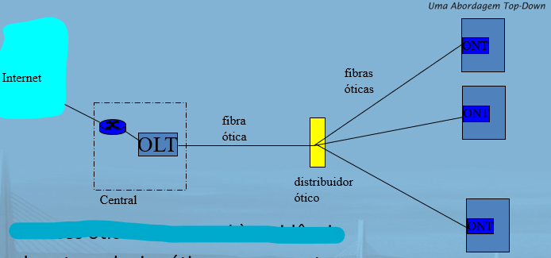

# Redes de Computadores - 2023.1

## Aula 01 - 16.03.2023

### Bibliografia

- KUROSE J. ROSS K. W. Redes de Computadores e internet uma abordagem top-down (IDEAL).
- ANDREW S. TANENBAUM. Redes de Computadores 4° edição, editora Campus (PARA UM MAIOR APROFUNDAMENTO). 

### Avaliações

- 3 avaliações escritas.
- Trabalho final substituí a última avaliação (AP3).
- Segunda chamada e avaliação final cobrem todo o assunto da matéria.

### Sistemas

- Frquência e arquivos - SIPPA.
- Resultados e avaliações - SIGAA.

---
### Capítulo 01

### O que é a Internet?
- Aspectos principais da internet:
  - Componentes de software e hardware báscios que a formam.
- Podemos descrever a Internet em termos de uma infraestrutura de redes que fornece serviços para aplicações distribuídas.

1. Borda da rede
1. Núcleo da rede
1. Atraso, perdas e vazão nas redes comutadas por pacotes.
1. Camadas de protocolo, modelos de serviço
1. Segurança da rede
1. História.

- Alguns conceitos da internet

  

    
  

#### Visão básica
- A internet é uma rede de conhecimento que interconecta centenas de milhões de dispositivos de computação ao redor do mundo.
  - Hospedeiros (Hosts) = sistemas finais.
     - Rodando aplicações de rede.
  - Sistemas finais são conectados entre si por **enlaces (links) de comunicação** e **comutadores (switches) de pacotes**.
  - Quando um sistema final possui dados para enviar a outro sistema final, o sistema emissor segmenta esses dados e adicona bytes de cabeçalho a cada segmento.
  - Os **pacotes** são enviados através da rede ao sistema final de destino, onde são remontados para os dados originais.

- Enlaces de comunicação
  - Fibra, cobre, satélite, rádio.
  - Taxa de transmissão.

- Roteadores -> Encaminham pacotes (pedaços de dados).

- Alguns conceitos:
  - Largura de banda -> Faixa de frequência medida em Hz.
  - Dados -> Medido em Bits ou Byts.
  - Transmissão de dados -> bps (bits por segundo) ou Bps (bytes por segundo).
  - Velocidade -> (distância/tempo) -> M/s ou KM/h.

- Um comutador de pacotes encaminha o pacote que está chegando em um de seus enlaces de comunicação de entrada para um de seus enlaces de comunicação de saída (os mais predominantes são roteadores e comutadores de chamada de enlace).
  - Comutadores de chamada de enlace são geralmente utilizados em redes de acesso.
  - Roteadores são principalmente utilizados no núcleo da rede.
- **rota**/**caminho**: sequência de enlaces de comunicação e comutadores de pacotes que um pacotes percorre.
- Sistemas finais (Hosts) acessam a internet por meio de **Provedores de Serviços de Internet (ISPs)**
  - Cada ISP é uma rede de comutadores de pacotes e enlaces de comunicação.
  - Um ISP de nível mais alto consiste em roteadores de alta velocidade interconectados com enlaces de fibra ótica de alta velocidade.

#### Visão dos elementos básicos
- Sistemas finais, comutadores de pacotes e outras peças da internet executam protocolos.
- **Protocolos**: controle de envio e recepção de mensagens.  
  - Ex.: TCP, IP, HTTP, Skype, Ethernet.
- **Internet: "rede de redes"**
  - Vagamente hierárquica.
  - Internet pública _versus_ intranet privada.  
- Padrões da Internet
  - RFC: Request For Comments
  - IETF: Internet Engineering Task Force.  
- O protocolo IP especifica o formato dos pacotes que são enviados e recebidos entre roteadores e sistemas finais.
  - Os principais protocolos da internet são conhecidos como **TCP/IP**.
- Dada a importância de protocolos para a internet, é adequado que todos concordem sobre o que cada um deles faz.
  - Aqui entram em ação **Padrões de Internet** que são desenvolvidos pela IETF.
  - Os documentos padronizados da IETF são denominados **RFCs** (**Request For Comments** - pedido de comentários).

#### Uma visão de serviço

- **Infraestrutura de comunicação**
  - Possibilita aplicações distribuídas:
    - Web, VolP, e-mail, jogos, e-commerce, compartilhamento de arquivos.
- **Serviços de comunicação fornecidos às aplicações**
  - Entrega de dados confiável da origem ao destino.  
  - Entrga de dados pelo "melhor esforço" (não confiável).
- Os sistemas finais ligados à internet oferecem uma **Interface de Programa de Aplicação** (API).

### O que é um protocolo?

- Protocolos humanos:
  - Que horas são?
  - tenho uma pergunta
  - introduções

- Protocolos de rede:
  - máquinas em vez de humanos.
  - toda atividade de comunicação na internet controlada por protocolos.

  

- Um protocolo define o formato e a ordem das mensagens trocadas entre duas ou mais entidades comunicantes, bem como as ações realizadas na transmissão e/ou no recebimento de uma mensagem ou outro evento.
- Um protocolo de rede é semelhante a um protocolo humano; a única diferêncça é que as entidades que trocam mensagens e realizam ações são componentes de hardware ou software de algum dispositivo.

### Visão mais de perto da estrutura de rede:  

- Borda da rede 
  - Aplicações e hospedeiros.  
- Redes de acesso, meios físicos: enlaces de comunicação com e sem fio.
- Núcleo da rede.
  - Roteadoes interconectados.
  - Rede de redes.

### A borda da rede
- Sistemas finais (hospedeiros)
  - São hospedeiros porque executam programas de aplicação.
  - Ex.: Web, e-mail.
  - na "borda da rede".

- Modelo cliente/servidor
  - Hospedeiro cliente solicita e recebe serviços de servidor sempre ativo.
  - Ex.: navegador/servidor Web, cliente/servidor de e-mail.

- modelo peer-peer:  
  - Usa mínimo (ou nenhum) de servidores dedicados.
  - Ex.: Skype

### Redes de acesso e meios físicos

- Como conectar sistemas finais ao roteador da borda?
  - Rede de acesso residencial.
    - Os dois tipos de acesso residencial banda larga predominantes são a **linha digital de assinante (DSL)** ou a cabo.
    - Normalmente, uma residência obtém acesso DSL à Internet da mesma empresa que fornece acesso telefônico local com fio.
    - A linha telefônica conduz, simultaneamente, dados e sianis telefônicos tradicionais, que são codificados em frequências diferentes:
      - Um canal _downstream_ de alta velocidade, com banda de 50KHz a 1MHZ.
      - Um canal _upstream_ de velocidade média, com uma banda de 4 KHz a 50 KHz.
      - Um canal de telefone bidirecional comum, com uma banda de 0 a 4 KHz. 
  - Redes de acesso institucional (escola, empresa)  
    - Uma rede local (LAN) costuma ser usada para conectar sistemas finais ao roteador da periferia (isso também ocorre nas residencias, com mais frequêcnia atualmente).
    - A **Ethernet** é uma tecnologia LAN que é utilizada predominantemente.  
    - Em uma LAN sem fio, os usuários transmitem/recebem pacotes para/de um ponto de acesso que está conectado à rede da empresa (quase sempre incluindo Ethernet com fio) que, por sua vez, é conectada à Internet com fio.
    - Um usuário de LAN sem fio deve estar no espaço de alguns metros do ponto de acesso.  
    - O acesso à LAN sem fio é baseado na tecnologia IEEE 802.11m ou seja, Wi-Fi, está presente em todo lugar.
  - Redes de acesso móvel
    - Dispositivos com acesso móvel empregam a mesma infraestrutura sem fios usada para a telefonia celular para enviar/receber pacotes por uma estação-base que é controlada pela operadora de rede celular.  
    - Diferente do Wi-Fi, um usuário só precisa estar dentro de algumas dezenas de quilômetros da estação-base.

- Lembre-se:
  - Taxa de transmissão (bits por segundo) da rede de acesso?
  - Compartilhado ou dedicado? 

---
## Aula 02 - 17.03.2023

### Modem discado

  

- Usa infrasestrutura de telefonia existente.
  - Casa conectada ao **escritório central**.
- Até 56 kbps de acesso direto ao roteador (geralmente menos).
- Não pode navegar e telefonar ao mesmo tempo: não está "sempre ligado".

### Digital Subscriber Line (DSL)

  

- Também usa infraestrutura de telefone existente.
- Até 1 Mbps upstram (hoje, normalmente < 256 kbps).
- Até 8 Mbps downstram (hoje, normalmente < 1 Mbps>).
- Linha física dedicada à central telefônica.

### Acesso residencial: modems a cabo

- Não usa infraestrutura de telefone.
  - Usa infraestrutura de TV a cabo.
- **HFC: Hybrid Fiber Coax**
  - assimétrico: até 30 Mbps downstream, 2 Mbps upstream.
- **Rede** de cabo e fibra conecta casas ao roteador ISP.
  - Casas **compartilham acesso** ao roteador.
  - Diferente de DSL, que tem **acesso dedicado**.

### Fibra nas residências

  

- Enlace ótico da central à residência.
- Duas tecnologias óticas concorrentes:  
  - Passive Optical Network (PON).
  - Active Optical Network (PAN).
- Velocidades de internet muito mais altas;
- Fibra também transporta serviços de tv e telefone.

### Acesso à Internet por Ethernet

  

- Normalmente usado em empresas, universidade, etc.
- Ethernet a 10 Mbs, 100 Mbps, 1 Gbps, 10 Gbps.
- Hoje, os sistemas finais normalmente se conectam ao comutador Ethernet.

### Redes de acesso sem fio

  

- Rede de acesso sem fio compartilhado conecta sistema final ao roteador.
  - Via estação base, também conhecida como "ponto de acesso".
- **LANs sem fio:**
  - 802.11b/g (wifi): 11 ou 54 Mbps
- **Acesso sem fio de área mais remota**
  - Fornecido pelo operador de telecomunicação.  
  - ~1 Mbps por sistema celular (EVDO, HSDPA)
  - Próximo (?): WiMAX (101s Mbps) por área remota. 

### Redes residenciais

- **Componentes típicos da rede residencial:**
- modem DSL ou a cabo.
- roteador/firewall/nat
- Ethernet
- Ponto de acesso sem fio

  

### Meios físicos

- **bit**: propaga entre pares de transmissor/receptor.
- **enlace físico**: o que fica entre o transmissor e receptor.
- **Meio guiado**:
  - Sinais se propagam em meio sólido: cobre, fibra, coaxial.  
- **Meio não guiado**:
  - Sinais se propagam livrimente, Ex.: rádio.
- **Par Trançado (TP)**
  - Dois fios de cobre isolados (é o tradicional cabo Ethernet).  
    - Categoria 3: fios de telefone tradicionais, Ethernet a 10 Mbps.
    - Categoria 5: Ethernet a 100 Mbps.
- Exemplos de meios físicos são: Par de fios de cobre trançado, cabo coaxial, cabo de fibra ótica multimodo, espectro de rádio terrestre e espectro de rádio por satélite.
### Meio físico: cabo coaxial, fibra

- **Cabo coaxial**:
  - Dois condutores de cobre concêntricos
  - Bidirecional
  - Banda base:
    - Único canal no cabo.
    - Ethernet legado.
  - Banda larga:
    - Múltiplos canais no cabo
    - HFC
  - Como o par trançado, o cabo coaxial é constituído de dois condutores de cobre, porém concêntricos e não paralelos.
- **Cabo de fibra ótica**:
  - Fibra de vidro conduzindo pulsos de luz. Cada pulso é um bit.
  - Operação em alta velocidade:
    - Transmissão em alta velocidade ponto a ponto (Ex.: 10-100 Gps).
  - A fibra ótica é um meio delgado e flexível que conduz pulsos de luz, cada um deles representando um bit.

### Meio físico: rádio

- Sinal transportado no espectro eletromagnético.
- Nenhum "fio" físico.
- Bidirecional.
- Efeitos no ambiente de propagação:
  - Reflexão
  - Obstrução por objetos
  - Interferência
- Os canais de rádio terrestres carregam sinais dentro do espectro eletromagnético.
  - São um meio atraente porque sua instalação não requer cabos físicos, podem atravessar paredes, dão conectividade ao usuário móvel e, potencialmente, conseguem transmitir um sinal a longas distâncias.
  - Podem ser classificados, a nível de operação, em:
    - Distâncias muito curtas.
    - Pequeno alcance.
    - Longo alcance.
- **Rasdo link types:**
  - micro-ondas terrestre
    - Ex.: até canais de 45 Mbps
  - LAN (Ex.: Wifi)
    - 11 Mbps, 54 Mbps
  - àrea ampla (Ex.: celular)
    - celular 36: ~1 Mbps
  - satélite
    - Um satélite de comunicação liga dois ou mais transmissores-receptores de micro-ondas baseados na Terra, denominados estações terrestres.
    - Canal de Kbps a 45 Mbps (ou múltiplos canais menores)
    - Atraso fim a fim de 270 msec.
    - Geoestacionário VS baixa altitude.

### O núcleo da rede

- Malha de roteadores interconectados.
- A questão fundamental:
  - Como os dados são transferidos?

### Núcleo da rede: comutação de circuitos

- **Recursos fim a fim reservados para "chamada"**
- Largura de banda do enlace, capacidade de comutação.
- Recursos dedicados: sem compartilhamento.  
- Desempenho tipo circuito (garantido).
- Exige preparação de chamada.
- Recursos de rede (Ex.: largura de banda) divididos em "pedaços".
  - Pedaços alocados a chamadas.
  - Pedaço de recurso **ocioso** se não usado por chamada particular (sem compartilhamento).
- Dividindo largura de banda do enlace em "pedaços".  
  - Divisão de frequência
  - Divisão de tempo

  

  

Resolução:

- 1536/24 = 64 Mbps = 64.000.000 bps
- 640.000/64.000.000 = 0,01 segundos = 10 ms
- 500 ms + 10 ms = **510 ms**

### Núcleo da rede: comutação de pacotes

- **Cada fluxo de dados fim a fim dividido em pacotes**
- Para enviar uma mensagem de um sistema final de origem para um destino, o originador fragmenta mensagens longas em porçoes de dados menores, denominados **pacotes**.  
- Entre origem e destino, cada um deles percorre enlaces de comunicação e **comutadores de pacotes** (há dois tipos principais de comutadores de pacotes: **roteadores** e **comutadores de camada de enlace**).
- Se um sistema final de origem ou um comutador de pacotes estiver enviando um pacote de L bits por um enlace com taxa de transmissão de R bits/s, então o tempo para transmitir o pacote é L/R segundos.
- Cada pacote usa largura de banda total do enlace.
- Recrusos usados quando necessário.
- **Disputa por recursos**:
  - Demanda de recurso agregado pode exceder quantidade disponível.
  - Congestionamento: fila de pacotes, espera por uso do enlace.
  - store and forward: pacotes se movem um salto de cada vez.  
    - Nó recebe pacote completo antes de encaminhar.
### Comutação de pacotes: multiplexação estatística

  

### Comutação de pacotes: store-and-forward

- O comutador de pacotes deve receber o pacote inteiro antes de poder começar a transmitir o primeiro bit para o enlace de saída.
- Supondo uma linha de transmissão de A até B passando por um comutador de pacotes, teríamos um atrase de 2L/R, pois o comutador iria receber o pacote inteiro antes de iniciar a transmissão.
  - Se o comutador reenviasse os bits assim que chegassem, então o atraso total seria L/R.

  

- Considerando um caso geral do envio de um pacote da origem ao destino por um caminho que consiste em N enlaces, cada um com taxa R (assim, há N - 1 roteadores entre a origem e o destino), teríamos que `d_fim_a_fim = N * L/R`.

### Comutação de pacotes VS comutação de circuitos

- A comutação de pacotes permite que mais usuários usem a rede.  

  

  

---
## Aula 03 - 23.03.2023

### Estrutura da Internet

- Aproximadamente hierárquica.  
- **no centro: ISPs de "níve l"** -> Cobertura nacional/internacional.  
  - Tratam uns aos outros como iguais.
  - Ex. - Sprint:
  

    
  

- **ISPs de nível 2: ISPs menores (geralmente regionais)**
  - Conectam a um ou a mais ISPs de nível 1, possívelmente outros ISPs de nível 2.
  

    
  

- **ISPs de nível 3 e ISPs locais**
  - rede do último salto ("acesso"), mais próximo dos sistemas finais.
  

    
  

### Como ocorrem a perda e o atraso?

- Pacotes se enfileiram em buffers de roteador.  
  - Taxa de chegada de pacotes ao enlace ultrapassa capacidade de saída do enlace.
  - Pacotes se enfileiram, esperam por sua vez.
  - Se não houver buffers livres para armazenar os pacotes, os mesmos serão descartados.

### Quatro fontes de atraso de pacotes

1. Processamento nodal
   - Verficar erros de bit.
   - Determinar enlace de saída.  
2. Enfileiramento
   - Tempo esperado por transmissão no enlace de saída.  
   - Depende do nível de congestionamento do roteador.
3. Atraso de transmissão
   - R = largura de banda do enlace (bps).
   - L = tamanho do pacote (bits)
   - Tempo para enviar bits no enlace = L/R.
4. Atraso de propagação
   - d = tamanho do enlace físico.  
   - s = vel. de propagação no meio (~2*108 m/s)
   - Atraso de propagação = d/s.

### Atraso nodal

  

&nbsp;

### Atraso de enfileiramento (revisado)

- R = Largura de banda do enlace (bps).  
- L = tamanho do pacote (bits)
- a = taxa média de chegado de pacote
- **Intensidade de tráfego = La/R**
  - La/R ~ 0: Pequeno atraso de enfileiramento médio.
  - La/R -> 1: Atrasos tornam-se grandes.
  - La/R > 1: Mais "trabalho" chegando do que pode ser atendido, atraso médio infinito!

  

&nbsp;

### Perda de pacote

- Fila (ou buffer) antes do enlace no buffer tem capacidade finita.  
- Pacote chegando à fila cheia -> descartado (ou perdido).  
- Último pacote pode ser retransmitido pelo nó anterior, pela origem ou de forma nenhuma.

### Vazão 

- **Vazão**: taxa (bits/unidade de tempo) em que os bits são transferidos entre o emissor/receptor.  
  - **Instantânea**: taxe em determinado ponto no tempo.  
  - **média**: taxa por período de tempo maior.

  

### Vazão: cenário da internet

- Na prática: Rc ou Rs normalmente é gargalo.
- Vazão fim a fim por conexão: mim(Rc,Rs,R/10)
- "R/10" porque há 10 conexões (aproximadamente) compatilhando enlace de gargalo do backbone a R bits/s

### "Camadas" de protocolo

- **Redes são complexas!**  
  - muitas "partes":
    - hospedeiros
    - roteadores
    - enlaces de vários meios físicos
    - aplicações
    - protocolos
    - hardware, software
- **Camada**: cada camada implementam um serviço.  
  - por meio de suas própias ações da camada interna.  
  - contando com serviços fornecidos pela camada abaixo.

#### Por que usar camadas?

- lidando com sistemas complexos:  
  - estrutura explicita permite identificação e relação entre partes complexas do sistema.
    - **modelo de referência** em camadas para discussão.  
  - modularização facilita manutenção e atualização do sistema.  
    - mudança de implementação do serviço da camada transparente ao restante do sistema.  
    - Ex.: mudanças no procedimento de porta não afeta o restante do sistema.  
- uso de camadas considerado prejudicial?  

### Pilha de protocolos da Internet  

- **aplicação**: suporte a aplicações de rede.  
  - FTP, SMTP, HTTP.  
- **transporte**: transferência de dados processo-processo.  
  - TCP, UDP.  
- **rede**: roteamento de datagramas da origem ao destino.  
  - IP, protocolos de roteamento.  
- **enlace**: transferência de dados entre elementos vizinhos da rede.  
  - PPP, Ethernet.  
- **física**: bits "nos fios".  

#### Modelo de referência ISO/OSI  
- **apresentação**: permite que as aplicações interpretem significado de dados. Ex.: criptografia, compactação, convenções específicas da máquina.  
- **session**: sincronização, verificação, recuperação de troca de dados.  
- Pilha da Internet não contém essas camadas.
  - estes serviços, se necessários, devem ser implementados na aplicação.
---